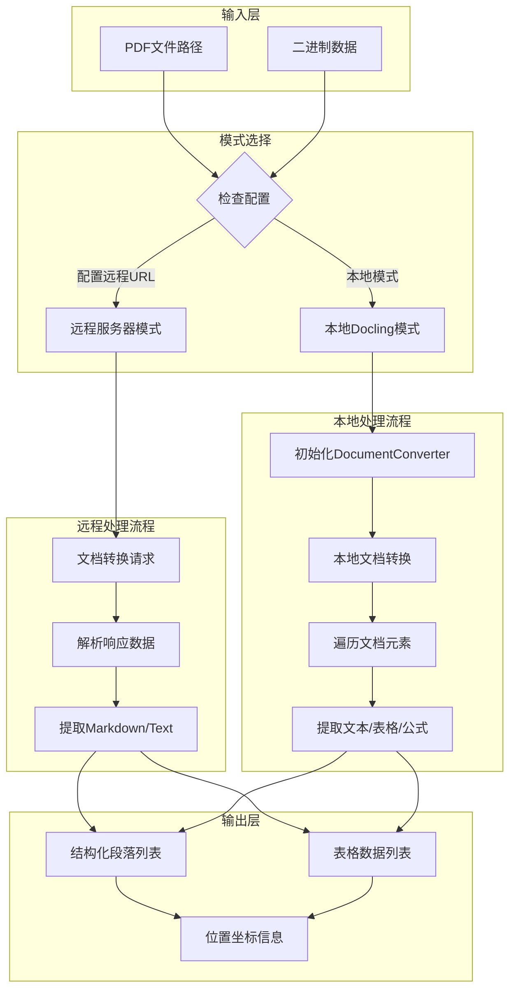

# RAGFlow Docling Parser 完整解析逻辑详解

> **文档版本**: v1.0  
> **目标文件**: `deepdoc/parser/docling_parser.py`  
> **总行数**: 528 行  
> **核心类**: `DoclingParser`

---

## 目录

1. [架构总览](#一架构总览)
2. [初始化流程](#二初始化流程)
3. [核心数据结构](#三核心数据结构)
4. [本地解析流程](#四本地解析流程)
5. [远程解析流程](#五远程解析流程)
6. [工业级设计考量](#六工业级设计考量)

---

## 一、架构总览

### 1.1 系统架构图



### 1.2 核心数据结构

| 数据结构 | 类型 | 用途 |
|---------|------|------|
| DoclingContentType | Enum | 内容类型枚举：TEXT/TABLE/IMAGE/EQUATION |
| _BBox | dataclass | 边界框：page_no, x0, y0, x1, y1 |
| DoclingParser | class | 主解析器类 |

---

## 二、初始化流程

### 2.1 初始化代码

```python
def __init__(self, docling_server_url: str = "", request_timeout: int = 600):
    self.logger = logging.getLogger(self.__class__.__name__)
    self.page_images: list[Image.Image] = []
    self.page_from = 0
    self.page_to = 10_000  # 最大支持10000页
    self.outlines = []
    self.docling_server_url = (docling_server_url or "").rstrip("/")
    self.request_timeout = request_timeout
```

### 2.2 关键属性

| 属性名 | 类型 | 默认值 | 说明 |
|--------|------|--------|------|
| logger | Logger | 类名日志器 | 日志记录 |
| page_images | list | [] | 缓存的页图 |
| page_from | int | 0 | 起始页码 |
| page_to | int | 10000 | 结束页码 |
| outlines | list | [] | PDF大纲 |
| docling_server_url | str | "" | 远程服务器URL |
| request_timeout | int | 600 | 请求超时(秒) |

---

## 三、核心数据结构

### 3.1 内容类型枚举

```python
class DoclingContentType(str, Enum):
    IMAGE = "image"       # 图片内容
    TABLE = "table"       # 表格内容
    TEXT = "text"         # 文本内容
    EQUATION = "equation" # 公式/方程内容
```

### 3.2 边界框数据类

```python
@dataclass
class _BBox:
    page_no: int   # 页码（从1开始）
    x0: float      # 左边界x坐标
    y0: float      # 下边界y坐标
    x1: float      # 右边界x坐标
    y1: float      # 上边界y坐标
```

### 3.3 边界框提取函数

```python
def _extract_bbox_from_prov(item, prov_attr: str = "prov") -> Optional[_BBox]:
    """
    从Docling文档元素中提取边界框信息
    
    提取逻辑:
    1. 获取prov属性
    2. 处理列表/单个prov的情况
    3. 提取page_no和bbox对象
    4. 提取bbox的四个坐标(l, t, r, b)
    5. 验证坐标完整性
    6. 创建并返回_BBox对象
    """
    prov = getattr(item, prov_attr, None)
    if not prov:
        return None
    
    prov_item = prov[0] if isinstance(prov, list) else prov
    
    pn = getattr(prov_item, "page_no", None)
    bb = getattr(prov_item, "bbox", None)
    if pn is None or bb is None:
        return None
    
    coords = [getattr(bb, attr) for attr in ("l", "t", "r", "b")]
    if None in coords:
        return None
    
    return _BBox(page_no=int(pn), x0=coords[0], y0=coords[1], x1=coords[2], y1=coords[3])
```

---

## 四、本地解析流程

### 4.1 解析流程概述

```
1. 提取PDF大纲 (extract_pdf_outlines)
2. 检查安装/配置 (check_installation)
3. 选择本地/远程模式
4. 本地模式处理:
   - 准备输入文件 (处理binary/path)
   - 渲染页面图像 (__images__)
   - 初始化DocumentConverter
   - 转换文档 (conv.convert)
   - 提取文档对象 (conv_res.document)
   - 遍历文档元素 (_iter_doc_items)
   - 转换为段落 (_transfer_to_sections)
   - 转换为表格 (_transfer_to_tables)
   - 清理临时文件
5. 返回结果 (sections, tables)
```

### 4.2 核心解析方法

```python
def parse_pdf(self, filepath, binary=None, callback=None, ..., parse_method="raw"):
    # 1. 提取PDF大纲
    self.outlines = extract_pdf_outlines(binary if binary is not None else filepath)

    # 2. 检查安装
    if not self.check_installation(docling_server_url=docling_server_url):
        raise RuntimeError("Docling not available")

    # 3. 选择模式
    server_url = self._effective_server_url(docling_server_url)
    if server_url:
        return self._parse_pdf_remote(...)

    # 4. 本地模式处理
    # ... (详见文档)
    
    return sections, tables
```

---

## 五、远程解析流程

### 5.1 远程解析概述

远程解析通过HTTP API调用Docling服务器，支持两种API版本：
- v1: `/v1/convert/source`
- v1alpha: `/v1alpha/convert/source`

### 5.2 请求流程

```
1. 构建请求payload（包含base64编码的PDF）
2. 尝试v1 API
3. 如果失败，尝试v1alpha API
4. 解析响应JSON
5. 提取document内容
6. 转换为sections和tables
```

### 5.3 核心代码

```python
def _parse_pdf_remote(self, filepath, binary, callback, ..., docling_server_url, request_timeout):
    # 构建请求payload
    v1_payload = {
        "options": {
            "from_formats": ["pdf"],
            "to_formats": ["json", "md", "text"],
        },
        "sources": [{
            "kind": "file",
            "filename": filename,
            "base64_string": b64,
        }],
    }
    
    # 发送请求并解析响应
    for endpoint, payload in (("/v1/convert/source", v1_payload), ...):
        resp = requests.post(f"{server_url}{endpoint}", json=payload, timeout=timeout)
        if resp.status_code < 300:
            response_json = resp.json()
            break
    
    # 提取并返回结果
    docs = self._extract_remote_document_entries(response_json)
    # ... 处理sections和tables
    return sections, tables
```

---

## 六、工业级设计考量

### 6.1 双模式架构优势

| 特性 | 本地模式 | 远程模式 |
|------|----------|----------|
| 依赖 | 需安装docling库 | 需配置服务器URL |
| 性能 | 依赖本地硬件 | 可扩展服务器集群 |
| 隐私 | 数据不出本地 | 需传输到服务器 |
| 适用场景 | 单机处理、敏感数据 | 大规模处理、轻客户端 |

### 6.2 容错设计

1. **API版本降级**: 优先尝试v1 API，失败后自动降级到v1alpha
2. **页面渲染容错**: `__images__` 失败不会中断整个解析流程
3. **临时文件清理**: try-finally确保临时文件被清理
4. **网络超时控制**: 可配置request_timeout避免无限等待

### 6.3 性能优化

1. **Base64编码**: 二进制数据通过base64编码传输，兼容JSON格式
2. **懒加载**: page_images按需渲染，非必须步骤
3. **多API端点**: 支持多个API版本，提高兼容性
4. **流式处理**: 遍历文档元素时生成器yield，节省内存

### 6.4 扩展性设计

1. **ContentType枚举**: 易于添加新内容类型
2. **parse_method参数**: 支持多种解析策略（raw/manual/pipeline/paper）
3. **Callback机制**: 可注入进度回调，支持UI更新
4. **配置外部化**: 服务器URL可通过参数或环境变量配置

---

## 附录：关键方法索引

| 方法名 | 用途 | 所在行 |
|--------|------|--------|
| __init__ | 初始化 | 82 |
| _effective_server_url | 获取有效服务器URL | 91 |
| _is_http_endpoint_valid | 检查HTTP端点 | 97 |
| check_installation | 检查安装 | 108 |
| __images__ | 渲染页面图像 | 127 |
| _make_line_tag | 生成位置标签 | 146 |
| extract_positions | 提取位置信息 | 157 |
| crop | 裁剪图像 | 166 |
| _iter_doc_items | 遍历文档元素 | 218 |
| _transfer_to_sections | 转换为段落 | 234 |
| cropout_docling_table | 裁剪表格 | 255 |
| _transfer_to_tables | 转换为表格 | 283 |
| _sections_from_remote_text | 远程文本转段落 | 311 |
| _extract_remote_document_entries | 提取远程文档 | 322 |
| _parse_pdf_remote | 远程解析 | 343 |
| parse_pdf | 主解析入口 | 446 |

---

*文档生成时间: 2025年*
*基于 RAGFlow 项目代码分析*
