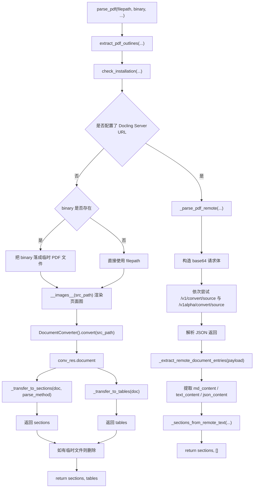
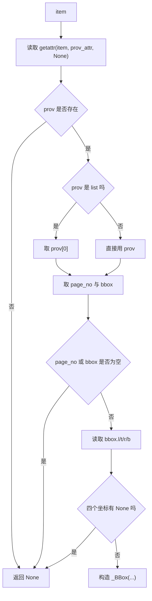
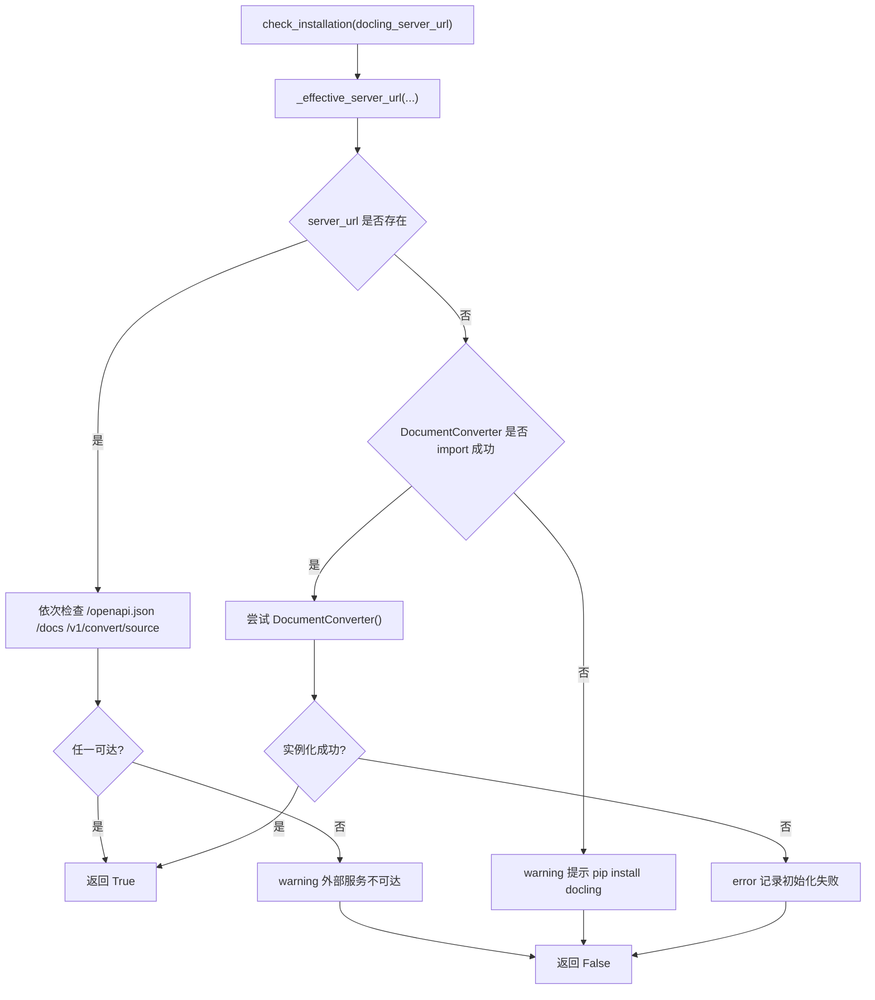
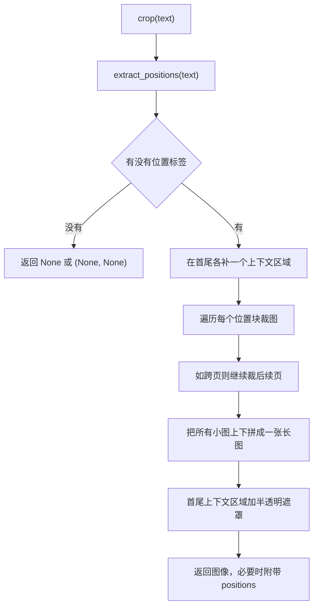
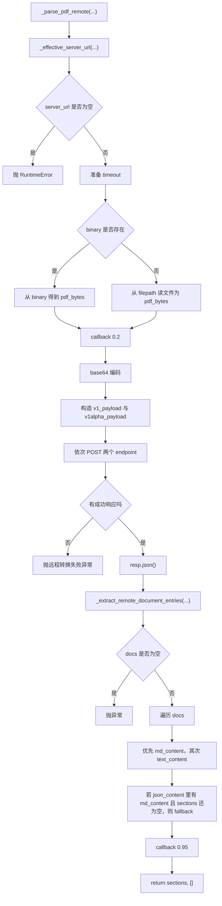
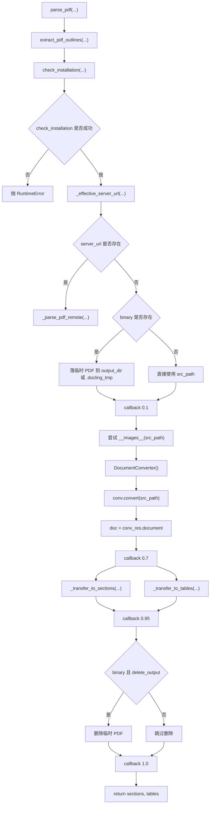

# Docling PDF 解析完整逻辑讲解

本文对应代码文件：

- [`/E:/py/ragflow/deepdoc/parser/docling_parser.py`](/E:/py/ragflow/deepdoc/parser/docling_parser.py)

目标：

- 完整讲清 `DoclingParser` 解析 PDF 的所有入口、分支、查询、计算和返回逻辑
- 不只解释“做了什么”，还解释“为什么要这样做”
- 结合工业实现里的工程取舍来理解这份代码
- 给每个关键逻辑都配例子

---

## 1. 总览

`DoclingParser` 不是 RAGFlow 默认的所有 PDF 都会走的 parser，而是“当上层选择了 `Docling` 路线时”才会进入的 PDF 解析实现。

它的核心职责不是自己做 OCR 和版面识别，而是：

1. 检查当前环境是否能用 Docling
2. 判断走“远程 Docling Server”还是“本地 DocumentConverter”
3. 把 PDF 交给 Docling 解析
4. 把 Docling 的结果转成 RAGFlow 后续链路能消费的数据结构：
   - `sections`
   - `tables`
5. 补齐位置标签、裁图、表格 HTML、图片 caption 等衍生信息

你可以把它理解成一个“适配层”：

- 上游输入是 PDF 路径或 PDF 二进制
- 下游输出是 RAGFlow 统一的 section / table 结果
- 中间适配了两种 Docling 运行方式：
  - 远程 HTTP 服务
  - 本地 Python 库

---

## 2. 全流程图



这个图里最重要的分叉是：

- 远程模式：返回 `sections`，通常不返回结构化 `tables`
- 本地模式：返回 `sections` 和 `tables`

这不是代码遗漏，而是当前实现能力边界不同。

工业上这是很常见的做法：

- 先保证“文本能稳定出来”
- 再逐步补齐“位置、表格、图片等增强信息”

---

## 3. 类和辅助结构

### 3.1 `DoclingContentType`

代码：

- `IMAGE`
- `TABLE`
- `TEXT`
- `EQUATION`

作用：

- 给 `DoclingParser` 内部流转的内容加统一类型标签

为什么这样做：

- Docling 原始对象本身可能是 `text`、`table`、`picture`、`formula`
- RAGFlow 下游不希望知道 Docling 的所有内部类结构
- 所以这里先抽象成更稳定的内容类型枚举

工业考量：

- 用 Enum 做中间语义层，比直接在逻辑里硬编码字符串更稳
- 上游库升级时，只要适配这一层，后面的转换逻辑改动就更小

例子：

```python
DoclingContentType.TEXT.value == "text"
DoclingContentType.EQUATION.value == "equation"
```

---

### 3.2 `_BBox`

字段：

- `page_no`
- `x0`
- `y0`
- `x1`
- `y1`

作用：

- 统一承载 Docling provenance 里的 bbox 信息

为什么要单独定义 dataclass：

- Docling 原始 `prov` 结构不一定稳定
- 后面 `_make_line_tag()`、`cropout_docling_table()`、`crop()` 都希望面对统一字段

工业考量：

- 统一结构体能降低上游对象变动对下游逻辑的影响
- dataclass 可读性强，也便于类型提示

例子：

```python
_BBox(page_no=3, x0=72.0, y0=120.5, x1=530.2, y1=168.4)
```

表示：

- 第 3 页
- 左上到右下的一个矩形区域

---

## 4. `_extract_bbox_from_prov()` 完整逻辑

代码入口：

- `_extract_bbox_from_prov(item, prov_attr="prov")`

作用：

- 从 Docling item 的 `prov` 字段里提取标准化 `_BBox`

流程图：



逐步解释：

1. `prov = getattr(item, prov_attr, None)`
   作用：
   从对象动态读取 provenance 字段

   为什么不用 `item.prov`：
   因为不是所有对象都保证有这个属性

2. `if not prov: return None`
   作用：
   没位置信息时直接返回空

   工业考量：
   坐标属于增强信息，不应阻断主文本解析

3. `prov_item = prov[0] if isinstance(prov, list) else prov`
   作用：
   兼容两种输入：
   - 单个 prov 对象
   - prov 列表

   为什么只取第一个：
   这段代码默认“第一个 provenance 就是主定位”

   工业考量：
   多 provenance 情况通常意味着多来源或复杂映射，但主流程往往只需要一个稳定主框

4. `pn = getattr(prov_item, "page_no", None)`
   `bb = getattr(prov_item, "bbox", None)`
   作用：
   拿页号和 bbox 对象

5. `coords = [getattr(bb, attr) for attr in ("l", "t", "r", "b")]`
   作用：
   取左、上、右、下

6. `if None in coords: return None`
   作用：
   坐标不全时放弃使用

7. `return _BBox(...)`
   作用：
   转成统一结构

例子 1：

假设某个 text item 的 provenance 是：

```python
prov.page_no = 2
prov.bbox.l = 40
prov.bbox.t = 100
prov.bbox.r = 300
prov.bbox.b = 130
```

那么返回：

```python
_BBox(page_no=2, x0=40, y0=100, x1=300, y1=130)
```

例子 2：

如果 `prov = []` 或 `bbox.r is None`，直接返回 `None`

为什么这样做：

- 位置是增强信息，不完整时不要带着半坏数据继续走
- 后续 `_make_line_tag()` 和裁图逻辑都要求坐标可靠

---

## 5. `DoclingParser.__init__()` 完整逻辑

初始化字段：

- `self.logger`
- `self.page_images`
- `self.page_from`
- `self.page_to`
- `self.outlines`
- `self.docling_server_url`
- `self.request_timeout`

为什么这些字段要在构造阶段就准备好：

- 解析过程中多个函数都要复用页面图和页偏移
- 远程/本地模式都需要统一的 timeout 和 server_url 配置

例子：

```python
parser = DoclingParser(docling_server_url="http://127.0.0.1:8001", request_timeout=600)
```

这意味着：

- 优先走该远程地址
- 每次请求最大等待 600 秒

工业考量：

- timeout 不应硬编码在请求函数里，应该作为 parser 实例参数，方便环境级调整
- `rstrip("/")` 是典型工程细节，避免后面拼 URL 时出现 `//v1/convert/source`

---

## 6. `_effective_server_url()` 完整逻辑

代码：

```python
return (docling_server_url or self.docling_server_url or "").rstrip("/") or (
    os.environ.get("DOCLING_SERVER_URL", "").rstrip("/")
)
```

这是一个很典型的“配置优先级”逻辑。

优先级从高到低：

1. 调用时显式传入的 `docling_server_url`
2. 实例初始化时保存的 `self.docling_server_url`
3. 环境变量 `DOCLING_SERVER_URL`

为什么这么排：

- 调用时参数最临时、最具体，优先级最高
- 实例字段是程序内部配置，次高
- 环境变量是部署默认值，兜底

例子：

```python
self.docling_server_url = "http://a:8000/"
docling_server_url = "http://b:9000/"
```

结果：

- 返回 `http://b:9000`

再比如：

```python
self.docling_server_url = ""
docling_server_url = None
os.environ["DOCLING_SERVER_URL"] = "http://c:7000/"
```

结果：

- 返回 `http://c:7000`

工业考量：

- 显式参数覆盖默认配置，是最符合运维和调试习惯的方式
- 去掉尾部 `/` 可以减少 URL 拼接 bug

---

## 7. `_is_http_endpoint_valid()` 完整逻辑

作用：

- 检测某个 HTTP 地址是否可达

流程：

1. 先发 `HEAD`
2. 如果 `HEAD` 抛异常，再发 `GET`
3. 只要状态码在 `200/301/302/307/308` 中就算可用
4. 两次都失败则返回 `False`

为什么先 `HEAD` 后 `GET`：

- `HEAD` 更轻量，不需要拿响应正文
- 但不是所有服务都正确支持 `HEAD`
- 所以失败后退回 `GET`

工业考量：

- 这是很常见的服务健康探测模式
- 兼顾性能和兼容性

例子：

```python
_is_http_endpoint_valid("http://127.0.0.1:8001/docs")
```

如果：

- `HEAD /docs` 返回 405 或超时
- `GET /docs` 返回 200

那么最终仍然返回 `True`

---

## 8. `check_installation()` 完整逻辑

这个函数非常关键，因为它决定：

- Docling 是否可用
- 当前走远程还是本地

流程图：



### 8.1 远程模式分支

如果存在 `server_url`，就说明优先尝试远程服务。

它会依次检查：

- `/openapi.json`
- `/docs`
- `/v1/convert/source`

为什么是这三个：

- `/openapi.json` 常是标准接口元数据入口
- `/docs` 常是 Swagger 或文档首页
- `/v1/convert/source` 是它实际要调用的转换接口

这是一种“宽松可用性检查”。

工业考量：

- 某些服务只开放 docs，不开放 openapi
- 某些代理把 docs 和 api 分别转发
- 任意一个可达，基本就说明服务地址大概率对了

例子：

假设：

- `http://host/openapi.json` 404
- `http://host/docs` 200

那么：

- `check_installation()` 返回 `True`

### 8.2 本地模式分支

如果没有 `server_url`：

1. 检查 `DocumentConverter` 是否 import 成功
2. 再尝试实例化 `DocumentConverter()`

为什么要实例化：

- import 成功不代表模型、依赖、运行环境真的可用
- 真正实例化时可能才会触发内部依赖检查

例子：

如果：

- `pip install docling` 没装

那么：

- `DocumentConverter is None`
- 返回 `False`

如果：

- 包装上了，但底层依赖缺失导致 `DocumentConverter()` 抛异常

那么：

- 返回 `False`

工业考量：

- “可导入”和“可运行”是两回事
- 这里的检查更贴近真实可用性

---

## 9. `__images__()` 完整逻辑

作用：

- 预先把 PDF 指定页范围渲染成页图，保存到 `self.page_images`

注意：

- 这不是 Docling 核心解析步骤
- 但它对后面的坐标标签和裁图非常重要

流程：

1. 记录 `page_from` / `page_to`
2. 如果 `fnm` 不是路径，包装成 `BytesIO`
3. 用 `pdfplumber.open(...)` 打开 PDF
4. 取 `page_from:page_to`
5. 把每页渲染成 `PIL Image`
6. 存入 `self.page_images`
7. 出错则置空并记日志
8. 最后关闭 `BytesIO`

为什么要额外渲染页图：

- Docling 解析文字时不一定需要页图
- 但后面：
  - `_make_line_tag()`
  - `crop()`
  - `cropout_docling_table()`
  都依赖页图尺寸和裁图能力

工业考量：

- 解析文本和裁图往往是两种不同的数据通路
- 提前缓存页图可以避免后面每次裁图都重新打开 PDF

例子：

```python
parser.__images__("report.pdf", zoomin=1, page_from=0, page_to=3)
```

如果 PDF 有 3 页，会得到：

- `self.page_images[0]` = 第 1 页图片
- `self.page_images[1]` = 第 2 页图片
- `self.page_images[2]` = 第 3 页图片

---

## 10. `_make_line_tag()` 完整逻辑

作用：

- 把 bbox 转成 RAGFlow 风格的位置标签字符串

输出格式：

```text
@@页号\t左\t右\t上\t下##
```

例子：

```text
@@2\t40.0\t300.0\t620.0\t650.0##
```

### 10.1 关键计算：为什么要翻转 Y 坐标

代码逻辑：

```python
_, page_height = self.page_images[bbox.page_no-1].size
top, bott = page_height-top ,page_height-bott
```

这是因为：

- Docling/provenance 常用的坐标系，原点往往接近页面左下或左上，和 RAGFlow 后续使用习惯不一定一致
- 这里通过页高做一次翻转，把坐标转成项目后续更一致的页面坐标表示

例子：

假设：

- 页面高度 `800`
- Docling bbox `top=100, bott=150`

翻转后：

- `top = 700`
- `bott = 650`

为什么这样做：

- 这能和项目里其他 PDF parser 的位置标签语义保持更一致
- 下游裁图和定位逻辑更容易统一

工业考量：

- 跨解析器统一坐标语义，比保留各自原生坐标更重要
- 否则不同 parser 结果无法共用同一套后处理

---

## 11. `extract_positions()` 完整逻辑

作用：

- 从文本里的 `@@...##` 位置标签提取出结构化坐标

流程：

1. 用正则找出所有位置标签
2. 解析：
   - 页号串
   - left
   - right
   - top
   - bottom
3. 页号转成 0-based
4. 返回列表

为什么页号减 1：

- `self.page_images` 是 Python 列表，下标从 0 开始
- 后面 `crop()` 要直接拿列表下标取页图

例子：

输入：

```text
这是正文@@2\t40\t300\t100\t140##后面还有内容
```

输出：

```python
[([1], 40.0, 300.0, 100.0, 140.0)]
```

如果标签是跨页：

```text
@@2-3\t40\t300\t100\t900##
```

输出：

```python
[([1, 2], 40.0, 300.0, 100.0, 900.0)]
```

工业考量：

- 用字符串标签携带位置，是一种低耦合设计
- 文本在下游流转时不需要单独再带复杂对象
- 需要裁图时再反解析出来即可

---

## 12. `crop()` 完整逻辑

作用：

- 根据文本中嵌入的位置标签，从页图中裁出对应区域

这是一个很实用的“文本反查图像”函数。

流程图：



### 12.1 为什么要首尾各补一个额外区域

代码：

- 在第一个位置前加一块上文区域
- 在最后一个位置后加一块下文区域

并且这些额外区域：

- 不会进入 `positions`
- 在最终图里会被加半透明遮罩

为什么这样做：

- 用户看裁图时，完全只截正文会缺少上下文
- 稍微带一点前后内容更容易理解位置
- 但又不能把上下文误认为正文目标，所以用遮罩弱化

例子：

假设正文块坐标是：

- top=300
- bottom=360

则它会额外补：

- 上文：`top-120` 到 `top-GAP`
- 下文：`bottom+GAP` 到 `bottom+120`

工业考量：

- 这是典型的“可视化友好”设计
- 对 review、debug、标注很有帮助

### 12.2 跨页裁图逻辑

如果一个位置标签的 `pns` 包含多页：

1. 在第一页从 `top` 裁到页底
2. 在后续页从页顶裁到剩余高度

为什么这样做：

- 一个逻辑块可能跨页
- 文本位置标签可能只给了一个整体高度区间
- 所以要把剩余部分继续从下一页接着裁

例子：

假设：

- 第 2 页剩余需要 100 像素
- 第 3 页继续需要 80 像素

函数会：

- 先从第 2 页裁一段
- 再从第 3 页页顶裁 80 像素

### 12.3 最终拼图逻辑

所有裁出来的小图会被拼成一张竖向长图：

- 宽度取所有小图最大宽度
- 高度取所有小图高度之和，加上间隔 `GAP`

为什么这样做：

- 下游通常更希望拿到一张连续图，而不是一组碎图
- 对多页表格、跨页段落尤其重要

---

## 13. `_iter_doc_items()` 完整逻辑

作用：

- 从 Docling `document` 对象里筛选“要转成 sections 的内容项”

它分两轮：

1. 正文文本和 list item
2. 公式

### 13.1 第一轮：正文与 list item

筛选条件：

```python
(label in ("section_header", "text") and ref in ("#/body",)) or label in ("list_item",)
```

拆解解释：

- `label in ("section_header", "text")`
  只收正文和小节标题

- `ref in ("#/body",)`
  要求 parent 引用属于文档 body

- `label in ("list_item",)`
  列表项单独纳入

为什么要查 `parent.cref`：

- Docling 里不是所有 text 都属于正文
- 可能有页眉、元数据、边栏等
- `#/body` 是一种“正文域过滤”

例子：

如果一个 text item：

```python
label = "text"
parent.cref = "#/body"
text = "本季度收入增长 12%"
```

会被产出：

```python
("text", "本季度收入增长 12%", bbox)
```

而如果：

```python
label = "text"
parent.cref = "#/metadata"
```

就不会被纳入

### 13.2 第二轮：公式

筛选条件：

```python
if getattr(item, "label", "") in ("FORMULA",)
```

为什么公式单独一轮：

- 正文文本和公式往往不是同一类节点
- 公式需要保留自己的内容类型

例子：

公式 item：

```python
label = "FORMULA"
text = "E = mc^2"
```

会被产出：

```python
("equation", "E = mc^2", bbox)
```

工业考量：

- 这种两轮筛选比“一轮把各种 label 写成巨大 if-else”更清晰
- 也更方便日后扩充 picture caption、footnote 等类型

---

## 14. `_transfer_to_sections()` 完整逻辑

作用：

- 把 `_iter_doc_items()` 产出的内容项，转成 RAGFlow 标准的 `sections`

### 14.1 基础流程

遍历每个 `(typ, payload, bbox)`：

1. 如果是 `text`
   - `section = payload.strip()`
   - 空文本跳过
2. 如果是 `equation`
   - `section = payload.strip()`
3. 其他类型跳过
4. 如果有 bbox，就生成 `tag = _make_line_tag(bbox)`
5. 根据 `parse_method` 选择不同 section 结构

### 14.2 `parse_method` 分支

#### 分支一：`manual` / `pipeline`

输出：

```python
(section, typ, tag)
```

例子：

```python
("营业收入同比增长", "text", "@@2\t40.0\t300.0\t100.0\t130.0##")
```

为什么这样设计：

- `manual` / `pipeline` 更强调结构化处理
- 需要把内容类型和位置都显式保留

#### 分支二：`paper`

输出：

```python
(section + tag, typ)
```

例子：

```python
("营业收入同比增长@@2\t40.0\t300.0\t100.0\t130.0##", "text")
```

为什么 tag 拼进正文：

- 某些下游 paper 处理链更习惯“正文自带位置标签”
- 而不是多维护一个独立字段

#### 分支三：其他默认分支，比如 `raw`

输出：

```python
(section, tag)
```

例子：

```python
("营业收入同比增长", "@@2\t40.0\t300.0\t100.0\t130.0##")
```

工业考量：

- 一个 parser 同时服务多个下游场景时，输出形状往往不能完全统一
- 这里通过 `parse_method` 做最小适配，而不是复制三套 parser

---

## 15. `cropout_docling_table()` 完整逻辑

作用：

- 根据 Docling 给出的表格或图片 bbox，从对应页图裁出图像

### 15.1 页面下标换算

代码：

```python
idx = (page_no - 1) - getattr(self, "page_from", 0)
```

为什么这么算：

- Docling bbox 的 `page_no` 通常是 1-based 全局页号
- `self.page_images` 是从 `page_from` 开始截出来的局部页数组

例子：

假设：

- `page_from = 10`
- 当前 bbox `page_no = 12`

那么局部页图下标：

```python
idx = (12 - 1) - 10 = 1
```

即：

- 使用 `self.page_images[1]`

### 15.2 Y 坐标翻转

代码：

```python
y0 = float(H - top)
y1 = float(H - bott)
```

为什么：

- Docling bbox 的纵向坐标系和 PIL 裁图坐标系方向不完全一致
- PIL 裁图要左上角坐标系
- 所以要用页面高度翻转

例子：

页面高 `H=1000`，bbox：

- `top=100`
- `bott=200`

转换后：

- `y0 = 900`
- `y1 = 800`

后面再通过 clamp 保证合法

### 15.3 clamp 逻辑

代码：

```python
x0, y0 = max(0.0, min(x0, W - 1)), max(0.0, min(y0, H - 1))
x1, y1 = max(x0 + 1.0, min(x1, W)), max(y0 + 1.0, min(y1, H))
```

作用：

- 坐标限制在图像边界内
- 且保证裁图宽高至少为 1

为什么：

- provenance 坐标可能越界
- PIL crop 遇到极端非法框可能报错或得到空图

工业考量：

- 边界校正是图像裁切代码的标准防御动作

### 15.4 返回结构

返回：

```python
(crop, [pos])
```

其中 `pos` 结构：

```python
(page_no-1, x0, x1, y0, y1)
```

为什么位置存成列表：

- 和多页 crop 的位置表示形式对齐

---

## 16. `_transfer_to_tables()` 完整逻辑

作用：

- 把 Docling 的 `tables` 和 `pictures` 转成 RAGFlow 的统一 `tables` 列表

这里名字叫 `_transfer_to_tables()`，但其实：

- 真表格会进来
- 图片也会进来

这是因为在 RAGFlow 的某些下游流程里，图片和表格都会以“富内容块”方式统一消费。

### 16.1 处理 `doc.tables`

每个 `tab` 的流程：

1. 先尝试 `_extract_bbox_from_prov(tab)`
2. 如果有 bbox，就 `cropout_docling_table(...)`
3. 再尝试 `tab.export_to_html(doc=doc)`
4. 最终 append：

```python
((img, html), positions)
```

为什么先裁图再导 HTML：

- 图像和 HTML 是两个互补表示
- 有的下游要看表格图
- 有的下游要用表格 HTML 做语义处理

例子：

表格可能被转成：

```python
(
    (PIL.Image(...), "<table><tr><td>收入</td><td>100</td></tr></table>"),
    [(1, 40.0, 500.0, 120.0, 260.0)]
)
```

### 16.2 处理 `doc.pictures`

每个 `pic` 的流程：

1. 尝试提取 bbox
2. 如有 bbox，则裁图
3. 尝试 `pic.caption_text(doc=doc)`
4. append：

```python
((img, [captions]), positions)
```

注意：

- 图片的“结构化内容”不是 HTML，而是 caption 列表

例子：

```python
(
    (PIL.Image(...), ["图 3：系统部署架构"]),
    [(2, 60.0, 540.0, 180.0, 420.0)]
)
```

为什么图片也走这条链：

- 表格和图片都属于需要“裁图 + 结构化文本”的对象
- 统一封装可以减少下游特殊分支

工业考量：

- 统一富内容块协议，是多模态文档系统里非常常见的设计

---

## 17. `_sections_from_remote_text()` 完整逻辑

作用：

- 把远程 Docling Server 返回的纯文本/Markdown，包装成和本地模式尽量兼容的 section 结构

逻辑：

1. 文本为空则返回空列表
2. `manual` / `pipeline`
   - 返回 `[(txt, "text", "")]`
3. `paper`
   - 返回 `[(txt, "text")]`
4. 其他
   - 返回 `[(txt, "")]`

为什么远程模式位置标签为空字符串：

- 当前远程接口只稳定消费远程返回的 text/md，不保证每个 section 都有 bbox
- 所以先保留接口形状，再把位置信息置空

工业考量：

- 保持输出 shape 接近本地模式，有利于下游复用
- 位置缺失时用空字符串占位，比直接改返回协议风险更小

---

## 18. `_extract_remote_document_entries()` 完整逻辑

作用：

- 兼容不同版本/不同风格的 Docling Server 返回 JSON

支持的 payload 结构：

1. `{"document": {...}}`
2. `{"documents": [{...}, ...]}`
3. `{"results": [...]}`
   - 每个元素里可能有：
     - `document`
     - `result`
     - 或者直接就是 document 本身

为什么要这么写：

- 远程 API 在版本演进中，返回结构很容易变
- 客户端必须有一定的兼容弹性

例子 1：

```json
{"document": {"md_content": "## 标题"}}
```

返回：

```python
[{"md_content": "## 标题"}]
```

例子 2：

```json
{
  "results": [
    {"document": {"text_content": "第一页内容"}},
    {"result": {"text_content": "第二页内容"}}
  ]
}
```

返回：

```python
[
  {"text_content": "第一页内容"},
  {"text_content": "第二页内容"}
]
```

工业考量：

- 这是一种“客户端宽容解析”策略
- 对接外部服务时，强依赖单一 JSON shape 很脆弱

---

## 19. `_parse_pdf_remote()` 完整逻辑

这是 Docling 远程服务模式的核心。

流程图：



### 19.1 输入 PDF bytes 的准备逻辑

分支：

- 如果有 `binary`
  - `bytes` / `bytearray` 直接转 bytes
  - 否则按 `binary.getbuffer()` 取出
- 如果没有 `binary`
  - 从 `filepath` 读文件

为什么统一成 `pdf_bytes`：

- 远程接口最终只认字节流
- 输入来源可以不同，但出网前必须统一

例子：

```python
binary = open("a.pdf", "rb").read()
```

会直接变成：

```python
pdf_bytes = bytes(binary)
```

### 19.2 为什么要 base64

代码：

```python
b64 = base64.b64encode(pdf_bytes).decode("ascii")
```

原因：

- 当前远程接口使用 JSON body
- JSON 不适合直接传原始二进制
- base64 是最通用、最稳定的二进制嵌入 JSON 方案

工业考量：

- 比 `multipart/form-data` 更容易跨语言、跨网关兼容
- 代价是体积膨胀，但实现简单

### 19.3 为什么同时构造 `v1_payload` 和 `v1alpha_payload`

这是版本兼容逻辑。

两者差异：

- `v1` 用 `sources`
- `v1alpha` 用 `file_sources`

为什么要两个都试：

- 不同部署环境可能还停留在不同接口版本
- 客户端直接兼容两版，比要求用户统一升级服务更务实

### 19.4 双 endpoint 重试逻辑

顺序：

1. `/v1/convert/source`
2. `/v1alpha/convert/source`

规则：

- 只要有一个响应 `< 300` 就成功
- 否则把失败原因累积到 `errors`

例子：

- `v1` 返回 404
- `v1alpha` 返回 200

结果：

- 使用 `v1alpha` 的响应继续处理

工业考量：

- 这是典型的协议版本回退策略

### 19.5 响应解析逻辑

成功后：

1. `response_json = resp.json()`
2. `docs = _extract_remote_document_entries(response_json)`
3. 遍历每个 doc，优先取：
   - `md_content`
   - 否则 `text_content`
4. 如果都没有，再看：
   - `json_content["md_content"]`
   - 但只在 `sections` 还为空时才 fallback

为什么优先 `md_content`：

- Markdown 通常比纯文本保留更多结构
- 标题、列表、表格 markdown 等语义更完整

为什么 fallback 只在 `not sections` 时触发：

- 避免主内容和 json_content 再重复拼一遍，造成重复 sections

例子：

如果响应 doc 是：

```json
{
  "md_content": "# 标题\n\n正文",
  "text_content": "标题 正文"
}
```

会选：

- `md_content`

如果是：

```json
{
  "json_content": {
    "md_content": "## 补充 markdown"
  }
}
```

且 `sections` 还为空，则用这个 fallback

### 19.6 为什么远程模式返回 `tables = []`

当前代码最后：

```python
tables = []
return sections, tables
```

这表示远程模式当前只稳定抽取 sections。

为什么可能这样设计：

- 远程接口返回的表格/图片结构不一定统一
- 先保障文本链路稳定
- 后面再逐步接入远程表格/图片对象解析

工业考量：

- 远程接口最先保证的是“主要可用路径”
- 高级结构通常后补，不会一开始就把所有对象类型都接满

---

## 20. `parse_pdf()` 完整逻辑

这是 `DoclingParser` 的总入口。

流程图：



### 20.1 `extract_pdf_outlines(...)`

最开始就提取大纲：

```python
self.outlines = extract_pdf_outlines(binary if binary is not None else filepath)
```

为什么不等解析完成再提：

- 大纲提取和正文转换相互独立
- 越早拿到越方便后续统一挂在 parser 状态里

工业考量：

- 目录/大纲是文档级元信息
- 应该尽早提取，且不要受正文解析分支影响

### 20.2 可用性检查

如果 `check_installation()` 失败，直接抛异常：

```python
raise RuntimeError("Docling not available, please install `docling`")
```

为什么这里不降级：

- 这个 parser 就是 Docling parser
- 如果 Docling 都不可用，再继续往下只会得到更隐蔽的错误

### 20.3 远程优先逻辑

如果 `server_url` 存在，立刻走远程：

```python
return self._parse_pdf_remote(...)
```

为什么远程优先：

- 只要配置了 server_url，说明部署者明确希望使用远程服务
- 不应再偷偷落回本地 DocumentConverter

工业考量：

- 显式远程配置通常意味着：
  - 中央化部署
  - 资源统一管理
  - 本地环境不想安装沉重依赖

### 20.4 本地模式下的 binary 落盘逻辑

如果传入的是 `binary`：

1. 找临时目录：
   - `output_dir`
   - 否则当前目录下 `.docling_tmp`
2. 创建目录
3. 用 `filepath` 的名字或 `input.pdf` 生成临时文件
4. 把 binary 写成临时 PDF

为什么要落盘：

- `DocumentConverter().convert(...)` 这里用的是文件路径接口
- 本地 Docling 当前这条链没有直接吃 `BytesIO`

工业考量：

- 很多底层解析库对路径支持最好
- 落盘比去 hack 内存对象适配更稳定

例子：

```python
filepath = "uploads/a.pdf"
binary = b"%PDF...."
output_dir = None
```

则可能生成：

```text
E:\py\ragflow\.docling_tmp\a.pdf
```

### 20.5 `__images__(src_path)` 为什么只是 try

代码：

```python
try:
    self.__images__(str(src_path), zoomin=1)
except Exception as e:
    self.logger.warning(...)
```

为什么页图渲染失败只警告、不终止：

- 页图主要服务裁图和位置可视化
- Docling 文本解析本身仍可能成功

工业考量：

- “图像增强失败”不应阻断“正文解析成功”
- 这是核心能力和增强能力分离的典型实现

### 20.6 `DocumentConverter().convert(...)`

这是本地 Docling 解析的核心调用：

```python
conv = DocumentConverter()
conv_res = conv.convert(str(src_path))
doc = conv_res.document
```

为什么单独先拿 `doc`：

- 后面 `_transfer_to_sections(doc)` 和 `_transfer_to_tables(doc)` 都基于这个 document

### 20.7 回调进度设计

本地模式里有三个主要回调点：

- `0.1` 开始转换
- `0.7` 文档解析完成
- `0.95` sections/tables 统计完成
- `1.0` 全部完成

为什么这样设计：

- UI / 上层任务系统能展示阶段进度
- 不是每一步都精确计量，而是反映主要阶段

工业考量：

- 文档解析通常耗时较长
- 进度反馈能显著改善可用性

### 20.8 删除临时文件逻辑

只有在：

- `binary is not None`
- `delete_output is True`

时，才删除临时 PDF

为什么：

- 如果本来就是 filepath，就不能删用户原文件
- `delete_output` 给调试和复现留了后门

工业考量：

- 临时文件默认清理，避免磁盘堆积
- 但也要允许排障时保留现场

---

## 21. 本地模式与远程模式的输出差异

### 本地模式输出更完整

本地模式通常会得到：

- `sections`
- `tables`
- 表格/图片裁图
- HTML 表格
- caption

### 远程模式输出更保守

远程模式当前主要得到：

- `sections`
- `tables = []`

为什么会这样：

- 当前远程代码优先消费 `md_content` / `text_content`
- 没有把远程返回里的表格、图片对象继续转成本地那套统一结果

工业上很常见：

- 第一阶段先打通“远程文本解析”
- 第二阶段再对齐“远程结构化对象输出”

---

## 22. 所有“小查询”和“小计算”逐项总结

这一节专门回应“不能漏掉任何一个小逻辑”。

### 22.1 URL 查询逻辑

- `_effective_server_url()`
  - 查询参数
  - 查询实例字段
  - 查询环境变量

为什么：

- 支持多层配置覆盖

### 22.2 HTTP endpoint 查询逻辑

- `_is_http_endpoint_valid()`
  - 先 `HEAD`
  - 再 `GET`
  - 查状态码是否在允许集合里

为什么：

- 健康检查更稳

### 22.3 provenance 查询逻辑

- `_extract_bbox_from_prov()`
  - 查 `prov`
  - 查 `page_no`
  - 查 `bbox`
  - 查 `l/t/r/b`

为什么：

- 坐标必须完整才值得继续用

### 22.4 文本 item 查询逻辑

- `_iter_doc_items()`
  - 查 `doc.texts`
  - 查 `label`
  - 查 `parent.cref`
  - 查 `text`

为什么：

- 只抽正文和列表，不把所有 text item 全吞进来

### 22.5 公式 item 查询逻辑

- `_iter_doc_items()` 第二轮
  - 查 `label == "FORMULA"`

为什么：

- 公式和正文分开语义更清晰

### 22.6 远程响应查询逻辑

- `_extract_remote_document_entries()`
  - 查 `document`
  - 查 `documents`
  - 查 `results`
  - 查 `result.document`
  - 查 `result.result`

为什么：

- 兼容不同 API 版本

### 22.7 remote doc 内容查询逻辑

- `_parse_pdf_remote()`
  - 查 `md_content`
  - 查 `text_content`
  - 查 `json_content`
  - 查 `json_content.md_content`

为什么：

- 优先结构 richer 的 markdown

### 22.8 坐标翻转计算

- `_make_line_tag()`
- `cropout_docling_table()`

公式：

- `new_y = page_height - old_y`

为什么：

- 统一到项目内部习惯的页面坐标系

### 22.9 页号偏移计算

- `idx = (page_no - 1) - page_from`

为什么：

- provenance 页号通常是全局 1-based
- `page_images` 是局部 0-based

### 22.10 边界 clamp 计算

- `x0/y0/x1/y1` 限制在图像边界内

为什么：

- 防止越界裁图

### 22.11 跨页残余裁图计算

- `remain_bottom = bottom - img0.size[1]`

为什么：

- 第 1 页裁完后，剩余高度要在后续页继续扣减

### 22.12 拼图尺寸计算

- 宽度 = 所有子图最大宽度
- 高度 = 所有子图高度总和 + GAP

为什么：

- 生成一个连续的长图输出

---

## 23. 一个完整本地例子

假设调用：

```python
parser = DoclingParser()
sections, tables = parser.parse_pdf(
    filepath="annual_report.pdf",
    binary=None,
    parse_method="raw",
)
```

可能发生的流程：

1. 提取 PDF 大纲
2. `check_installation()` 检查本地 `DocumentConverter` 可用
3. 没配置 server_url，走本地
4. `__images__()` 把 PDF 页渲染成页图
5. `DocumentConverter().convert("annual_report.pdf")`
6. `doc.texts` 中抽出：
   - section_header
   - text
   - list_item
   - FORMULA
7. `_transfer_to_sections()` 产出：

```python
[
  ("第一章 公司概况", "@@1\t40.0\t320.0\t120.0\t150.0##"),
  ("公司实现营业收入 12.3 亿元", "@@1\t40.0\t450.0\t180.0\t210.0##")
]
```

8. `_transfer_to_tables()` 产出：

```python
[
  (
    (PIL.Image(...), "<table>...</table>"),
    [(0, 60.0, 520.0, 220.0, 420.0)]
  ),
  (
    (PIL.Image(...), ["图 2：主营业务结构"]),
    [(1, 80.0, 500.0, 160.0, 360.0)]
  )
]
```

为什么这样适合工业 RAG：

- `sections` 适合切 chunk、做 embedding、做检索
- `tables` 保留图像和 HTML，适合表格问答或多模态增强

---

## 24. 一个完整远程例子

假设：

```python
parser = DoclingParser(docling_server_url="http://127.0.0.1:8001")
sections, tables = parser.parse_pdf(
    filepath="paper.pdf",
    binary=open("paper.pdf", "rb").read(),
    parse_method="paper",
)
```

可能发生的流程：

1. 提取大纲
2. `check_installation()` 检查远程服务：
   - `/openapi.json`
   - `/docs`
   - `/v1/convert/source`
3. 有可达 endpoint，进入 `_parse_pdf_remote()`
4. 把 PDF bytes 做 base64
5. 先尝试 POST `/v1/convert/source`
6. 若失败，再尝试 `/v1alpha/convert/source`
7. 服务返回：

```json
{
  "document": {
    "md_content": "# 摘要\n\n本文提出..."
  }
}
```

8. `_sections_from_remote_text(..., parse_method="paper")`
   输出：

```python
[
  ("# 摘要\n\n本文提出...", "text")
]
```

9. `tables = []`

为什么远程先做成这样：

- 最重要的是尽快把内容解析链打通
- 位置和表格增强可以后续再加

---

## 25. 工业设计考量总结

### 25.1 为什么同时支持远程和本地

因为工业环境通常同时存在两类需求：

- 本地部署，强调简单直接
- 服务化部署，强调统一资源管理

支持两者可以覆盖更多部署形态。

### 25.2 为什么本地模式要自己渲染页图

因为文本解析和裁图展示是两条能力链：

- Docling 负责理解文档
- RAGFlow 还需要把表格和图片裁出来给下游

### 25.3 为什么大量逻辑都采用“失败即降级，不轻易中断”

比如：

- `__images__()` 失败只 warning
- `export_to_html()` 失败就给空字符串
- `caption_text()` 失败就给空 caption

这是工业文档系统最常见的思路：

- 先尽量返回“部分可用结果”
- 不因为增强信息失败而让主流程完全失败

### 25.4 为什么到处都在做结构统一

比如：

- `_BBox`
- `DoclingContentType`
- `sections` 不同 parse_method 的适配
- `tables` 统一为 `(img, 内容) + positions`

因为系统不是只服务一种 parser。

工业上，多 parser 并存时最重要的不是每个 parser 多强，而是：

- 输出协议是否统一
- 下游是否能稳定复用

### 25.5 为什么 remote 兼容多 endpoint 和多 JSON shape

因为服务接口演进不可避免。

工业实践里，客户端通常比服务端更需要“宽容”：

- 多试几个 endpoint
- 多兼容几种返回结构
- 少要求用户先升级所有服务

---

## 26. 代码阅读建议

如果你要继续顺着这条链往下看，推荐顺序是：

1. [`/E:/py/ragflow/deepdoc/parser/docling_parser.py`](/E:/py/ragflow/deepdoc/parser/docling_parser.py) 的 `parse_pdf()`
2. [`/E:/py/ragflow/deepdoc/parser/docling_parser.py`](/E:/py/ragflow/deepdoc/parser/docling_parser.py) 的 `check_installation()`
3. [`/E:/py/ragflow/deepdoc/parser/docling_parser.py`](/E:/py/ragflow/deepdoc/parser/docling_parser.py) 的 `_parse_pdf_remote()`
4. [`/E:/py/ragflow/deepdoc/parser/docling_parser.py`](/E:/py/ragflow/deepdoc/parser/docling_parser.py) 的 `_iter_doc_items()`
5. [`/E:/py/ragflow/deepdoc/parser/docling_parser.py`](/E:/py/ragflow/deepdoc/parser/docling_parser.py) 的 `_transfer_to_sections()`
6. [`/E:/py/ragflow/deepdoc/parser/docling_parser.py`](/E:/py/ragflow/deepdoc/parser/docling_parser.py) 的 `_transfer_to_tables()`
7. [`/E:/py/ragflow/deepdoc/parser/docling_parser.py`](/E:/py/ragflow/deepdoc/parser/docling_parser.py) 的 `crop()` 与 `cropout_docling_table()`

这样看最容易把“主流程”和“增强逻辑”分开理解。

---

## 27. 一句话总结

`DoclingParser` 本质上不是“自己解析 PDF 的核心引擎”，而是 RAGFlow 针对 Docling 做的一层工业级适配器：

- 上面兼容远程和本地两种运行形态
- 中间兼容不同响应结构和坐标体系
- 下面输出 RAGFlow 统一能消费的 sections / tables 结果

它真正体现工程价值的地方，不是某一个算法有多复杂，而是：

- 在多种输入、多种部署方式、多种下游消费形式之间，把协议和行为尽量统一了

