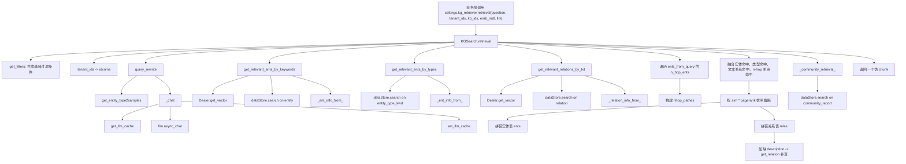
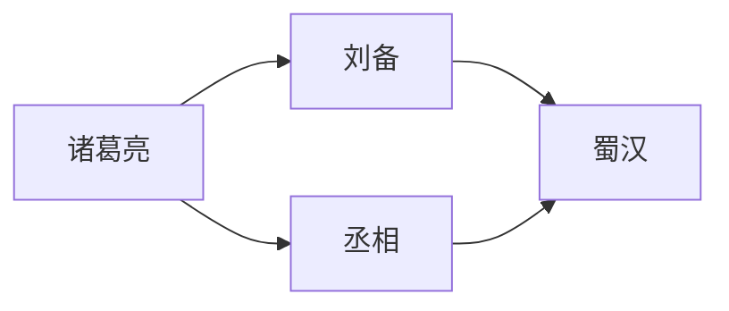
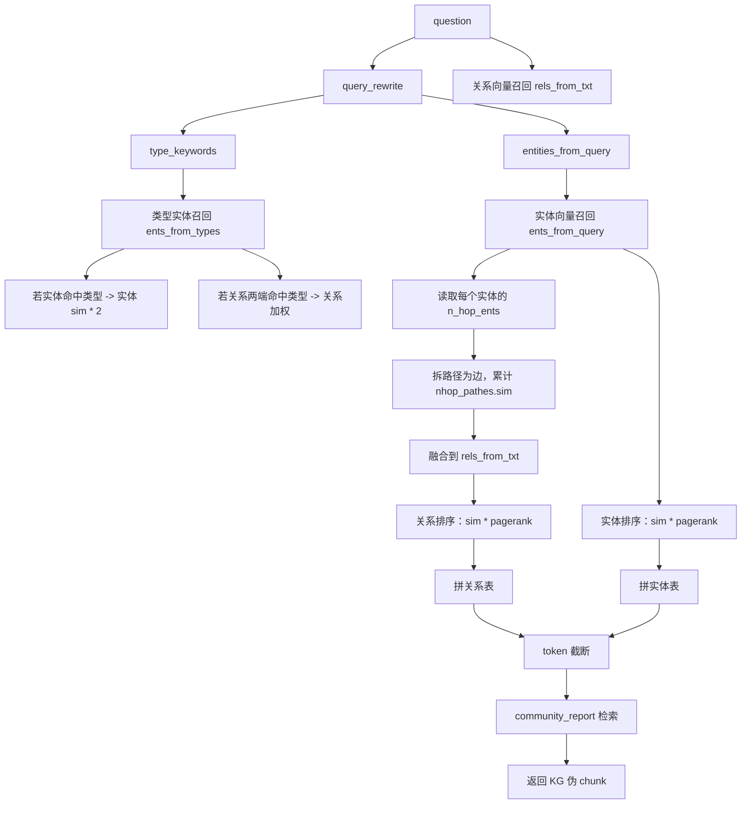
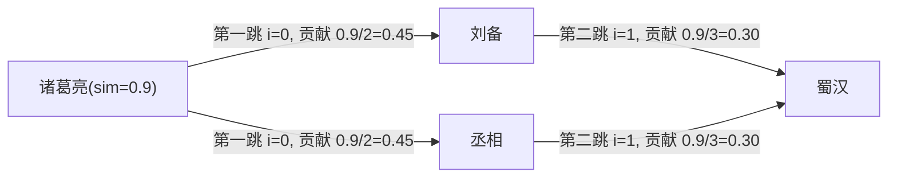

# KG Search 完整逻辑讲解

本文完整讲解 RAGFlow 中 `settings.kg_retriever.retrieval(...)` 这一条知识图谱检索链路。

目标：

- 讲清楚 KG search 是如何初始化、如何被调用、如何改写问题、如何召回实体和关系、如何做 n-hop 扩展、如何重排、如何拼装最终上下文的
- 每一个逻辑点都给出例子
- 每一个小查询逻辑、分支逻辑、计算逻辑都覆盖到

涉及代码：

- [common/settings.py](/C:/Users/able2207008/公司/opensource/ragflow/common/settings.py#L337)
- [rag/graphrag/search.py](/C:/Users/able2207008/公司/opensource/ragflow/rag/graphrag/search.py)
- [rag/graphrag/utils.py](/C:/Users/able2207008/公司/opensource/ragflow/rag/graphrag/utils.py)
- [rag/nlp/search.py](/C:/Users/able2207008/公司/opensource/ragflow/rag/nlp/search.py)
- [rag/graphrag/query_analyze_prompt.py](/C:/Users/able2207008/公司/opensource/ragflow/rag/graphrag/query_analyze_prompt.py)

---

## 1. 总览

`settings.kg_retriever` 的初始化：

```python
from rag.graphrag import search as kg_search
kg_retriever = kg_search.KGSearch(docStoreConn)
```

也就是说：

- `settings.kg_retriever` 是 `KGSearch` 的实例
- 外部调用 `settings.kg_retriever.retrieval(...)`
- 实际打到的是 `KGSearch.retrieval(...)`

---

## 2. 一张总流程图



---

## 3. 用一个完整例子贯穿全文

假设用户问题是：

```text
诸葛亮辅佐的是哪个政权？
```

假设图谱里有这些实体和关系：

- 实体
  - `诸葛亮`
  - `刘备`
  - `蜀汉`
  - `丞相`
- 关系
  - `诸葛亮 -> 刘备`
  - `刘备 -> 蜀汉`
  - `诸葛亮 -> 丞相`
  - `丞相 -> 蜀汉`
- community_report
  - `蜀汉政权关系总结`

下面每一步都用这个问题举例。

---

## 4. 初始化逻辑

代码位置：

- [common/settings.py](/C:/Users/able2207008/公司/opensource/ragflow/common/settings.py#L337)

逻辑：

1. 创建普通检索器 `retriever = search.Dealer(docStoreConn)`
2. 创建 KG 检索器 `kg_retriever = kg_search.KGSearch(docStoreConn)`

例子：

- 普通检索器负责正文 chunk 检索
- KG 检索器负责图谱实体、关系、community report 检索

---

## 5. `KGSearch.retrieval(...)` 的入口参数

代码位置：

- [search.py](/C:/Users/able2207008/公司/opensource/ragflow/rag/graphrag/search.py#L177)

参数含义：

- `question`
  - 用户问题
- `tenant_ids`
  - 租户 ID，可是字符串，也可是列表
- `kb_ids`
  - 知识库 ID 列表
- `emb_mdl`
  - embedding 模型
- `llm`
  - chat 模型，用于 query rewrite
- `max_token`
  - 最终拼装内容的 token 预算
- `ent_topn`
  - 最多保留多少实体
- `rel_topn`
  - 最多保留多少关系
- `comm_topn`
  - 最多保留多少社区报告
- `ent_sim_threshold`
  - 实体相似度阈值
- `rel_sim_threshold`
  - 关系相似度阈值

例子：

```python
await settings.kg_retriever.retrieval(
    "诸葛亮辅佐的是哪个政权？",
    ["tenant_a"],
    ["kb_1"],
    emb_mdl,
    llm,
    max_token=8196,
    ent_topn=6,
    rel_topn=6,
    comm_topn=1,
    ent_sim_threshold=0.3,
    rel_sim_threshold=0.3,
)
```

---

## 6. `qst = question`

代码位置：

- [search.py](/C:/Users/able2207008/公司/opensource/ragflow/rag/graphrag/search.py#L190)

逻辑：

- 只是把传进来的 `question` 保存为局部变量 `qst`
- 后面所有实体检索、关系检索、改写都基于这个问题

例子：

- 输入 `question = "诸葛亮辅佐的是哪个政权？"`
- 那么 `qst` 也是同一串文本

---

## 7. `filters = self.get_filters({"kb_ids": kb_ids})`

代码位置：

- 调用点：[search.py](/C:/Users/able2207008/公司/opensource/ragflow/rag/graphrag/search.py#L192)
- 实现：[rag/nlp/search.py](/C:/Users/able2207008/公司/opensource/ragflow/rag/nlp/search.py#L88)

逻辑：

`get_filters` 会把业务层参数转成底层搜索过滤条件。

这里只传了：

```python
{"kb_ids": kb_ids}
```

所以它会转成：

```python
{"kb_id": kb_ids}
```

例子：

- 输入：`kb_ids = ["kb_1", "kb_2"]`
- 输出过滤条件：`{"kb_id": ["kb_1", "kb_2"]}`

作用：

- 后续所有实体、关系、community_report 检索都只在这些知识库里查

---

## 8. `tenant_ids` 标准化与 `idxnms`

代码位置：

- [search.py](/C:/Users/able2207008/公司/opensource/ragflow/rag/graphrag/search.py#L194)

逻辑 1：如果 `tenant_ids` 是字符串，就按逗号拆分

例子：

- 输入：`"tenant_a,tenant_b"`
- 变成：`["tenant_a", "tenant_b"]`

逻辑 2：把租户 ID 变成索引名

调用的是：

- [rag/nlp/search.py](/C:/Users/able2207008/公司/opensource/ragflow/rag/nlp/search.py#L34)

```python
def index_name(uid): return f"ragflow_{uid}"
```

例子：

- `tenant_a -> ragflow_tenant_a`
- `tenant_b -> ragflow_tenant_b`

最终：

```python
idxnms = ["ragflow_tenant_a", "ragflow_tenant_b"]
```

作用：

- 这是底层 ES / Infinity / OceanBase 检索真正使用的索引名

---

## 9. `query_rewrite(...)` 完整逻辑

代码位置：

- 调用点：[search.py](/C:/Users/able2207008/公司/opensource/ragflow/rag/graphrag/search.py#L199)
- 实现：[search.py](/C:/Users/able2207008/公司/opensource/ragflow/rag/graphrag/search.py#L46)

### 9.1 `get_entity_type2samples(...)`

代码位置：

- [utils.py](/C:/Users/able2207008/公司/opensource/ragflow/rag/graphrag/utils.py#L685)

逻辑：

1. 到普通检索器 `settings.retriever.search(...)` 中查 `knowledge_graph_kwd = "ty2ents"` 的记录
2. 只取 `content_with_weight`
3. 把 JSON 字符串解析出来
4. 聚合成 `{实体类型: [示例实体...]}` 的字典

例子：

假设底层存了两条 `ty2ents`：

```json
{"人物": ["诸葛亮", "刘备"], "组织": ["蜀汉"]}
```

```json
{"人物": ["曹操"], "地点": ["成都"]}
```

聚合结果就是：

```python
{
    "人物": ["诸葛亮", "刘备", "曹操"],
    "组织": ["蜀汉"],
    "地点": ["成都"]
}
```

作用：

- 给 LLM 一份“当前图谱真实存在的类型样本池”

### 9.2 渲染 `minirag_query2kwd` prompt

代码位置：

- [query_analyze_prompt.py](/C:/Users/able2207008/公司/opensource/ragflow/rag/graphrag/query_analyze_prompt.py)

逻辑：

- 把 `question`
- 和 `TYPE_POOL = ty2ents`
- 填进 prompt 模板里

例子：

```text
问题：诸葛亮辅佐的是哪个政权？
答案类型池：{
  "人物": ["诸葛亮", "刘备", "曹操"],
  "组织": ["蜀汉"],
  "地点": ["成都"]
}
```

模型会被要求输出：

```json
{
  "answer_type_keywords": ["组织", "人物"],
  "entities_from_query": ["诸葛亮", "政权"]
}
```

### 9.3 `_chat(...)`

代码位置：

- [search.py](/C:/Users/able2207008/公司/opensource/ragflow/rag/graphrag/search.py#L31)

逻辑：

1. 先查 LLM 缓存 `get_llm_cache(...)`
2. 缓存命中就直接返回
3. 未命中则调用 `llm_bdl.async_chat(system, history, gen_conf)`
4. 如果返回中包含 `**ERROR**` 就抛异常
5. 正常结果写入 `set_llm_cache(...)`

#### 9.3.1 `get_llm_cache(...)`

代码位置：

- [utils.py](/C:/Users/able2207008/公司/opensource/ragflow/rag/graphrag/utils.py#L96)

逻辑：

1. 用 `llm_name + system + history + genconf` 拼接
2. 做 `xxhash`
3. 用 hash 作为 Redis key
4. 从 Redis 取缓存

例子：

- 同一个模型
- 同一个 query rewrite prompt
- 同一个生成参数
- 第二次来时就不需要再打模型

#### 9.3.2 `set_llm_cache(...)`

代码位置：

- [utils.py](/C:/Users/able2207008/公司/opensource/ragflow/rag/graphrag/utils.py#L114)

逻辑：

- 用同样的 hash key
- 把模型返回结果写进 Redis
- TTL 是 `24 * 3600`

例子：

- 第一次 query rewrite 输出：
  ```json
  {"answer_type_keywords": ["组织"], "entities_from_query": ["诸葛亮"]}
  ```
- 后面相同请求 24 小时内可直接复用

### 9.4 解析模型输出

逻辑 1：正常 JSON 解析

```python
keywords_data = json_repair.loads(result)
```

例子：

```json
{"answer_type_keywords":["组织"],"entities_from_query":["诸葛亮"]}
```

解析结果：

- `type_keywords = ["组织"]`
- `entities_from_query = ["诸葛亮"]`

逻辑 2：如果标准 JSON 解析失败，做一次字符串清洗后再解析

例子：

如果模型返回：

```text
user
{"answer_type_keywords":["组织"],"entities_from_query":["诸葛亮"]}
model
```

就会：

1. 去掉 prompt 片段
2. 去掉 `user`、`model`
3. 截取最外层 `{...}`
4. 再用 `json_repair.loads(...)` 解析

逻辑 3：如果还是失败，就抛异常给上层

上层兜底逻辑：

- `retrieval()` 里会捕获异常
- 把 `ents = [qst]`

例子：

- query rewrite 完全失败
- 那么后续实体关键词退化成：
  ```python
  ["诸葛亮辅佐的是哪个政权？"]
  ```

---

## 10. `get_relevant_ents_by_keywords(...)` 完整逻辑

代码位置：

- [search.py](/C:/Users/able2207008/公司/opensource/ragflow/rag/graphrag/search.py#L124)

作用：

- 用 query rewrite 提取出来的实体关键词，到实体索引里做向量召回

### 10.1 空关键词分支

逻辑：

- 如果 `keywords` 为空，直接返回 `{}`

例子：

- `keywords = []`
- 返回 `{}``

### 10.2 复制过滤条件

逻辑：

- `filters = deepcopy(filters)`

作用：

- 避免把调用方传进来的 `filters` 直接修改掉

### 10.3 限定只查实体

逻辑：

```python
filters["knowledge_graph_kwd"] = "entity"
```

例子：

最终过滤条件可能变成：

```python
{
    "kb_id": ["kb_1"],
    "knowledge_graph_kwd": "entity"
}
```

### 10.4 `self.get_vector(", ".join(keywords), emb_mdl, 1024, sim_thr)`

调用位置：

- [rag/nlp/search.py](/C:/Users/able2207008/公司/opensource/ragflow/rag/nlp/search.py#L46)

逻辑：

1. 把关键词拼成一段文本
2. 调用 `emb_mdl.encode_queries`
3. 校验返回向量是一维
4. 转成纯 float 列表
5. 生成 `MatchDenseExpr`

例子：

如果：

```python
keywords = ["诸葛亮", "政权"]
```

那么拼接文本是：

```text
诸葛亮, 政权
```

假设 embedding 结果是：

```python
[0.12, -0.33, 0.89, ...]
```

会生成：

```python
MatchDenseExpr(
    "q_1024_vec",
    [0.12, -0.33, 0.89, ...],
    "float",
    "cosine",
    1024,
    {"similarity": 0.3}
)
```

### 10.5 `dataStore.search(...)`

逻辑：

- 在实体索引上做向量搜索
- 取字段：
  - `content_with_weight`
  - `entity_kwd`
  - `rank_flt`

例子：

可能搜回来 3 条：

```python
[
  {"entity_kwd": "诸葛亮", "_score": 0.92, "rank_flt": 0.41, ...},
  {"entity_kwd": "刘备", "_score": 0.58, "rank_flt": 0.36, ...},
  {"entity_kwd": "蜀汉", "_score": 0.81, "rank_flt": 0.35, ...}
]
```

### 10.6 `_ent_info_from_(...)`

逻辑：

1. 从底层结果中提字段
2. 删除值为 `None` 的字段
3. `_score < sim_thr` 的跳过
4. 如果 `entity_kwd` 是 list，只取第一个
5. 组装成统一结构

结果例子：

```python
{
    "诸葛亮": {
        "sim": 0.92,
        "pagerank": 0.41,
        "n_hop_ents": [...],
        "description": "{...}"
    },
    "蜀汉": {
        "sim": 0.81,
        "pagerank": 0.35,
        "n_hop_ents": [...],
        "description": "{...}"
    }
}
```

---

## 11. `get_relevant_ents_by_types(...)` 完整逻辑

代码位置：

- [search.py](/C:/Users/able2207008/公司/opensource/ragflow/rag/graphrag/search.py#L165)

作用：

- 根据 query rewrite 给出的“答案类型关键词”，去补召回相关实体

例子：

- `types = ["组织"]`

### 11.1 空类型分支

- `types = [] -> return {}`

### 11.2 复制过滤条件并限定实体

```python
filters["knowledge_graph_kwd"] = "entity"
filters["entity_type_kwd"] = types
```

例子：

```python
{
  "kb_id": ["kb_1"],
  "knowledge_graph_kwd": "entity",
  "entity_type_kwd": ["组织"]
}
```

### 11.3 排序规则

```python
ordr.desc("rank_flt")
```

意思：

- 不按语义相似度搜
- 直接按图中实体权重 `rank_flt` 排序

例子：

如果类型是 `组织`，候选有：

- `蜀汉 rank_flt = 0.35`
- `曹魏 rank_flt = 0.42`

那么排序后是：

1. `曹魏`
2. `蜀汉`

### 11.4 `_ent_info_from_(es_res, 0)`

这里阈值传 `0`

意思：

- 不过滤低 `_score`
- 因为类型召回本来就不是语义相似检索

---

## 12. `get_relevant_relations_by_txt(...)` 完整逻辑

代码位置：

- [search.py](/C:/Users/able2207008/公司/opensource/ragflow/rag/graphrag/search.py#L154)

作用：

- 直接用整句问题去关系索引中做向量检索，找语义上最相关的关系边

例子：

- 输入：
  ```text
  诸葛亮辅佐的是哪个政权？
  ```

### 12.1 空文本分支

- `txt == "" -> return {}`

### 12.2 限定 relation 记录

```python
filters["knowledge_graph_kwd"] = "relation"
```

### 12.3 向量化问题文本

例子：

- 输入文本：
  ```text
  诸葛亮辅佐的是哪个政权？
  ```
- 转成 embedding
- 再变成 `MatchDenseExpr`

### 12.4 `dataStore.search(...)`

取字段：

- `content_with_weight`
- `_score`
- `from_entity_kwd`
- `to_entity_kwd`
- `weight_int`

例子：

可能搜回来：

```python
[
  {
    "from_entity_kwd": "诸葛亮",
    "to_entity_kwd": "蜀汉",
    "_score": 0.89,
    "weight_int": 12
  },
  {
    "from_entity_kwd": "刘备",
    "to_entity_kwd": "蜀汉",
    "_score": 0.63,
    "weight_int": 9
  }
]
```

### 12.5 `_relation_info_from_(...)`

逻辑：

1. `_score < sim_thr` 的跳过
2. `(from_entity, to_entity)` 排序成稳定元组
3. 如果起点/终点是 list，只取第一个
4. 组装结构

结果例子：

```python
{
    ("诸葛亮", "蜀汉"): {
        "sim": 0.89,
        "pagerank": 12,
        "description": "{...}"
    },
    ("刘备", "蜀汉"): {
        "sim": 0.63,
        "pagerank": 9,
        "description": "{...}"
    }
}
```

---

## 13. `n_hop_ents` 与 `nhop_pathes` 完整逻辑

代码位置：

- [search.py](/C:/Users/able2207008/公司/opensource/ragflow/rag/graphrag/search.py#L222)

### 13.1 什么是 n-hop

在图里：

- `1-hop`：一步直连
- `2-hop`：经过一个中间节点
- `3-hop`：经过两个中间节点

例子：



这里：

- `诸葛亮 -> 刘备` 是 1-hop
- `诸葛亮 -> 刘备 -> 蜀汉` 是 2-hop 路径

### 13.2 `nhop_pathes = defaultdict(dict)`

作用：

- 保存从 n-hop 路径中拆出来的边及其累计分数

结果结构例子：

```python
{
  ("诸葛亮", "刘备"): {"sim": 0.45, "pagerank": 10},
  ("刘备", "蜀汉"): {"sim": 0.30, "pagerank": 20}
}
```

### 13.3 遍历 `ents_from_query`

逻辑：

- 只对“通过实体关键词召回到的实体”做 n-hop 扩展

例子：

```python
ents_from_query = {
  "诸葛亮": {
    "sim": 0.9,
    "n_hop_ents": [...]
  }
}
```

### 13.4 读取 `n_hop_ents`

例子：

```python
n_hop_ents = [
  {
    "path": ["诸葛亮", "刘备", "蜀汉"],
    "weights": [10, 20]
  },
  {
    "path": ["诸葛亮", "丞相", "蜀汉"],
    "weights": [6, 18]
  }
]
```

### 13.5 非 list 异常分支

逻辑：

- 如果 `n_hop_ents` 不是 list，打 warning 后跳过该实体

例子：

- `n_hop_ents = None`
- 该实体不参与 n-hop 扩展

### 13.6 拆路径为边

例子：

路径：

```python
["诸葛亮", "刘备", "蜀汉"]
```

拆成：

- `("诸葛亮", "刘备")`
- `("刘备", "蜀汉")`

### 13.7 分数衰减计算

代码：

```python
ent["sim"] / (2 + i)
```

例子：

- `ent["sim"] = 0.9`

那么：

- 第一跳 `i = 0`
  - 分数 = `0.9 / 2 = 0.45`
- 第二跳 `i = 1`
  - 分数 = `0.9 / 3 = 0.30`

意义：

- 离原命中实体越近，边的贡献越大
- 走得越远，边的贡献越小

### 13.8 同一边重复出现时累加

例子：

如果两条路径都包含 `("刘备", "蜀汉")`

- 第一次加 0.30
- 第二次再加 0.25

最后：

```python
("刘备", "蜀汉")["sim"] = 0.55
```

### 13.9 保存 pagerank

代码：

```python
nhop_pathes[(f, t)]["pagerank"] = wts[i]
```

例子：

- `("刘备", "蜀汉")` 的边权重是 20

则：

```python
("刘备", "蜀汉")["pagerank"] = 20
```

---

## 14. 实体类型命中对实体分数的加权

代码位置：

- [search.py](/C:/Users/able2207008/公司/opensource/ragflow/rag/graphrag/search.py#L245)

逻辑：

如果某个实体：

- 既出现在 `ents_from_query`
- 又出现在 `ents_from_types`

则：

```python
ents_from_query[ent]["sim"] *= 2
```

例子：

- `蜀汉` 由关键词召回 `sim = 0.81`
- 同时又命中类型 `组织`

那么：

```python
0.81 * 2 = 1.62
```

意义：

- “问题文本”和“答案类型”都支持这个实体
- 所以它更可信

---

## 15. 文本关系命中与 n-hop 关系命中的融合

代码位置：

- [search.py](/C:/Users/able2207008/公司/opensource/ragflow/rag/graphrag/search.py#L250)

### 15.1 遍历 `rels_from_txt`

例子：

```python
rels_from_txt = {
  ("诸葛亮", "蜀汉"): {"sim": 0.89, "pagerank": 12},
  ("刘备", "蜀汉"): {"sim": 0.63, "pagerank": 9}
}
```

### 15.2 `pair = tuple(sorted([f, t]))`

作用：

- 把边规范成无向排序后的元组，方便和 `nhop_pathes` 对齐

例子：

- `("蜀汉", "刘备") -> ("刘备", "蜀汉")`

### 15.3 `s` 的累积来源

来源 1：n-hop 命中

如果：

```python
nhop_pathes[("刘备", "蜀汉")]["sim"] = 0.55
```

则：

```python
s += 0.55
```

来源 2：起点实体命中类型

如果 `f in ents_from_types`，则：

```python
s += 1
```

来源 3：终点实体命中类型

如果 `t in ents_from_types`，则：

```python
s += 1
```

### 15.4 关系分数放大

代码：

```python
rels_from_txt[(f, t)]["sim"] *= s + 1
```

例子：

假设：

- 原始 `sim = 0.63`
- n-hop 贡献 `0.55`
- 终点 `蜀汉` 命中类型，额外 `+1`

那么：

```python
s = 1.55
新 sim = 0.63 * (1.55 + 1) = 1.6065
```

意义：

- 文本相似
- 图路径支持
- 类型也支持

这条关系就会被明显抬高

---

## 16. 把“只来自 n-hop、没被文本直接召回”的关系补进结果

代码位置：

- [search.py](/C:/Users/able2207008/公司/opensource/ragflow/rag/graphrag/search.py#L264)

逻辑：

- 遍历剩余的 `nhop_pathes`
- 它们代表“没在 `rels_from_txt` 里出现过的边”
- 也把它们补成关系候选

例子：

如果：

```python
nhop_pathes = {
  ("丞相", "蜀汉"): {"sim": 0.30, "pagerank": 18}
}
```

而 `rels_from_txt` 里没有这条边，
那就补进去：

```python
rels_from_txt[("丞相", "蜀汉")] = {
  "sim": 0.30 * (s + 1),
  "pagerank": 18
}
```

如果 `蜀汉` 命中类型，则 `s = 1`

所以：

```python
sim = 0.30 * 2 = 0.60
```

---

## 17. 排序公式：`sim * pagerank`

代码位置：

- [search.py](/C:/Users/able2207008/公司/opensource/ragflow/rag/graphrag/search.py#L277)

实体排序公式：

```python
ent["sim"] * ent["pagerank"]
```

关系排序公式：

```python
rel["sim"] * rel["pagerank"]
```

例子 1：实体排序

- `诸葛亮: sim=0.92, pagerank=0.41 -> 0.3772`
- `蜀汉: sim=1.62, pagerank=0.35 -> 0.567`

所以 `蜀汉` 会排在前面。

例子 2：关系排序

- `("诸葛亮","蜀汉"): sim=0.89, pagerank=12 -> 10.68`
- `("刘备","蜀汉"): sim=1.6065, pagerank=9 -> 14.4585`

那么后者会排更前。

然后：

- 实体截断为 `ent_topn`
- 关系截断为 `rel_topn`

---

## 18. 拼装实体表 `ents`

代码位置：

- [search.py](/C:/Users/able2207008/公司/opensource/ragflow/rag/graphrag/search.py#L283)

逻辑：

每个实体会变成：

```python
{
  "Entity": 实体名,
  "Score": "sim * pagerank 的两位小数",
  "Description": 描述文本
}
```

例子：

```python
{
  "Entity": "蜀汉",
  "Score": "0.57",
  "Description": "三国时期刘备建立的政权"
}
```

### 18.1 token 预算扣减

每加入一条实体：

```python
max_token -= num_tokens_from_string(str(ents[-1]))
```

例子：

- 初始 `max_token = 100`
- 加入实体 1 消耗 25
- 剩余 75
- 加入实体 2 消耗 30
- 剩余 45

### 18.2 超预算分支

如果某次加入后：

```python
max_token <= 0
```

就：

1. 删除刚加入的那一条
2. 结束实体拼装

例子：

- 剩余 10 token
- 新实体占 20 token
- 那就把这条删掉，不保留

---

## 19. 拼装关系表 `relas`

代码位置：

- [search.py](/C:/Users/able2207008/公司/opensource/ragflow/rag/graphrag/search.py#L295)

逻辑：

每条关系会变成：

```python
{
  "From Entity": f,
  "To Entity": t,
  "Score": "sim * pagerank 的两位小数",
  "Description": 关系描述
}
```

例子：

```python
{
  "From Entity": "诸葛亮",
  "To Entity": "蜀汉",
  "Score": "10.68",
  "Description": "诸葛亮是蜀汉的重要政治与军事人物"
}
```

### 19.1 若关系没有 description，调用 `get_relation(...)`

代码位置：

- 调用点：[search.py](/C:/Users/able2207008/公司/opensource/ragflow/rag/graphrag/search.py#L298)
- 实现：[utils.py](/C:/Users/able2207008/公司/opensource/ragflow/rag/graphrag/utils.py#L340)

逻辑：

1. 把 `from_ent_name` 和 `to_ent_name` 合并成 `ents`
2. 用普通检索器 `settings.retriever.search(...)`
3. 条件是：
   - `knowledge_graph_kwd = ["relation"]`
   - `from_entity_kwd = ents`
   - `to_entity_kwd = ents`
4. 找到后解析 `content_with_weight`

例子：

查：

```python
get_relation("tenant_a", ["kb_1"], "诸葛亮", "蜀汉")
```

可能返回：

```json
{
  "description": "诸葛亮是蜀汉的重要政治与军事人物",
  "keywords": ["辅佐", "蜀汉", "丞相"]
}
```

### 19.2 JSON 描述解析

逻辑：

- 如果 `description` 是 JSON 字符串，就取其中 `description` 字段
- 如果不是合法 JSON，就保留原始字符串

例子：

输入：

```python
'{"description": "诸葛亮是蜀汉的重要政治与军事人物"}'
```

输出：

```python
"诸葛亮是蜀汉的重要政治与军事人物"
```

### 19.3 token 预算逻辑

和实体一样：

- 每加一条关系就扣 token
- 超预算就删掉刚加的那条并停止

---

## 20. 把实体表和关系表转成 CSV 文本块

代码位置：

- [search.py](/C:/Users/able2207008/公司/opensource/ragflow/rag/graphrag/search.py#L321)

逻辑：

- 如果有实体，就变成：

```text
---- Entities ----
,Entity,Score,Description
0,蜀汉,0.57,三国时期刘备建立的政权
1,诸葛亮,0.38,蜀汉丞相
```

- 如果没有实体，就变成空字符串

关系同理：

```text
---- Relations ----
,From Entity,To Entity,Score,Description
0,诸葛亮,蜀汉,10.68,诸葛亮是蜀汉的重要政治与军事人物
```

---

## 21. `_community_retrieval_(...)` 完整逻辑

代码位置：

- [search.py](/C:/Users/able2207008/公司/opensource/ragflow/rag/graphrag/search.py#L419)

作用：

- 根据最终筛出的实体，再去查 community report，补充更长、更总结性的图谱文本

### 21.1 设置过滤条件

```python
fltr["knowledge_graph_kwd"] = "community_report"
fltr["entities_kwd"] = entities
```

例子：

如果最终实体有：

```python
["蜀汉", "诸葛亮"]
```

那么会查：

```python
{
  "kb_id": ["kb_1"],
  "knowledge_graph_kwd": "community_report",
  "entities_kwd": ["蜀汉", "诸葛亮"]
}
```

### 21.2 排序

```python
odr.desc("weight_flt")
```

意思：

- 优先取更重要的 community report

### 21.3 搜索字段

只取：

- `docnm_kwd`
- `content_with_weight`

### 21.4 解析 report 内容

假设 `content_with_weight` 是：

```json
{
  "report": "蜀汉是三国时期的重要政权，诸葛亮长期辅佐刘备和刘禅。",
  "evidences": ["诸葛亮 -> 刘备", "刘备 -> 蜀汉"]
}
```

会被格式化成：

```text
# 1. 蜀汉政权关系总结
## Content
蜀汉是三国时期的重要政权，诸葛亮长期辅佐刘备和刘禅。
## Evidences
['诸葛亮 -> 刘备', '刘备 -> 蜀汉']
```

### 21.5 token 预算

这里也会继续扣减 `max_token`

例子：

- 前面实体+关系后还剩 120 token
- 一个 report 占 80 token
- 还能加进去

### 21.6 空结果分支

如果没有查到 community report：

```python
return ""
```

---

## 22. 最终返回的“伪 chunk”结构

代码位置：

- [search.py](/C:/Users/able2207008/公司/opensource/ragflow/rag/graphrag/search.py#L330)

返回结构例子：

```python
{
  "chunk_id": "随机 UUID",
  "content_ltks": "",
  "content_with_weight": "实体表 + 关系表 + community report",
  "doc_id": "",
  "docnm_kwd": "Related content in Knowledge Graph",
  "kb_id": ["kb_1"],
  "important_kwd": [],
  "image_id": "",
  "similarity": 1.0,
  "vector_similarity": 1.0,
  "term_similarity": 0,
  "vector": [],
  "positions": []
}
```

每个字段的意义：

- `chunk_id`
  - 临时生成，表示这是一个虚拟 chunk
- `content_ltks`
  - 空，因为不是普通正文 chunk
- `content_with_weight`
  - 真正给上游 LLM 的 KG 上下文
- `doc_id`
  - 空，因为不属于某个真实文档块
- `docnm_kwd`
  - 固定展示名
- `kb_id`
  - 关联的知识库范围
- `similarity = 1.0`
  - 固定高分，让它作为增强结果进入后续链路
- `vector = []`
  - 没有向量
- `positions = []`
  - 没有文档位置信息

---

## 23. 一张更细的计算流程图



---

## 24. 一张 n-hop 拆边图



最终可能得到：

- `("诸葛亮", "刘备") -> sim = 0.45`
- `("刘备", "蜀汉") -> sim = 0.30`
- `("诸葛亮", "丞相") -> sim = 0.45`
- `("丞相", "蜀汉") -> sim = 0.30`

---

## 25. 一次完整跑通的结果示例

假设：

- `query_rewrite`
  ```python
  type_keywords = ["组织"]
  entities_from_query = ["诸葛亮"]
  ```
- `get_relevant_ents_by_keywords`
  ```python
  {
    "诸葛亮": {"sim": 0.92, "pagerank": 0.41, "n_hop_ents": [...]},
    "蜀汉": {"sim": 0.81, "pagerank": 0.35, "n_hop_ents": [...]}
  }
  ```
- `get_relevant_ents_by_types`
  ```python
  {
    "蜀汉": {"sim": 0.0, "pagerank": 0.35}
  }
  ```
- `get_relevant_relations_by_txt`
  ```python
  {
    ("诸葛亮", "蜀汉"): {"sim": 0.89, "pagerank": 12},
    ("刘备", "蜀汉"): {"sim": 0.63, "pagerank": 9}
  }
  ```

中间加权后可能变成：

- `蜀汉.sim = 0.81 * 2 = 1.62`
- `("刘备","蜀汉").sim = 1.6065`

排序后可能得到：

- 实体 Top2
  - `蜀汉`
  - `诸葛亮`
- 关系 Top2
  - `("刘备","蜀汉")`
  - `("诸葛亮","蜀汉")`

最终 `content_with_weight` 可能像：

```text
---- Entities ----
,Entity,Score,Description
0,蜀汉,0.57,三国时期刘备建立的政权
1,诸葛亮,0.38,蜀汉丞相

---- Relations ----
,From Entity,To Entity,Score,Description
0,刘备,蜀汉,14.46,刘备建立了蜀汉
1,诸葛亮,蜀汉,10.68,诸葛亮长期辅佐蜀汉政权

---- Community Report ----
# 1. 蜀汉政权关系总结
## Content
蜀汉是三国时期的重要政权，诸葛亮长期辅佐刘备和刘禅。
## Evidences
['诸葛亮 -> 刘备', '刘备 -> 蜀汉']
```

---

## 26. 这条链路的核心特点总结

1. 不是只做实体召回
   - 它同时做了实体召回、类型召回、关系召回、n-hop 路径扩展、community report 检索

2. 不是只靠文本相似度
   - 它会把图里的 `pagerank` / `weight_int` 一起考虑进去

3. 会把 query rewrite 的结果用在多个地方
   - `entities_from_query` 用于实体召回
   - `answer_type_keywords` 用于类型实体召回和后续加权

4. 会用 n-hop 把“图上的隐式路径”补进关系候选
   - 即便某条关系没被文本直接搜到，也可能被图路径扩出来

5. 最终输出不是一堆实体对象，而是一个“可直接给大模型看的伪 chunk”
   - 所以上游能把 KG 检索结果像普通 RAG chunk 一样处理

---

## 27. 一句话版本

`KGSearch.retrieval(...)` 的本质是：

先用 LLM 把问题改写成“类型 + 实体”，再从知识图谱里同时召回实体、关系和 n-hop 路径，用图权重和语义分数做融合重排，最后拼成一个给大模型直接使用的知识图谱上下文块。
