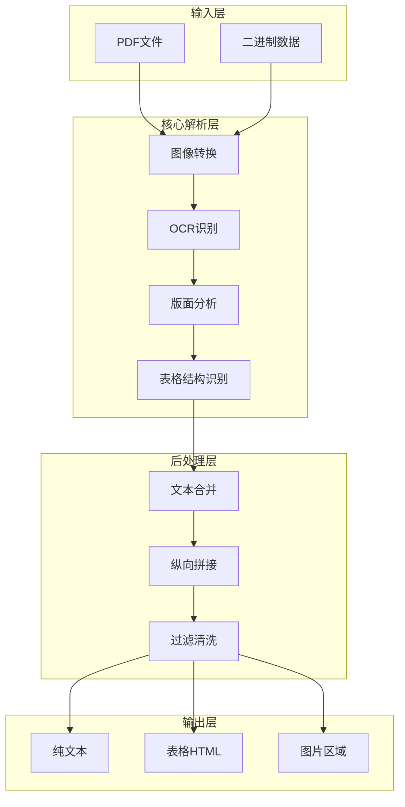
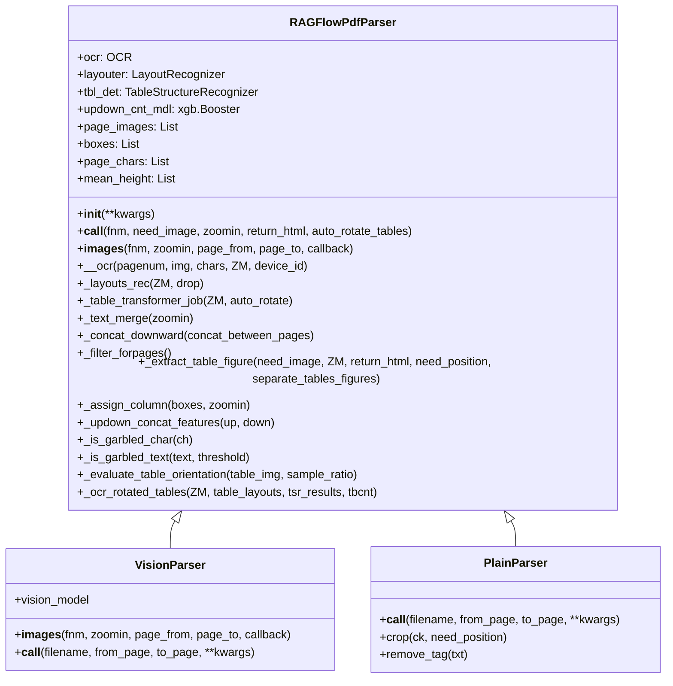
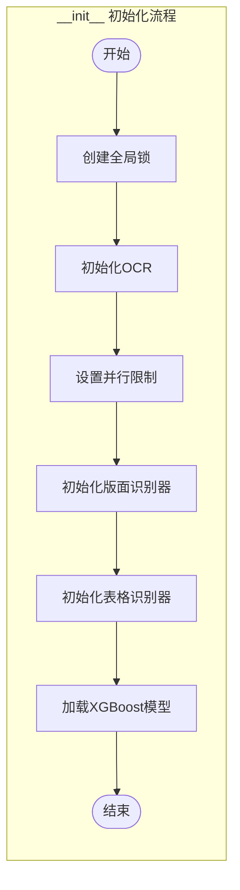
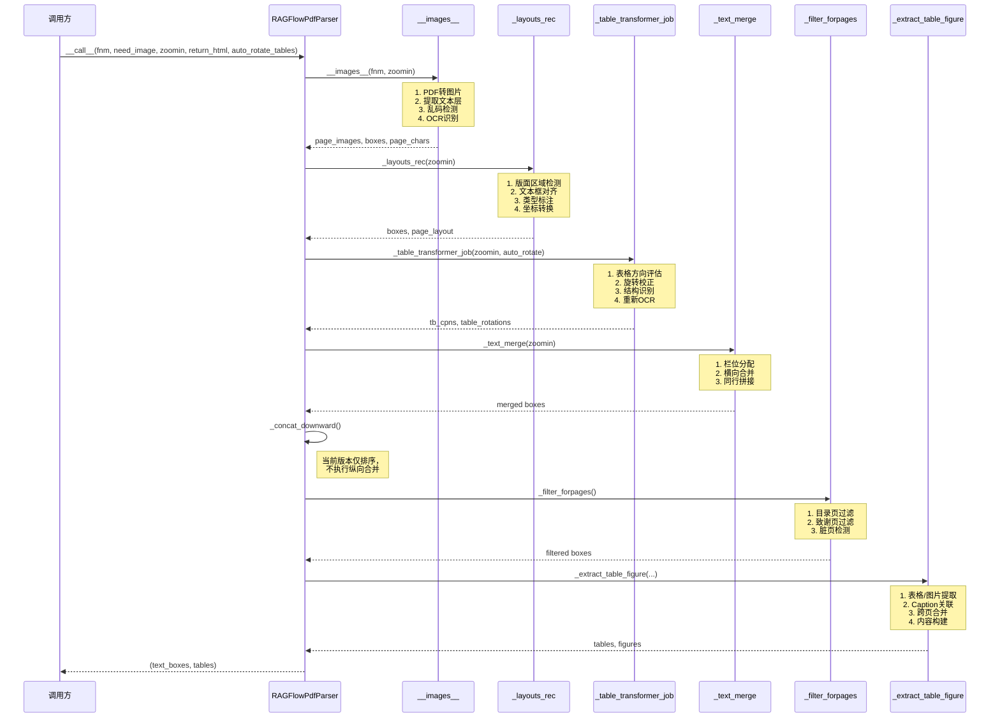

# RAGFlow PDF Parser 完整解析逻辑详解

> **文档版本**: v1.0  
> **目标文件**: `deepdoc/parser/pdf_parser.py`  
> **总行数**: 2515 行  
> **核心类**: `RAGFlowPdfParser`

---

## 目录

1. [架构总览](#一架构总览)
2. [初始化流程](#二初始化流程)
3. [主解析流程](#三主解析流程)
4. [图像处理与OCR](#四图像处理与ocr)
5. [版面分析](#五版面分析)
6. [表格处理](#六表格处理)
7. [文本合并](#七文本合并)
8. [列检测算法](#八列检测算法)
9. [关键工具方法](#九关键工具方法)
10. [工业级设计考量](#十工业级设计考量)

---

## 一、架构总览

### 1.1 系统架构图



### 1.2 类结构图



---

## 二、初始化流程

### 2.1 初始化流程图



### 2.2 关键初始化代码解析

#### 2.2.1 全局锁机制

```python
LOCK_KEY_pdfplumber = "global_shared_lock_pdfplumber"
if LOCK_KEY_pdfplumber not in sys.modules:
    sys.modules[LOCK_KEY_pdfplumber] = threading.Lock()
```

**为什么要用全局锁？**
- pdfplumber 在一些底层对象上不是完全线程安全的
- 这是稳定性优先的工程取舍：牺牲一点并发，避免多文档并发时出现诡异崩溃或句柄冲突

**工业考量**：
- PDF 解析库往往依赖底层 C 扩展，线程安全性难以保证
- 全局锁虽然降低了并发度，但确保了稳定性
- 对于生产环境，稳定性优于极致性能

#### 2.2.2 设备并行限制器

```python
self.parallel_limiter = None
if settings.PARALLEL_DEVICES > 1:
    # 每个设备一个信号量，控制同时只能有一个任务在用
    self.parallel_limiter = [
        asyncio.Semaphore(1) 
        for _ in range(settings.PARALLEL_DEVICES)
    ]
```

**核心逻辑**：
- 当配置多设备（多 GPU）时，创建多个信号量
- 每个信号量对应一个设备，确保该设备上同时只有一个 OCR 任务
- 避免显存溢出和设备竞争

#### 2.2.3 版面识别器选择

```python
layout_recognizer_type = os.getenv("LAYOUT_RECOGNIZER_TYPE", "onnx").lower()

if layout_recognizer_type == "ascend":
    # 华为昇腾 NPU 环境
    self.layouter = AscendLayoutRecognizer(recognizer_domain)
else:
    # 默认 ONNX 运行时（CPU/GPU）
    self.layouter = LayoutRecognizer(recognizer_domain)
```

**架构设计考量**：
- 支持异构硬件（x86 + NVIDIA GPU、华为昇腾 NPU）
- 通过环境变量控制，无需改代码即可切换
- 统一的抽象接口，调用方无感知

#### 2.2.4 XGBoost 模型加载

```python
self.updown_cnt_mdl = xgb.Booster()
# 显式设置使用 CPU，即使系统有 GPU
# 因为 XGBoost 模型很小，用 GPU 反而有数据传输开销
self.updown_cnt_mdl.set_param({"device": "cpu"})

try:
    # 尝试从本地加载
    model_dir = os.path.join(get_project_base_directory(), "rag/res/deepdoc")
    self.updown_cnt_mdl.load_model(os.path.join(model_dir, "updown_concat_xgb.model"))
except Exception:
    # 本地没有则从 HuggingFace 下载
    model_dir = snapshot_download(
        repo_id="InfiniFlow/text_concat_xgb_v1.0",
        local_dir=os.path.join(get_project_base_directory(), "rag/res/deepdoc"),
        local_dir_use_symlinks=False
    )
    self.updown_cnt_mdl.load_model(os.path.join(model_dir, "updown_concat_xgb.model"))
```

**工程实践要点**：

| 设计点 | 说明 |
|--------|------|
| 显式 CPU | 小模型用 GPU 有数据搬运开销，不如 CPU 直接算 |
| 本地优先 | 先尝试本地加载，避免每次都要网络请求 |
| 自动下载 | 本地没有时自动从 HuggingFace 下载，降低部署门槛 |
| 模型版本 | 使用 snapshot_download 确保版本一致性 |

---

## 三、主解析流程

### 3.1 主流程调用链



### 3.2 主流程代码详解

```python
def __call__(self, fnm, need_image=True, zoomin=3, return_html=False, auto_rotate_tables=None):
    """
    主入口函数 - PDF解析完整流程
    
    参数说明:
    -----------
    fnm: str | bytes
        PDF文件路径或二进制内容
    need_image: bool
        是否提取图片/表格图像，默认为True
    zoomin: int  
        图像放大倍数，默认3倍（216 DPI）
    return_html: bool
        表格是否返回HTML格式，默认False（文本格式）
    auto_rotate_tables: bool | None
        表格自动旋转校正开关，None时从环境变量读取
    
    返回值:
    --------
    tuple: (text_boxes, tables)
        - text_boxes: 解析后的文本块列表
        - tables: 提取的表格列表（图像+结构化内容）
    """
    
    # 步骤 1: 确定表格自动旋转设置
    # 优先使用参数传入值，其次从环境变量读取，默认开启
    if auto_rotate_tables is None:
        auto_rotate_tables = os.getenv(
            "TABLE_AUTO_ROTATE", "true"
        ).lower() in ("true", "1", "yes")
    
    # 步骤 2: 提取PDF大纲（目录结构）
    # 用于后续章节识别和文档结构理解
    self.outlines = extract_pdf_outlines(fnm)
    
    # 步骤 3: 图像转换与OCR识别（第一阶段）
    # 将PDF页面转为高清图像，提取文本层，执行OCR
    self.__images__(fnm, zoomin)
    
    # 步骤 4: 版面分析
    # 识别页面区域（标题、正文、表格、图片等）
    self._layouts_rec(zoomin)
    
    # 步骤 5: 表格结构识别
    # 检测表格行列结构，自动旋转校正，重新OCR
    self._table_transformer_job(zoomin, auto_rotate=auto_rotate_tables)
    
    # 步骤 6: 文本合并
    # 横向合并同行文本框
    self._text_merge()
    
    # 步骤 7: 纵向拼接（当前版本仅排序）
    self._concat_downward()
    
    # 步骤 8: 页面过滤
    # 去除目录页、致谢页、脏页
    self._filter_forpages()
    
    # 步骤 9: 表格/图片提取
    # 提取结构化内容，关联caption
    tbls = self._extract_table_figure(need_image, zoomin, return_html, False)
    
    # 步骤 10: 最终过滤与输出
    # 清洗噪声文本，返回结果
    return self.__filterout_scraps(deepcopy(self.boxes), zoomin), tbls
```

---

