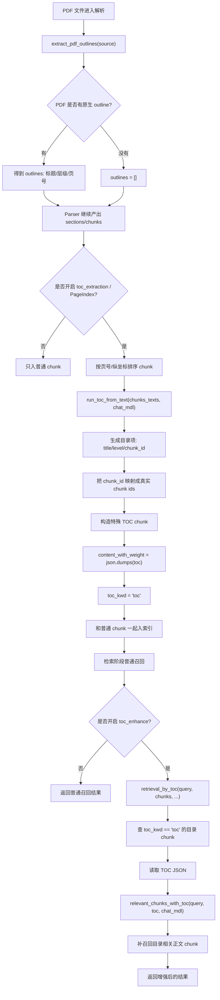
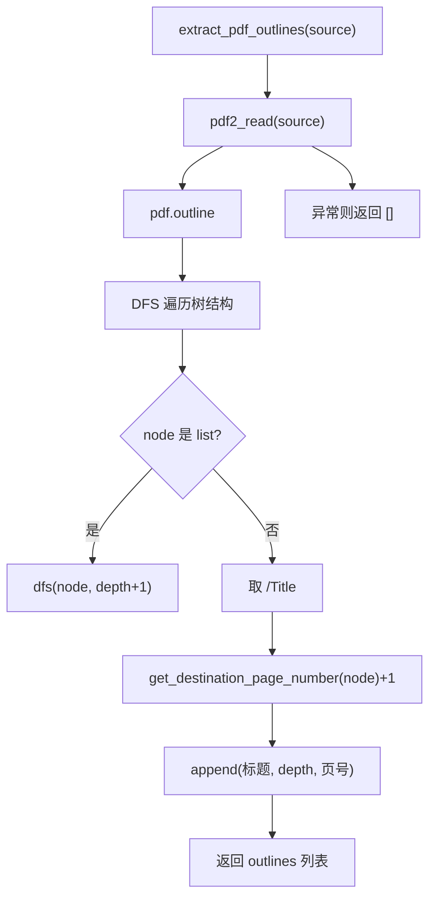
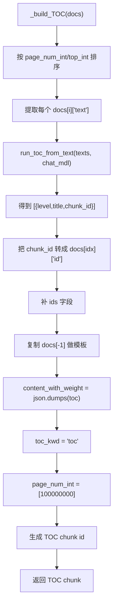
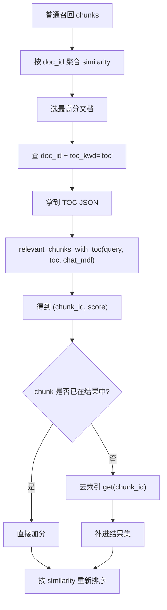

# PDF 目录提取完整逻辑讲解

本文讲的是“处理 PDF 时，RAGFlow 是怎么提取目录、生成目录结构、把目录写入索引、并在检索时再利用目录”的整条代码链。

不是只讲某一个函数，而是把代码库里这几条相关链路全部串起来：

- PDF 原生 outline / 书签目录提取
- 没有原生 outline 时，如何从正文标题模式恢复层级
- 开启 `toc_extraction` 时，如何用 LLM 生成 TOC chunk
- TOC chunk 怎么入库
- 检索时怎么用 `retrieval_by_toc()` 做目录增强

核心相关文件：

- [`/E:/py/ragflow/deepdoc/parser/utils.py`](/E:/py/ragflow/deepdoc/parser/utils.py)
- [`/E:/py/ragflow/deepdoc/parser/pdf_parser.py`](/E:/py/ragflow/deepdoc/parser/pdf_parser.py)
- [`/E:/py/ragflow/deepdoc/parser/docling_parser.py`](/E:/py/ragflow/deepdoc/parser/docling_parser.py)
- [`/E:/py/ragflow/rag/nlp/__init__.py`](/E:/py/ragflow/rag/nlp/__init__.py)
- [`/E:/py/ragflow/rag/flow/extractor/extractor.py`](/E:/py/ragflow/rag/flow/extractor/extractor.py)
- [`/E:/py/ragflow/rag/prompts/generator.py`](/E:/py/ragflow/rag/prompts/generator.py)
- [`/E:/py/ragflow/rag/nlp/search.py`](/E:/py/ragflow/rag/nlp/search.py)
- [`/E:/py/ragflow/api/db/services/task_service.py`](/E:/py/ragflow/api/db/services/task_service.py)
- [`/E:/py/ragflow/rag/svr/task_executor.py`](/E:/py/ragflow/rag/svr/task_executor.py)
- [`/E:/py/ragflow/conf/infinity_mapping.json`](/E:/py/ragflow/conf/infinity_mapping.json)

---

## 1. 先讲结论

代码库里其实有两套“目录”能力，而且它们不是一回事。

第一套：原生 PDF 目录

- 来源：PDF 自带的书签 / outline 元数据
- 入口：`extract_pdf_outlines(...)`
- 特点：可靠、结构强、成本低

第二套：PageIndex / TOC 增强目录

- 来源：正文 chunk + LLM 抽取章节结构
- 入口：`run_toc_from_text(...)` 和 `build_TOC(...)`
- 特点：适合没有原生 outline 的长文档，但更耗算力和 token

所以“PDF 目录提取”在代码里不是一个单点逻辑，而是两级结构：

1. 能直接读 PDF 原生目录就先读
2. 如果希望目录增强检索，再额外生成一个 TOC chunk 存进索引

---

## 2. 全局流程图



---

## 3. 目录到底分哪几类

代码里“目录”这个词至少有 4 种语义，必须先分清。

### 3.1 PDF 原生 outline

来源：

- PDF 文件结构里的 bookmark / outline

代码：

- [`/E:/py/ragflow/deepdoc/parser/utils.py`](/E:/py/ragflow/deepdoc/parser/utils.py)

输出：

```python
[
    ("第一章 绪论", 0, 1),
    ("1.1 背景", 1, 2),
]
```

### 3.2 页面里的“目录页文字”

来源：

- 正文页面上印着“目录”“Contents”那一页
- 可能来自文本层，也可能来自 OCR

特点：

- 这不是原生 outline
- 只是页面内容

### 3.3 标题层级恢复

来源：

- `第X章`
- `第X节`
- `1.`
- `1.1`
- markdown 标题
- layout 中的 `title/head`

代码：

- [`/E:/py/ragflow/rag/nlp/__init__.py`](/E:/py/ragflow/rag/nlp/__init__.py)
- [`/E:/py/ragflow/rag/flow/chunker/title_chunker/common.py`](/E:/py/ragflow/rag/flow/chunker/title_chunker/common.py)

### 3.4 TOC chunk / PageIndex

来源：

- 不是 PDF 自带
- 是用 LLM 从 chunk 文本里抽取出来，再单独存到索引里的特殊 chunk

标志：

- `toc_kwd = "toc"`

代码：

- [`/E:/py/ragflow/rag/flow/extractor/extractor.py`](/E:/py/ragflow/rag/flow/extractor/extractor.py)
- [`/E:/py/ragflow/rag/svr/task_executor.py`](/E:/py/ragflow/rag/svr/task_executor.py)

---

## 4. 原生 PDF 目录提取链

### 4.1 入口在哪里

多个 PDF parser 都会在解析开始时提取原生 outline：

- [`/E:/py/ragflow/deepdoc/parser/pdf_parser.py`](/E:/py/ragflow/deepdoc/parser/pdf_parser.py)
- [`/E:/py/ragflow/deepdoc/parser/docling_parser.py`](/E:/py/ragflow/deepdoc/parser/docling_parser.py)
- [`/E:/py/ragflow/deepdoc/parser/mineru_parser.py`](/E:/py/ragflow/deepdoc/parser/mineru_parser.py)
- [`/E:/py/ragflow/deepdoc/parser/paddleocr_parser.py`](/E:/py/ragflow/deepdoc/parser/paddleocr_parser.py)
- [`/E:/py/ragflow/deepdoc/parser/tcadp_parser.py`](/E:/py/ragflow/deepdoc/parser/tcadp_parser.py)

典型代码形态：

```python
self.outlines = extract_pdf_outlines(binary if binary is not None else filepath)
```

为什么放在最前面：

- outline 是文档级元信息
- 不依赖正文 OCR / 文本抽取结果
- 越早拿到越方便后面章节处理和调试

工业考量：

- 元信息提取和正文提取最好解耦
- outline 失败不该阻断正文解析

---

### 4.2 `extract_pdf_outlines(source)` 完整逻辑

文件：

- [`/E:/py/ragflow/deepdoc/parser/utils.py`](/E:/py/ragflow/deepdoc/parser/utils.py)

核心代码逻辑：

1. 用 `pdf2_read(...)` 打开 PDF
2. 访问 `pdf.outline`
3. 递归 DFS 遍历目录树
4. 对每个节点提取：
   - `/Title`
   - `depth`
   - `pdf.get_destination_page_number(node) + 1`
5. 返回拍平列表
6. 出错返回 `[]`

流程图：



例子：

假设 PDF 书签树是：

```text
第一章 绪论
  1.1 背景
  1.2 现状
第二章 方法
```

输出会是：

```python
[
    ("第一章 绪论", 0, 1),
    ("1.1 背景", 1, 2),
    ("1.2 现状", 1, 5),
    ("第二章 方法", 0, 10),
]
```

为什么返回扁平结构而不是树：

- 下游大多数逻辑更容易消费线性序列
- 树结构虽然更完整，但序列化、检索、比较都更麻烦

工业考量：

- 把复杂树结构尽早归一化成简单表，是很常见的中间层设计

---

## 5. 原生 outline 在代码里怎么被利用

原生 outline 并不是只存到 `self.outlines` 就结束。

在某些 chunking 场景里，它会直接参与“标题层级判断”。

### 5.1 `title_chunker` 里的 outline 优先逻辑

文件：

- [`/E:/py/ragflow/rag/flow/chunker/title_chunker/common.py`](/E:/py/ragflow/rag/flow/chunker/title_chunker/common.py)

关键逻辑：

1. `extract_outlines()`  
   从输入文件里调用 `extract_pdf_outlines(source)`

2. `resolve_outline_levels(line_records)`  
   用 outline 和正文行文本做相似度匹配

3. 如果匹配足够多，就直接把 outline 层级当作标题层级来源

关键判断：

```python
if not line_records or len(outlines) / len(line_records) <= 0.03:
    return None
```

这意味着：

- 只有当 outline 数量相对正文行数不算太稀少时，才认为 outline 值得参与

为什么用 `0.03` 这个比例：

- 如果全文上千行，只有 1 个 outline 节点，那用它去推整个章节结构意义不大
- 比例阈值是一个工程启发式，避免弱 outline 误导层级恢复

例子：

如果：

- `line_records = 1000`
- `outlines = 2`

那么：

- `2 / 1000 = 0.002`
- 不会用 outline 路线

如果：

- `line_records = 80`
- `outlines = 6`

那么：

- `6 / 80 = 0.075`
- 会继续尝试用 outline 匹配层级

### 5.2 outline 相似度计算

代码：

```python
left_pairs = {left[i] + left[i + 1] for i in range(len(left) - 1)}
right_pairs = {right[i] + right[i + 1] for i in range(min(len(left), len(right) - 1))}
return len(left_pairs & right_pairs) / max(len(left_pairs), len(right_pairs), 1)
```

这是在做“相邻双字集合”的重叠率。

为什么不用直接字符串相等：

- 正文标题可能比 outline 标题多一些标点、空格、位置标签
- 也可能有小改动
- 双字 bigram overlap 比精确相等更鲁棒

例子：

outline 标题：

```text
第一章 系统设计
```

正文行：

```text
第一章 系统设计@@1\t40\t300\t100\t130##
```

虽然不完全相等，但双字重叠率仍然会很高，所以能匹配成功。

工业考量：

- 文档结构匹配里，轻量字符相似度通常比严格相等更稳
- 又比引入复杂 embedding 匹配更便宜

---

## 6. 没有原生 outline 时，代码怎么恢复“目录/标题结构”

这部分不是 `extract_pdf_outlines()`，但它是“目录提取整条链”里极重要的补充。

### 6.1 `BULLET_PATTERN` 和 `bullets_category(...)`

文件：

- [`/E:/py/ragflow/rag/nlp/__init__.py`](/E:/py/ragflow/rag/nlp/__init__.py)

这里定义了多套标题模式，例如：

- `第X章`
- `第X节`
- `1.`
- `1.1`
- `（一）`
- markdown `#` `##`

`bullets_category(sections)` 的作用是：

- 在多套候选正则族里，选出当前文档最像哪一套

为什么不是把所有规则混着用：

- 混用会导致层级编号混乱
- 同一文档通常会有主导标题体系

例子：

如果文档里大量出现：

```text
第一章
第一节
第二节
```

那么它更可能选中中文章节模式那一组。

如果大量出现：

```text
1.
1.1
1.1.1
```

就选数字层级模式。

工业考量：

- 先选“标题风格族”，再做层级解析，比规则大杂烩更稳

---

### 6.2 `title_frequency(...)`

作用：

- 根据标题模式和 layout 信息，给每一行分配一个层级

关键输入：

- `bull`：选中的标题模式族
- `sections`：每个 section 的 `(text, layout)`

逻辑：

1. 如果命中 `BULLET_PATTERN[bull]` 中的某一层规则，就赋对应级别
2. 否则如果 layout 像 `title/head`，给一个“回退标题层级”
3. 再统计最常见的标题级别，作为 `most_level`

为什么还要参考 layout：

- 有些标题没有明确编号，但版面模型能识别成标题
- 不能只依赖正则

例子：

正文里可能有：

```text
系统设计
```

虽然它不匹配 `第X章`，但 layout 被识别成 `title`，也会当作标题层级。

---

### 6.3 `Node.build_tree()` 和 `Node.get_tree()`

作用：

- 把 `(level, text)` 序列构造成标题树
- 再把树转回“带标题上下文的块”

文件：

- [`/E:/py/ragflow/rag/nlp/__init__.py`](/E:/py/ragflow/rag/nlp/__init__.py)

为什么要先建树再取块：

- 文档章节本质上是层级结构
- 如果直接线性拼接，很难知道某个正文应该挂在哪个标题下面

例子：

输入：

```python
[
    (1, "第一章 绪论"),
    (2, "1.1 背景"),
    (99, "RAG 是一种检索增强生成方法"),
    (2, "1.2 方法"),
    (99, "系统采用双路召回"),
]
```

建树后再取块，可能得到：

```text
第一章 绪论
1.1 背景
RAG 是一种检索增强生成方法
```

以及：

```text
第一章 绪论
1.2 方法
系统采用双路召回
```

这已经很接近“目录结构引导 chunk”的思路了。

工业考量：

- 带标题路径的 chunk 比纯正文 chunk 更适合回答“第三章第一节讲什么”

---

## 7. 真正入库的 TOC chunk 是怎么生成的

这部分是整条链最关键的一段。

文件：

- [`/E:/py/ragflow/rag/flow/extractor/extractor.py`](/E:/py/ragflow/rag/flow/extractor/extractor.py)
- [`/E:/py/ragflow/rag/svr/task_executor.py`](/E:/py/ragflow/rag/svr/task_executor.py)

### 7.1 触发条件

从 [`/E:/py/ragflow/api/db/services/task_service.py`](/E:/py/ragflow/api/db/services/task_service.py) 可以看出：

如果：

- `doc["parser_config"].get("toc_extraction", False)` 为 `True`

那么任务会走“整篇文档作为一个大任务”的路径，不做普通分页切小任务。

为什么：

- TOC 抽取依赖全局文档结构
- 如果文档被切成很多分页子任务，目录生成就看不到全局上下文

工业考量：

- 目录生成天然是文档级任务，而不是页面级任务

---

### 7.2 `_build_TOC(self, docs)` 完整逻辑

文件：

- [`/E:/py/ragflow/rag/flow/extractor/extractor.py`](/E:/py/ragflow/rag/flow/extractor/extractor.py)

核心流程：

1. 回调：开始生成目录
2. 对 docs 按 `(page_num_int, top_int)` 排序
3. 取每个 chunk 的 `text`
4. 调 `run_toc_from_text([...], self.chat_mdl)`
5. 得到 `toc = [{level, title, chunk_id}, ...]`
6. 把 `chunk_id` 映射成真实 chunk `id`
7. 组装特殊 chunk：
   - `content_with_weight = json.dumps(toc)`
   - `toc_kwd = "toc"`
   - `available_int = 0`
   - `page_num_int = [100000000]`
8. 生成特殊 chunk id 并返回

流程图：



### 7.3 为什么要先排序

代码：

```python
docs = sorted(docs, key=lambda d: (
    d.get("page_num_int", 0)[0] ...,
    d.get("top_int", 0)[0] ...
))
```

为什么：

- LLM 看的是 chunk 文本序列
- 顺序错了，抽出来的目录一定乱

例子：

正确顺序：

```text
第1页上方标题
第1页下方正文
第2页上方标题
```

错误顺序如果变成：

```text
第2页上方标题
第1页上方标题
第1页下方正文
```

LLM 就可能把章节顺序完全搞反。

工业考量：

- 目录抽取的前提是“线性阅读顺序必须可靠”

### 7.4 `chunk_id` 到 `ids` 的映射逻辑

这是很关键的小逻辑。

代码思想：

- LLM 返回的是目录项对应的“chunk 序号”
- 系统要把这个序号转成真实入库 chunk id
- 而且一个目录项不只对应一个 chunk，通常对应一段 chunk 范围

代码大意：

```python
idx = int(toc[ii]["chunk_id"])
toc[ii]["ids"] = [docs[idx]["id"]]
for jj in range(idx+1, int(toc[ii+1]["chunk_id"])+1):
    toc[ii]["ids"].append(docs[jj]["id"])
```

这意味着：

- 当前目录项从 `idx` 开始
- 一直管到下一个目录项开始前的 chunk

例子：

假设 LLM 返回：

```python
[
    {"level": "1", "title": "第一章 绪论", "chunk_id": "0"},
    {"level": "2", "title": "1.1 背景", "chunk_id": "3"},
    {"level": "2", "title": "1.2 方法", "chunk_id": "5"},
]
```

真实 docs id：

```python
docs[0]["id"] = "ck_0"
docs[1]["id"] = "ck_1"
docs[2]["id"] = "ck_2"
docs[3]["id"] = "ck_3"
docs[4]["id"] = "ck_4"
docs[5]["id"] = "ck_5"
```

那映射后可能变成：

```python
[
    {"level": "1", "title": "第一章 绪论", "ids": ["ck_0", "ck_1", "ck_2", "ck_3"]},
    {"level": "2", "title": "1.1 背景", "ids": ["ck_3", "ck_4", "ck_5"]},
]
```

这里其实体现了一种“目录项控制一个 chunk 区间”的思想。

工业考量：

- 用户问“第三章”，系统要能把一整章相关 chunk 一次补回来
- 不是只补某一个标题行

### 7.5 为什么 `page_num_int = [100000000]`

这个值非常特殊。

它不是正常页号，而是把 TOC chunk 放到一个极大的页号。

为什么这样做：

- TOC chunk 不是正文的一部分
- 不希望它在普通按页排序时混进正文中间

工业考量：

- 特殊元数据 chunk 经常会被放在逻辑排序末尾
- 这是一个简单但有效的工程技巧

---

## 8. `run_toc_from_text(...)` 是怎么生成目录项的

文件：

- [`/E:/py/ragflow/rag/prompts/generator.py`](/E:/py/ragflow/rag/prompts/generator.py)

### 8.1 输入预算计算

代码：

```python
input_budget = int(chat_mdl.max_length * INPUT_UTILIZATION) - num_tokens_from_string(
    TOC_FROM_TEXT_USER + TOC_FROM_TEXT_SYSTEM
)
input_budget = 1024 if input_budget > 1024 else input_budget
```

含义：

1. 先按模型最大上下文和 prompt 模板大小估算还能塞多少正文
2. 再把预算上限硬截成 1024 token

为什么：

- TOC 抽取不需要把大模型上下文塞满
- 过长只会更贵、更慢、更不稳定

工业考量：

- 目录生成是高层摘要任务，小而精的输入往往更稳

### 8.2 `split_chunks(chunks, max_length)`

作用：

- 把长文档按 token 预算切成多个批次

为什么：

- 单次 TOC 提取可能吃不下整篇文档
- 需要分批让 LLM 先抽局部目录

### 8.3 并发调用 `gen_toc_from_text(...)`

代码：

```python
tasks.append(asyncio.create_task(gen_toc_from_text(...)))
await asyncio.gather(*tasks)
```

为什么并发：

- 不同文档片段之间目录抽取互不依赖
- 并发可以显著降低长文档 TOC 生成耗时

工业考量：

- 这是典型的“可并行的 LLM 批任务”

### 8.4 `txt_info["toc"] = ans`

含义：

- 每个 chunk batch 的 TOC 抽取结果先挂到本地结果对象上

后面统一：

```python
titles.extend(chunk.get("toc", []))
```

把所有 batch 的结果合并。

### 8.5 目录项过滤逻辑

过滤条件包括：

- 不是 dict
- `title` 为空
- `title == "-1"`
- 标题 token 太长
- 标题纯数字/符号

为什么：

- LLM 会产生噪声标题
- 目录项应短、像标题，而不是正文句子

例子：

会被过滤：

```python
{"title": "-1"}
{"title": "12345"}
{"title": "这是一个非常长的完整正文句子，明显不像目录标题..."}
```

### 8.6 `assign_toc_levels(raw_structure, chat_mdl, ...)`

作用：

- 让 LLM 给标题分层级

为什么还要单独做一次：

- 目录项标题抽出来了，不等于层级关系也已经清楚
- 标题之间的父子关系仍然需要推断

例子：

输入：

```python
[
    "第一章 绪论",
    "1.1 背景",
    "1.2 方法",
]
```

输出可能是：

```python
[
    {"level": "1", "title": "第一章 绪论"},
    {"level": "2", "title": "1.1 背景"},
    {"level": "2", "title": "1.2 方法"},
]
```

---

## 9. TOC chunk 是怎么入库的

这部分有两套实现点：

- flow extractor 版
- server task executor 版

### 9.1 flow extractor 版

文件：

- [`/E:/py/ragflow/rag/flow/extractor/extractor.py`](/E:/py/ragflow/rag/flow/extractor/extractor.py)

关键逻辑：

```python
if self._param.field_name == "toc":
    ...
    toc = await self._build_TOC(chunks)
    chunks.append(toc)
```

含义：

- 当 extractor 的目标字段就是 `toc` 时
- 先给普通 chunk 补 `doc_id` 和 `id`
- 再生成 TOC chunk
- 最后 append 到 chunk 列表

### 9.2 task executor 版

文件：

- [`/E:/py/ragflow/rag/svr/task_executor.py`](/E:/py/ragflow/rag/svr/task_executor.py)

关键逻辑：

1. 如果 `task["parser_id"].lower() == "naive"` 且 `toc_extraction=True`
2. 启动 `toc_thread = executor.submit(build_TOC, task, chunks, progress_callback)`
3. 普通 chunk 先入库
4. 再把 TOC chunk 单独插一次

这条链说明：

- TOC 不是替代正文 chunk
- 而是“额外加一个特殊 chunk”

工业考量：

- 目录增强信息最好是附加层，不要污染正文 chunk 结构

---

## 10. 索引层怎么区分 TOC chunk

文件：

- [`/E:/py/ragflow/conf/infinity_mapping.json`](/E:/py/ragflow/conf/infinity_mapping.json)

有一个专门字段：

```json
"toc_kwd": {"type": "varchar", "default": "", "analyzer": "whitespace-#"}
```

说明：

- 索引设计层就已经明确支持 TOC chunk

为什么单独用字段标记：

- 检索时要精确查目录 chunk
- 不能靠正文内容猜

工业考量：

- 特殊文档片段最好有显式 schema 标志
- 便于过滤、统计、迁移、回查

---

## 11. 检索时怎么用目录增强

文件：

- [`/E:/py/ragflow/rag/nlp/search.py`](/E:/py/ragflow/rag/nlp/search.py)
- [`/E:/py/ragflow/api/db/services/dialog_service.py`](/E:/py/ragflow/api/db/services/dialog_service.py)

### 11.1 触发条件

在 `dialog_service.py` 里：

```python
if prompt_config.get("toc_enhance"):
    cks = await retriever.retrieval_by_toc(...)
```

也就是说：

- 必须明确打开 `toc_enhance`

### 11.2 `retrieval_by_toc(...)` 主逻辑

流程：

1. 先拿普通检索召回的 `chunks`
2. 按 `doc_id` 聚合 similarity
3. 选当前最相关的那篇文档
4. 去索引里查：

```python
{"doc_id": doc_id, "toc_kwd": "toc"}
```

5. 取回 TOC chunk 的 `content_with_weight`
6. `json.loads(...)` 解析 TOC
7. 调：

```python
relevant_chunks_with_toc(query, toc, chat_mdl, topn * 2)
```

8. 得到最相关目录项对应的 chunk ids
9. 如果这些 chunk 原来没召回，就再去索引补查
10. 合并结果、重排相似度、返回 topn

流程图：



### 11.3 为什么只在最高分文档里做 TOC 增强

代码：

- 先按 `doc_id` 聚合分数
- 再只挑 1 个主文档

为什么：

- 如果对所有召回文档都做 TOC 扩展，范围会过宽
- 很容易把多个文档的大量章节都补回来，反而污染结果

工业考量：

- 目录增强本质上是“文档内扩展”
- 更适合在最可能的主文档内部做精扩展

---

## 12. `relevant_chunks_with_toc(...)` 是怎么从目录反推正文 chunk 的

文件：

- [`/E:/py/ragflow/rag/prompts/generator.py`](/E:/py/ragflow/rag/prompts/generator.py)

逻辑：

1. 把 TOC 转成只含：
   - `level`
   - `title`
2. 用 LLM 对每个目录项打分
3. 对目录项命中的 `ids` 聚合平均分
4. 过滤出 `score >= 0.3`
5. 返回 `(chunk_id, score)`

为什么目录项只喂 `level/title` 不喂 `ids`：

- `ids` 是内部索引标识，对模型没有语义价值
- 模型只需要理解目录文字结构

例子：

TOC：

```python
[
  {"level": "1", "title": "第一章 绪论", "ids": ["ck1", "ck2"]},
  {"level": "1", "title": "第三章 实验设计", "ids": ["ck8", "ck9", "ck10"]},
]
```

用户问：

```text
第三章第一节的原文
```

模型大概率会给：

- `"第三章 实验设计"` 高分

然后系统就会把：

- `ck8`, `ck9`, `ck10`

补回来。

工业考量：

- 这是“目录做粗定位，正文 chunk 做细内容”的典型双阶段检索

---

## 13. 原生 outline 和 TOC chunk 的关系

很多人会把它们当成一回事，但代码里不是。

### 原生 outline

- 来源：PDF 文件结构
- 读取成本低
- 可靠但并不总有
- 主要用于：
  - parser 保存到 `self.outlines`
  - 某些 title chunker 恢复层级

### TOC chunk

- 来源：正文 chunk + LLM
- 成本高
- 适合没有 outline 的长文档
- 主要用于：
  - 检索增强 `retrieval_by_toc`

工业上为什么两套都要保留：

- 原生 outline 是高质量先验
- LLM TOC 是缺省时的补救机制
- 两者不是替代关系，而是层级递进关系

---

## 14. 一个完整例子

假设有一份 PDF：

- 没有原生书签
- 正文里有：

```text
第一章 总则
1.1 适用范围
1.2 定义
第二章 付款条款
2.1 付款时间
2.2 违约责任
```

### 14.1 解析阶段

1. `extract_pdf_outlines(...)` 返回 `[]`
2. 普通 parser 仍然产出很多正文 chunk
3. 开启了 `toc_extraction`
4. `build_TOC(...)` 对 chunk 文本做 LLM 目录抽取
5. 生成 TOC：

```python
[
  {"level": "1", "title": "第一章 总则", "ids": ["ck1", "ck2"]},
  {"level": "2", "title": "1.1 适用范围", "ids": ["ck2"]},
  {"level": "2", "title": "1.2 定义", "ids": ["ck3"]},
  {"level": "1", "title": "第二章 付款条款", "ids": ["ck4", "ck5", "ck6"]},
  {"level": "2", "title": "2.1 付款时间", "ids": ["ck5"]},
  {"level": "2", "title": "2.2 违约责任", "ids": ["ck6"]},
]
```

6. 作为特殊 chunk 写入索引：

```python
d["content_with_weight"] = json.dumps(toc, ensure_ascii=False)
d["toc_kwd"] = "toc"
```

### 14.2 检索阶段

用户问：

```text
第二章第一节原文
```

普通检索可能只命中一点“付款时间”相关 chunk。

如果开启 `toc_enhance`：

1. `retrieval_by_toc()` 找到当前最相关文档
2. 查出该文档的 TOC chunk
3. `relevant_chunks_with_toc()` 识别“第二章 / 2.1 付款时间”最相关
4. 把 `ck4`, `ck5`, `ck6` 补回来

这样最后模型看到的就不只是一个碎片，而是整章上下文。

---

## 15. 每个关键设计为什么这么做

### 15.1 为什么原生 outline 和 TOC chunk 要分开

因为它们来源不同：

- 一个来自 PDF 元数据
- 一个来自正文重建

混在一起会污染语义，也不利于调试。

### 15.2 为什么 TOC chunk 要单独入索引

因为目录增强是检索阶段的能力，不是解析阶段一次性消费完就没了。

把它存进索引后：

- 后续对话可以反复利用
- 不必每次重新生成目录

### 15.3 为什么 `toc_kwd` 要做专门字段

因为检索时要精准过滤：

```python
{"doc_id": doc_id, "toc_kwd": "toc"}
```

没有这个字段，就得在正文里猜“哪个 chunk 是目录”，又慢又不稳。

### 15.4 为什么 TOC 增强只在主文档内部扩展

因为目录增强本质是“找同一文档里缺失的上下文”。

如果跨文档扩展：

- 很容易把别的文档的同名章节一起拉进来
- 噪声会明显增大

### 15.5 为什么目录项映射的是 chunk 区间，不是单个 chunk

因为一个章节往往覆盖多个正文 chunk。

用户问“第三章第一节”，需要的通常是一段上下文，不是单行标题。

---

## 16. 工业视角下的评价

这套实现很典型地体现了“强结构优先，弱结构兜底”的工业思路。

第一层：强结构

- 原生 PDF outline
- 有就直接用

第二层：弱结构恢复

- 标题模式
- layout title/head
- 标题树恢复

第三层：LLM 增强结构

- 生成 TOC chunk
- 检索时做结构扩展

这种分层设计的优点是：

- 对好文档很省成本
- 对坏文档也有补救路径
- 检索时能显著缓解 chunk 太碎的问题

代价是：

- 开启 `toc_extraction` 会额外消耗 token、内存和时间
- LLM 生成的 TOC 仍然可能有误差

这也是官方文档里明确提醒“PageIndex 很耗资源”的原因。

---

## 17. 一句话总结

这个代码库里“处理 PDF 时提取目录”的完整逻辑，不是单纯的 `extract_pdf_outlines()`。

它实际上是三层协同：

1. `extract_pdf_outlines()` 提取原生 PDF 书签目录
2. 正文标题模式和标题树逻辑负责恢复章节结构
3. `build_TOC()` / `run_toc_from_text()` 生成 TOC chunk，并在 `retrieval_by_toc()` 中做目录增强检索

所以如果你问“第三章第一节原文怎么查”，真正起作用的通常不是某一个函数，而是：

- 普通召回
- TOC chunk
- `relevant_chunks_with_toc()`
- 目录增强补召回

这整条链一起工作。

