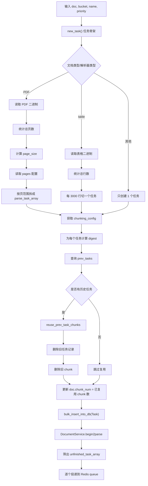
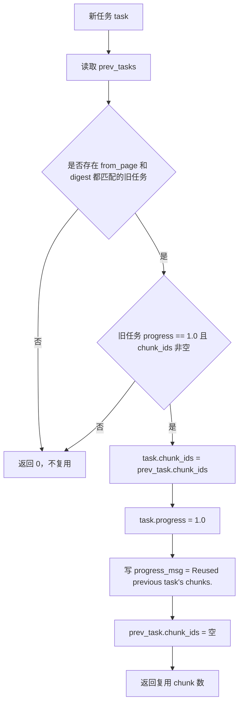

# `queue_tasks` 完整逻辑讲解

本文完整讲解 [task_service.py](/C:/Users/able2207008/公司/opensource/ragflow/api/db/services/task_service.py#L355) 中 `queue_tasks` 的全部逻辑。

目标：

- 讲清楚 `queue_tasks` 从输入参数到任务入 Redis 的完整流程
- 每一个分支都要解释
- 每一个小查询逻辑、每一个计算逻辑都要举例
- 不漏掉它依赖的关键辅助函数

相关代码：

- [task_service.py](/C:/Users/able2207008/公司/opensource/ragflow/api/db/services/task_service.py#L355)
- [task_service.py](/C:/Users/able2207008/公司/opensource/ragflow/api/db/services/task_service.py#L462)
- [document_service.py](/C:/Users/able2207008/公司/opensource/ragflow/api/db/services/document_service.py#L735)
- [document_service.py](/C:/Users/able2207008/公司/opensource/ragflow/api/db/services/document_service.py#L817)
- [file2document_service.py](/C:/Users/able2207008/公司/opensource/ragflow/api/db/services/file2document_service.py#L83)
- [settings.py](/C:/Users/able2207008/公司/opensource/ragflow/common/settings.py#L132)

---

## 1. `queue_tasks` 是干什么的

一句话概括：

`queue_tasks` 的作用是把一个文档拆成若干个“待解析任务”，尝试复用旧任务的 chunk，清理旧任务和旧 chunk，然后把未完成的新任务写入数据库并投递到 Redis 队列。

你可以把它理解成：

```text
文档 -> 任务切分 -> 任务去重/复用 -> 数据库入任务 -> Redis入队
```

---

## 2. 一张总流程图



---

## 3. 先看一个完整例子

假设我们有一个 PDF 文档：

```python
doc = {
    "id": "doc_001",
    "kb_id": "kb_100",
    "name": "三国志.pdf",
    "type": "pdf",
    "parser_id": "naive",
    "parser_config": {
        "layout_recognize": "DeepDOC",
        "task_page_size": 12,
        "pages": [(1, 25)]
    }
}
bucket = "kb_100"
name = "三国志.pdf"
priority = 0
```

假设：

- 总页数是 25
- 没有旧任务可复用

那么 `queue_tasks` 最后大致会生成 2 个任务：

```python
[
  {"doc_id": "doc_001", "from_page": 0,  "to_page": 12, ...},
  {"doc_id": "doc_001", "from_page": 12, "to_page": 24, ...}
]
```

然后把这 2 个任务插入数据库，再逐个投递到 Redis 队列。

---

## 4. 函数签名

代码位置：

- [task_service.py](/C:/Users/able2207008/公司/opensource/ragflow/api/db/services/task_service.py#L355)

```python
def queue_tasks(doc: dict, bucket: str, name: str, priority: int):
```

参数含义：

- `doc`
  - 文档信息字典，包含文档 ID、类型、parser、parser_config 等
- `bucket`
  - 对象存储桶名
- `name`
  - 对象存储中的文件名/对象名
- `priority`
  - Redis 队列优先级

---

## 5. `new_task()` 任务骨架逻辑

代码位置：

- [task_service.py](/C:/Users/able2207008/公司/opensource/ragflow/api/db/services/task_service.py#L376)

它生成一个基础任务模板：

```python
{
    "id": get_uuid(),
    "doc_id": doc["id"],
    "progress": 0.0,
    "from_page": 0,
    "to_page": 100000000,
    "begin_at": datetime.now().strftime("%Y-%m-%d %H:%M:%S"),
}
```

每个字段的作用：

- `id`
  - 任务唯一 ID
- `doc_id`
  - 属于哪篇文档
- `progress`
  - 初始进度 0
- `from_page`
  - 起始页/起始行，后面会被覆盖
- `to_page`
  - 结束页/结束行，后面通常会被覆盖
- `begin_at`
  - 任务创建时间

例子：

第一次调用 `new_task()` 可能得到：

```python
{
  "id": "task_a1",
  "doc_id": "doc_001",
  "progress": 0.0,
  "from_page": 0,
  "to_page": 100000000,
  "begin_at": "2026-04-17 10:00:00"
}
```

---

## 6. `parse_task_array = []`

作用：

- 用来承接最终要入库和入队的任务列表

例子：

开始时：

```python
parse_task_array = []
```

切完任务后可能变成：

```python
[
  {"doc_id": "doc_001", "from_page": 0, "to_page": 12, ...},
  {"doc_id": "doc_001", "from_page": 12, "to_page": 24, ...}
]
```

---

## 7. 第一个大分支：PDF 文档逻辑

代码位置：

- [task_service.py](/C:/Users/able2207008/公司/opensource/ragflow/api/db/services/task_service.py#L388)

分支条件：

```python
if doc["type"] == FileType.PDF.value:
```

这意味着：

- 只看文档类型是不是 PDF
- 并不看 `parser_id` 是否是 `pdf`

---

## 8. 读取 PDF 二进制

代码：

```python
file_bin = settings.STORAGE_IMPL.get(bucket, name)
```

作用：

- 从对象存储把 PDF 原始文件取回来

例子：

- `bucket = "kb_100"`
- `name = "三国志.pdf"`

调用后得到：

```python
file_bin = b"%PDF-1.7 ..."
```

---

## 9. 读取布局识别配置

代码：

```python
do_layout = doc["parser_config"].get("layout_recognize", "DeepDOC")
```

作用：

- 决定后面如何拆任务
- 默认是 `"DeepDOC"`

例子：

如果：

```python
doc["parser_config"] = {"layout_recognize": "DeepDOC"}
```

那么：

```python
do_layout = "DeepDOC"
```

如果没配：

```python
do_layout = "DeepDOC"
```

---

## 10. 统计 PDF 总页数

代码：

```python
pages = PdfParser.total_page_number(doc["name"], file_bin)
if pages is None:
    pages = 0
```

作用：

- 获取总页数
- 如果统计失败，用 0 兜底，避免后面 `range()` 报错

例子：

- 正常 PDF：`pages = 25`
- 损坏 PDF：`pages = None -> 0`

---

## 11. 计算 `page_size`

代码：

```python
page_size = doc["parser_config"].get("task_page_size") or 12
if doc["parser_id"] == "paper":
    page_size = doc["parser_config"].get("task_page_size") or 22
```

逻辑：

### 普通情况

- 默认每个任务处理 12 页

例子：

```python
task_page_size 未配置
=> page_size = 12
```

### `paper` 解析器

- 默认每个任务处理 22 页

例子：

```python
doc["parser_id"] = "paper"
task_page_size 未配置
=> page_size = 22
```

### 显式配置优先

如果：

```python
doc["parser_config"]["task_page_size"] = 5
```

无论普通还是 `paper`，都会优先使用 5。

---

## 12. 特殊场景：强制整段页范围只建一个任务

代码：

```python
if doc["parser_id"] in ["one", "knowledge_graph"] or do_layout != "DeepDOC" or doc["parser_config"].get("toc_extraction", False):
    page_size = 10 ** 9
```

这行非常关键。

作用：

如果满足下面任一条件：

1. `parser_id == "one"`
2. `parser_id == "knowledge_graph"`
3. 布局识别不是 `DeepDOC`
4. 开启了 `toc_extraction`

那么：

```python
page_size = 1_000_000_000
```

也就是等价于：

- 不再按小页块切任务
- 整个页范围通常只会生成 1 个任务

例子：

### 例子 1：`knowledge_graph`

```python
doc["parser_id"] = "knowledge_graph"
pages = 100
```

即使有 100 页，也大概率只生成 1 个任务。

### 例子 2：`toc_extraction = True`

```python
doc["parser_config"]["toc_extraction"] = True
```

为了做目录抽取，不希望切得太碎，所以也会整段跑。

---

## 13. 读取 `page_ranges`

代码：

```python
page_ranges = doc["parser_config"].get("pages") or [(1, 10 ** 5)]
```

作用：

- 支持只解析部分页码
- 默认解析全部页

注意：

- 页码配置是 1-based
- 后面会转成内部 0-based

例子：

### 例子 1：默认全量

```python
page_ranges = [(1, 100000)]
```

### 例子 2：只处理前 10 页

```python
page_ranges = [(1, 10)]
```

### 例子 3：只处理多个分段

```python
page_ranges = [(1, 5), (20, 30)]
```

---

## 14. 按页范围生成 PDF 任务

核心代码：

```python
for s, e in page_ranges:
    s -= 1
    s = max(0, s)
    e = min(e - 1, pages)
    for p in range(s, e, page_size):
        task = new_task()
        task["from_page"] = p
        task["to_page"] = min(p + page_size, e)
        parse_task_array.append(task)
```

这里每一步都很重要。

### 14.1 `s -= 1`

把用户页码从 1-based 转成 0-based。

例子：

- 用户配 `(1, 10)`
- 内部变成起点 `0`

### 14.2 `s = max(0, s)`

防止页码小于 1。

例子：

- 用户误传 `(0, 10)`
- 转换后 `s = -1`
- 最终修正为 `0`

### 14.3 `e = min(e - 1, pages)`

结束页也从 1-based 转成内部表示，并且不能超过总页数。

例子：

- 文档总页数 `pages = 25`
- 用户配 `(1, 100)`
- 则 `e = min(99, 25) = 25`

### 14.4 `for p in range(s, e, page_size)`

按 `page_size` 步长切子任务。

例子：

- `s = 0`
- `e = 25`
- `page_size = 12`

那么 `p` 会依次是：

- `0`
- `12`
- `24`

### 14.5 `task["from_page"] = p`

设置任务起始页。

### 14.6 `task["to_page"] = min(p + page_size, e)`

设置任务结束页。

例子：

#### 第一个任务

- `from_page = 0`
- `to_page = min(0 + 12, 25) = 12`

#### 第二个任务

- `from_page = 12`
- `to_page = min(12 + 12, 25) = 24`

#### 第三个任务

- `from_page = 24`
- `to_page = min(24 + 12, 25) = 25`

最终任务例子：

```python
[
  {"from_page": 0, "to_page": 12, ...},
  {"from_page": 12, "to_page": 24, ...},
  {"from_page": 24, "to_page": 25, ...}
]
```

---

## 15. 第二个大分支：表格解析器逻辑

代码位置：

- [task_service.py](/C:/Users/able2207008/公司/opensource/ragflow/api/db/services/task_service.py#L410)

分支条件：

```python
elif doc["parser_id"] == "table":
```

注意：

- 这里不是看 `doc["type"]`
- 而是看 `parser_id`

这说明 Excel/表格文档进入这条逻辑，关键是解析器类型被设成了 `table`

### 15.1 读取原始表格文件

```python
file_bin = settings.STORAGE_IMPL.get(bucket, name)
```

### 15.2 统计总行数

```python
rn = RAGFlowExcelParser.row_number(doc["name"], file_bin)
```

例子：

- 一个 Excel 一共有 8500 行
- 则 `rn = 8500`

### 15.3 每 3000 行切一个任务

```python
for i in range(0, rn, 3000):
```

例子：

- `rn = 8500`
- 那么 `i` 会依次是：
  - `0`
  - `3000`
  - `6000`

生成任务：

```python
[
  {"from_page": 0,    "to_page": 3000, ...},
  {"from_page": 3000, "to_page": 6000, ...},
  {"from_page": 6000, "to_page": 8500, ...}
]
```

这里虽然字段名还叫 `from_page / to_page`，但对 table 解析器来说它语义上其实是“起始行/结束行”。

---

## 16. 第三个大分支：其他类型文档

代码：

```python
else:
    parse_task_array.append(new_task())
```

作用：

- 非 PDF
- 非 `table`
- 默认只建一个整体任务

例子：

- `docx`
- `txt`
- `ppt`（如果这里没走 table / pdf）

可能最终就是：

```python
[
  {"from_page": 0, "to_page": 100000000, ...}
]
```

后续由解析器自己决定怎么处理全文。

---

## 17. 获取 `chunking_config`

代码位置：

- 调用点：[task_service.py](/C:/Users/able2207008/公司/opensource/ragflow/api/db/services/task_service.py#L421)
- 实现：[document_service.py](/C:/Users/able2207008/公司/opensource/ragflow/api/db/services/document_service.py#L735)

作用：

- 为任务计算 `digest`
- 以及提供后续删除旧 chunk 时用的 `tenant_id` / `kb_id`

它查出的字段包含：

- `id`
- `kb_id`
- `parser_id`
- `parser_config`
- `size`
- `content_hash`
- `language`
- `embd_id`
- `tenant_id`
- `img2txt_id`
- `asr_id`
- `llm_id`

例子：

```python
chunking_config = {
  "id": "doc_001",
  "kb_id": "kb_100",
  "parser_id": "naive",
  "parser_config": {"layout_recognize": "DeepDOC"},
  "size": 1048576,
  "content_hash": "abc123",
  "language": "Chinese",
  "embd_id": "bge-m3",
  "tenant_id": "tenant_a",
  "img2txt_id": "",
  "asr_id": "",
  "llm_id": "qwen-plus"
}
```

---

## 18. 为每个任务计算 `digest`

代码位置：

- [task_service.py](/C:/Users/able2207008/公司/opensource/ragflow/api/db/services/task_service.py#L422)

`digest` 是任务复用的关键。

它的本质是：

```text
文档切块配置 + 任务页范围
=> 一个稳定摘要
```

### 18.1 先初始化 hash

```python
hasher = xxhash.xxh64()
```

### 18.2 遍历 `chunking_config` 的字段

```python
for field in sorted(chunking_config.keys()):
```

这里用 `sorted(...)` 是为了保证字段顺序稳定。

如果不排序，同样的字典可能因为遍历顺序不同导致 hash 不稳定。

### 18.3 特殊处理 `parser_config`

代码：

```python
if field == "parser_config":
    for k in ["raptor", "graphrag"]:
        if k in chunking_config[field]:
            del chunking_config[field][k]
```

这一步非常关键。

意思是：

- `raptor`
- `graphrag`

这两个配置不参与普通解析任务复用判断。

原因：

- 它们属于后续派生流程
- 不应影响基础 chunk 任务的 digest

例子：

如果：

```python
parser_config = {
  "layout_recognize": "DeepDOC",
  "raptor": {...},
  "graphrag": {...}
}
```

参与 digest 计算前，会变成：

```python
{"layout_recognize": "DeepDOC"}
```

### 18.4 把 chunking_config 每个字段编码进 hash

```python
hasher.update(str(chunking_config[field]).encode("utf-8"))
```

例子：

- `kb_id = kb_100`
- `parser_id = naive`
- `content_hash = abc123`

这些都会参与摘要。

### 18.5 再把任务自身范围信息编码进去

代码：

```python
for field in ["doc_id", "from_page", "to_page"]:
    hasher.update(str(task.get(field, "")).encode("utf-8"))
```

意思：

- 即使是同一篇文档
- 不同页范围任务也要得到不同 digest

例子：

同一文档两个任务：

- 任务 A：`from_page=0, to_page=12`
- 任务 B：`from_page=12, to_page=24`

它们的 digest 一定不同。

### 18.6 写回任务字段

```python
task["digest"] = task_digest
task["progress"] = 0.0
task["priority"] = priority
```

例子：

```python
task = {
  "doc_id": "doc_001",
  "from_page": 0,
  "to_page": 12,
  "digest": "9f82c1...",
  "progress": 0.0,
  "priority": 0
}
```

---

## 19. 查询历史任务 `prev_tasks`

代码：

```python
prev_tasks = TaskService.get_tasks(doc["id"])
```

作用：

- 看这个文档是否以前已经跑过任务
- 如果跑过，尝试复用已有 chunk

例子：

如果这篇文档之前已经解析过，那么 `prev_tasks` 可能是：

```python
[
  {
    "doc_id": "doc_001",
    "from_page": 0,
    "to_page": 12,
    "digest": "9f82c1...",
    "progress": 1.0,
    "chunk_ids": "ck1 ck2 ck3"
  }
]
```

---

## 20. 复用逻辑 `reuse_prev_task_chunks(...)`

代码位置：

- [task_service.py](/C:/Users/able2207008/公司/opensource/ragflow/api/db/services/task_service.py#L462)

作用：

- 如果新任务和旧任务本质相同，就直接复用旧 chunk，不必重新解析

### 20.1 查找匹配任务

匹配条件：

```python
prev_task.get("from_page", 0) == task.get("from_page", 0)
and prev_task.get("digest", 0) == task.get("digest", "")
```

注意这里只比较：

- `from_page`
- `digest`

因为 `digest` 里已经隐含了 `doc_id/from_page/to_page/配置`

例子：

新任务：

```python
{"from_page": 0, "digest": "abc"}
```

旧任务：

```python
{"from_page": 0, "digest": "abc", "progress": 1.0, "chunk_ids": "ck1 ck2"}
```

则匹配成功。

### 20.2 如果找不到匹配任务

```python
return 0
```

表示复用失败。

### 20.3 如果旧任务没完成或没有 chunk

```python
if prev_task["progress"] < 1.0 or not prev_task["chunk_ids"]:
    return 0
```

例子：

- 旧任务还在跑：`progress = 0.5`
- 或者跑完了但没产出 chunk
- 都不能复用

### 20.4 复用成功时怎么做

代码：

```python
task["chunk_ids"] = prev_task["chunk_ids"]
task["progress"] = 1.0
```

意思：

- 新任务直接继承旧 chunk
- 并标记为已完成

例子：

```python
task["chunk_ids"] = "ck1 ck2 ck3"
task["progress"] = 1.0
```

### 20.5 `progress_msg` 的构造

代码：

```python
if int(task['to_page']) - int(task['from_page']) >= 10 ** 6:
    task["progress_msg"] = f"Page({task['from_page']}~{task['to_page']}): "
else:
    task["progress_msg"] = ""
task["progress_msg"] = " ".join([time, prefix, "Reused previous task's chunks."])
```

例子：

如果是“大范围任务”：

```python
Page(0~100000000): Reused previous task's chunks.
```

如果是普通任务：

```python
10:30:00 Reused previous task's chunks.
```

### 20.6 为什么还要 `prev_task["chunk_ids"] = ""`

作用：

- 防止后面清理旧任务时重复统计或重复复用

### 20.7 返回值

```python
return len(task["chunk_ids"].split())
```

例子：

- `chunk_ids = "ck1 ck2 ck3"`
- 返回 `3`

这就是外层的 `ck_num` 累加值来源。

---

## 21. `ck_num` 的意义

代码：

```python
ck_num = 0
for task in parse_task_array:
    ck_num += reuse_prev_task_chunks(...)
```

作用：

- 统计这次任务里一共复用了多少个 chunk

例子：

如果两个任务分别复用：

- 3 个 chunk
- 5 个 chunk

那么：

```python
ck_num = 8
```

---

## 22. 删除旧任务记录

代码：

```python
TaskService.filter_delete([Task.doc_id == doc["id"]])
```

作用：

- 不管是否复用成功
- 旧任务记录都删掉
- 后续只保留本次生成的新任务记录

例子：

旧任务有 3 条：

- task_old_1
- task_old_2
- task_old_3

执行后全部删除。

---

## 23. 删除旧 chunk

代码：

```python
pre_chunk_ids = []
for pre_task in prev_tasks:
    if pre_task["chunk_ids"]:
        pre_chunk_ids.extend(pre_task["chunk_ids"].split())
if pre_chunk_ids:
    settings.docStoreConn.delete({"id": pre_chunk_ids}, search.index_name(chunking_config["tenant_id"]), chunking_config["kb_id"])
```

作用：

- 把旧任务产生的 chunk 从底层索引删除
- 避免新旧结果并存

例子：

旧任务的 `chunk_ids` 有：

```python
"ck1 ck2"
"ck3 ck4 ck5"
```

汇总后：

```python
pre_chunk_ids = ["ck1", "ck2", "ck3", "ck4", "ck5"]
```

然后从：

- `search.index_name(chunking_config["tenant_id"])`
- `chunking_config["kb_id"]`

对应索引里删掉这些 ID。

注意一个细节：

即使某些 chunk 被“复用成功”，这里仍然会删旧 chunk，因为后面数据库里插入的是“新任务状态”，而索引里的旧 chunk 不应该继续挂在旧任务上下文里。

---

## 24. 更新文档的 `chunk_num`

代码：

```python
DocumentService.update_by_id(doc["id"], {"chunk_num": ck_num})
```

作用：

- 先把文档的 `chunk_num` 更新成“已复用 chunk 数”

例子：

如果前面复用了 8 个 chunk：

```python
chunk_num = 8
```

后续新任务真正跑完后，这个值还会继续被别的流程更新。

---

## 25. 批量插入新任务

代码：

```python
bulk_insert_into_db(Task, parse_task_array, True)
```

作用：

- 把这次生成的所有任务写进 `Task` 表

例子：

```python
parse_task_array = [
  {"id": "t1", "doc_id": "doc_001", "from_page": 0, "to_page": 12, ...},
  {"id": "t2", "doc_id": "doc_001", "from_page": 12, "to_page": 24, ...}
]
```

这两条都会入库。

---

## 26. `DocumentService.begin2parse(...)`

代码位置：

- 调用点：[task_service.py](/C:/Users/able2207008/公司/opensource/ragflow/api/db/services/task_service.py#L453)
- 实现：[document_service.py](/C:/Users/able2207008/公司/opensource/ragflow/api/db/services/document_service.py#L817)

逻辑：

```python
info = {
    "progress_msg": "Task is queued...",
    "process_begin_at": get_format_time(),
}
if not keep_progress:
    info["progress"] = random.random() * 1 / 100.0
    info["run"] = TaskStatus.RUNNING.value
cls.update_by_id(doc_id, info)
```

作用：

- 把文档状态改成“已开始解析 / 已入队”
- 给一个很小的随机进度，避免前端看到 0 卡住

例子：

更新后文档可能变成：

```python
{
  "run": "1",
  "progress": 0.0042,
  "progress_msg": "Task is queued..."
}
```

---

## 27. 筛出 `unfinished_task_array`

代码：

```python
unfinished_task_array = [task for task in parse_task_array if task["progress"] < 1.0]
```

作用：

- 只把真正还需要执行的任务送进 Redis
- 已复用完成的任务不重复执行

例子：

```python
parse_task_array = [
  {"id": "t1", "progress": 1.0},
  {"id": "t2", "progress": 0.0},
  {"id": "t3", "progress": 0.0}
]
```

筛出来：

```python
unfinished_task_array = ["t2", "t3"]
```

---

## 28. 投递到 Redis 队列

代码：

```python
for unfinished_task in unfinished_task_array:
    assert REDIS_CONN.queue_product(
        settings.get_svr_queue_name(priority), message=unfinished_task
    ), "Can't access Redis. Please check the Redis' status."
```

### 28.1 队列名怎么算

代码位置：

- [settings.py](/C:/Users/able2207008/公司/opensource/ragflow/common/settings.py#L132)

```python
def get_svr_queue_name(priority: int) -> str:
    if priority == 0:
        return SVR_QUEUE_NAME
    return f"{SVR_QUEUE_NAME}_{priority}"
```

例子：

- `priority = 0 -> 默认队列`
- `priority = 1 -> 默认队列_1`

### 28.2 为什么要 `assert`

如果 `queue_product(...)` 返回 False，
说明 Redis 不可用，直接抛断言错误：

```text
Can't access Redis. Please check the Redis' status.
```

也就是说：

- 入库成功但没成功入 Redis 不会静默忽略
- 系统会立即报错

---

## 29. 一个完整 PDF 例子

输入：

```python
doc = {
  "id": "doc_001",
  "type": "pdf",
  "name": "三国志.pdf",
  "parser_id": "naive",
  "parser_config": {
    "layout_recognize": "DeepDOC",
    "task_page_size": 12,
    "pages": [(1, 25)]
  }
}
bucket = "kb_100"
name = "三国志.pdf"
priority = 0
```

假设：

- 总页数 `25`
- 没有历史任务可复用

那么流程会是：

1. 读取 PDF
2. 统计总页数 `25`
3. `page_size = 12`
4. `page_ranges = [(1, 25)]`
5. 生成 3 个任务：

```python
[
  {"from_page": 0, "to_page": 12, "progress": 0.0},
  {"from_page": 12, "to_page": 24, "progress": 0.0},
  {"from_page": 24, "to_page": 25, "progress": 0.0}
]
```

6. 计算每个任务 digest
7. 没有旧任务，不复用
8. `chunk_num = 0`
9. 插入数据库
10. 文档状态变为 `RUNNING`
11. 三个任务全部推入 Redis

---

## 30. 一个“有旧任务复用”的例子

假设以前已经跑过：

```python
prev_tasks = [
  {
    "from_page": 0,
    "digest": "abc",
    "progress": 1.0,
    "chunk_ids": "ck1 ck2 ck3"
  }
]
```

这次新生成的第一个任务也是：

```python
{"from_page": 0, "digest": "abc"}
```

那么：

1. `reuse_prev_task_chunks` 命中
2. 新任务直接变成：

```python
{
  "from_page": 0,
  "digest": "abc",
  "chunk_ids": "ck1 ck2 ck3",
  "progress": 1.0,
  "progress_msg": "10:30:00 Reused previous task's chunks."
}
```

3. 这个任务不会再投进 Redis
4. 返回 chunk 数 `3`
5. 文档 `chunk_num` 先更新成 `3`

---

## 31. 再画一张“任务复用”图



---

## 32. 这段逻辑最核心的设计意图

`queue_tasks` 的核心不是“简单建任务”，而是这四层职责同时存在：

1. 按文档类型切任务
2. 按切块配置生成稳定 `digest`
3. 尝试复用旧 chunk，避免重复解析
4. 只把真正未完成任务送入 Redis

所以它本质上是一个：

```text
任务切分器 + 任务去重器 + 任务复用器 + 任务投递器
```

---

## 33. 一句话总结

`queue_tasks` 的完整逻辑就是：

先根据文档类型把文档拆成若干解析任务，再用 `chunking_config + 页范围` 计算每个任务的摘要，尝试复用旧任务已经产出的 chunk，清掉旧任务和旧 chunk，更新文档状态，最后把尚未完成的新任务写库并投递到 Redis 队列。  
