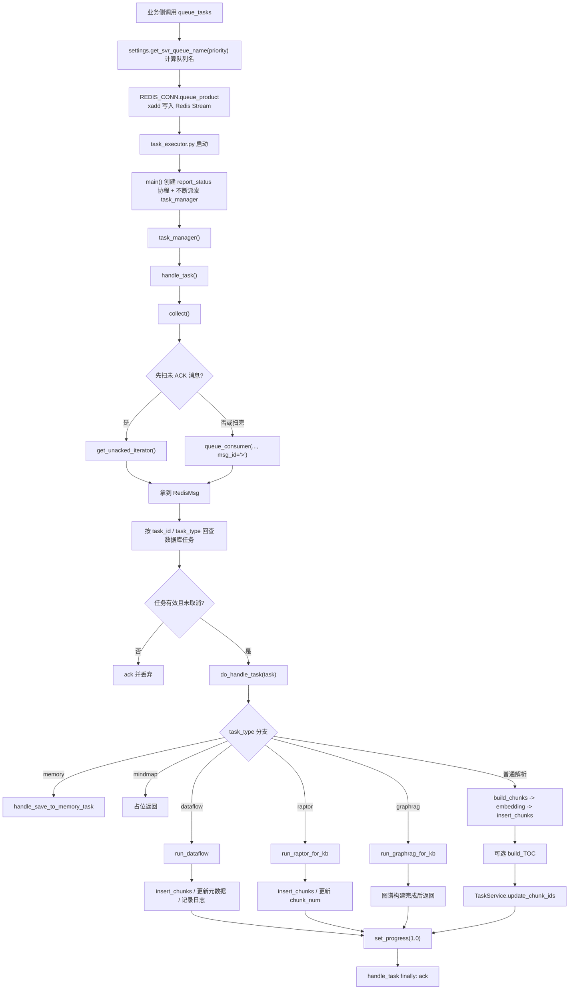
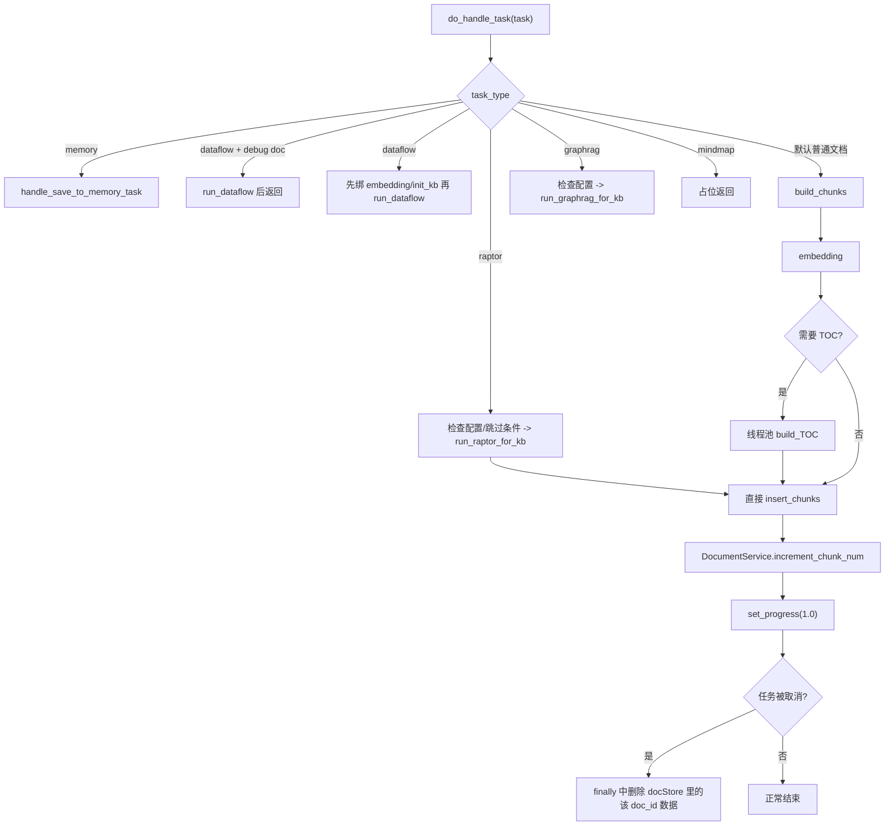

# Redis 任务消费者完整逻辑讲解

本文讲解“任务吐给 Redis 以后，谁来消费、怎么消费、消费后怎么执行”的完整链路。

重点代码：
- [task_service.py](/C:/Users/able2207008/公司/opensource/ragflow/api/db/services/task_service.py#L355)
- [settings.py](/C:/Users/able2207008/公司/opensource/ragflow/common/settings.py#L132)
- [redis_conn.py](/C:/Users/able2207008/公司/opensource/ragflow/rag/utils/redis_conn.py#L38)
- [redis_conn.py](/C:/Users/able2207008/公司/opensource/ragflow/rag/utils/redis_conn.py#L391)
- [task_executor.py](/C:/Users/able2207008/公司/opensource/ragflow/rag/svr/task_executor.py#L177)
- [task_executor.py](/C:/Users/able2207008/公司/opensource/ragflow/rag/svr/task_executor.py#L965)
- [task_executor.py](/C:/Users/able2207008/公司/opensource/ragflow/rag/svr/task_executor.py#L1221)

---

## 1. 先说结论：消费者代码在哪里

任务进入 Redis 以后，真正的消费者主程序在：

- [task_executor.py](/C:/Users/able2207008/公司/opensource/ragflow/rag/svr/task_executor.py)

更准确地说：

- `queue_tasks` 负责生产消息，写入 Redis Stream
- `RedisDB.queue_consumer` 负责从 Redis Stream 消费消息
- `task_executor.py` 负责把消息还原成任务，并执行完整解析流程

一句话概括：

```text
queue_tasks -> Redis Stream -> task_executor.collect -> task_executor.handle_task -> task_executor.do_handle_task
```

---

## 2. 总体架构图



---

## 3. 生产端是怎么把任务塞进 Redis 的

入口是：

- [task_service.py](/C:/Users/able2207008/公司/opensource/ragflow/api/db/services/task_service.py#L355)

`queue_tasks(doc, bucket, name, priority)` 的最后一步是：

1. 先把任务批量插入数据库 `Task` 表
2. 再调用 `DocumentService.begin2parse(doc["id"])`
3. 再把未完成任务逐个投递到 Redis

核心代码路径：

- `settings.get_svr_queue_name(priority)`
- `REDIS_CONN.queue_product(queue_name, message=unfinished_task)`

### 3.1 队列名怎么计算

代码：

- [settings.py](/C:/Users/able2207008/公司/opensource/ragflow/common/settings.py#L132)

逻辑：

- `priority == 0` 时，队列名就是 `rag_flow_svr_queue`
- `priority != 0` 时，队列名是 `rag_flow_svr_queue_{priority}`

例子：

- `priority=0` -> `rag_flow_svr_queue`
- `priority=1` -> `rag_flow_svr_queue_1`

### 3.2 消息如何写入 Redis

代码：

- [redis_conn.py](/C:/Users/able2207008/公司/opensource/ragflow/rag/utils/redis_conn.py#L391)

`queue_product` 的逻辑很简单：

1. 把任务对象 `message` 做 `json.dumps`
2. 包成 `{"message": "...json..."}` 这种 payload
3. 调用 `xadd(queue, payload)` 写入 Redis Stream
4. 最多重试 3 次

例子：

假设任务是：

```json
{
  "id": "task_001",
  "doc_id": "doc_001",
  "from_page": 0,
  "to_page": 12,
  "priority": 0
}
```

写到 Redis Stream 后，实际像：

```text
stream = rag_flow_svr_queue
field  = message
value  = "{\"id\":\"task_001\",\"doc_id\":\"doc_001\",\"from_page\":0,...}"
```

---

## 4. 消费者启动逻辑

入口：

- [task_executor.py](/C:/Users/able2207008/公司/opensource/ragflow/rag/svr/task_executor.py#L1366)

程序启动时：

1. 计算 `CONSUMER_NAME`
2. 初始化日志、配置、模型环境
3. 注册信号处理
4. 启动 `report_status()` 心跳协程
5. 进入死循环，不断创建 `task_manager()` 去抢任务

### 4.1 消费者名字怎么来的

代码：

- [task_executor.py](/C:/Users/able2207008/公司/opensource/ragflow/rag/svr/task_executor.py#L114)

逻辑：

- 如果命令行没传参数，`CONSUMER_NO = "0"`
- 消费者名是 `task_executor_` + 编号

例子：

- 启动 `python task_executor.py` -> `task_executor_0`
- 启动 `python task_executor.py 3` -> `task_executor_3`

### 4.2 为什么启动时会故意延迟

代码：

- [task_executor.py](/C:/Users/able2207008/公司/opensource/ragflow/rag/svr/task_executor.py#L1366)

逻辑：

- 从消费者名字最后一段提取 worker 编号
- 延迟时间 = `worker_num * 2.0 + random.uniform(0, 0.5)`
- 目的是避免所有 worker 同时启动，瞬间把 Infinity / 向量库压爆

例子：

- `task_executor_0` 可能延迟 `0.2s`
- `task_executor_3` 可能延迟 `6.3s`

---

## 5. 心跳与消费者存活管理

代码：

- [task_executor.py](/C:/Users/able2207008/公司/opensource/ragflow/rag/svr/task_executor.py#L1281)

`report_status()` 每 30 秒做几件事：

1. 把自己注册进 Redis 集合 `TASKEXE`
2. 查询队列 group 的 `pending` 和 `lag`
3. 把自己当前状态写进以 `CONSUMER_NAME` 命名的 zset
4. 清理自己过期心跳
5. 通过分布式锁清理其它超时 worker

### 5.1 心跳里写了什么

字段包括：

- `ip_address`
- `pid`
- `name`
- `now`
- `boot_at`
- `pending`
- `lag`
- `done`
- `failed`
- `current`

例子：

```json
{
  "name": "task_executor_0",
  "pending": 4,
  "lag": 12,
  "done": 97,
  "failed": 3,
  "current": {
    "task_001": {
      "doc_id": "doc_001",
      "task_type": ""
    }
  }
}
```

### 5.2 什么叫 `pending` 和 `lag`

- `pending`：已经被某个 consumer group 成员读走，但还没 `ack` 的消息数
- `lag`：Stream 里还没被这个消费组读到的积压消息数

例子：

- 队列里一共 100 条
- 已经读走但没确认 5 条
- 还没读的 20 条

那么：

- `pending = 5`
- `lag = 20`

### 5.3 为什么要清理超时 worker

因为某个 `task_executor` 进程可能已经挂了，但 Redis 里还残留它的心跳 key。

清理逻辑：

1. 遍历 `TASKEXE`
2. 读取每个 worker 最新心跳时间
3. 如果超过 `WORKER_HEARTBEAT_TIMEOUT`，就把它从 `TASKEXE` 删除，并删掉它对应 zset

例子：

- `task_executor_2` 最近 3 分钟没上报心跳
- 超时时间是 120 秒
- 它会被标记为过期并移除

---

## 6. Redis 消费的底层机制

代码：

- [redis_conn.py](/C:/Users/able2207008/公司/opensource/ragflow/rag/utils/redis_conn.py#L399)
- [redis_conn.py](/C:/Users/able2207008/公司/opensource/ragflow/rag/utils/redis_conn.py#L446)

这里不是普通 list 的 `BRPOP`，而是 Redis Stream + Consumer Group。

### 6.1 `queue_consumer` 做了什么

逻辑：

1. 先看 Stream 对应的消费组是否存在
2. 不存在就 `xgroup_create(..., mkstream=True)`
3. 然后调用 `xreadgroup`
4. `count=1`，一次只取一条
5. `block=5`，最多阻塞 5ms
6. `streams={queue_name: msg_id}`

### 6.2 `msg_id` 不同，语义不同

- `msg_id=">"`：读“新消息”
- `msg_id=0` 或其他较小 id：读“未确认消息”

这正是它为什么能补偿“进程崩了但消息没 ack”的原因。

例子：

- worker A 读到消息 `1700-1`，还没处理完就挂了
- 这条消息还留在 `pending`
- 新 worker 启动后，会先通过 `get_unacked_iterator` 把旧消息捞回来

### 6.3 `RedisMsg` 是什么

代码：

- [redis_conn.py](/C:/Users/able2207008/公司/opensource/ragflow/rag/utils/redis_conn.py#L31)

它是一个小包装对象，里面有：

- `get_message()`：取出反序列化后的 JSON 任务
- `get_msg_id()`：取 Redis Stream message id
- `ack()`：执行 `xack`

例子：

- Redis Stream message id 是 `1744891000000-0`
- 处理成功后 `redis_msg.ack()`
- 这条消息就从消费组 pending 里移除了

---

## 7. 为什么消费者先扫“未 ACK 任务”

代码：

- [task_executor.py](/C:/Users/able2207008/公司/opensource/ragflow/rag/svr/task_executor.py#L177)

`collect()` 的顺序非常关键：

1. 先取 `settings.get_svr_queue_names()`
2. 先用 `get_unacked_iterator(...)` 扫旧消息
3. 旧消息没有了，才去读新消息

而 `get_svr_queue_names()` 返回顺序是：

```python
[get_svr_queue_name(priority) for priority in [1, 0]]
```

也就是：

- 先扫优先级 1 队列
- 再扫优先级 0 队列

### 7.1 这个顺序意味着什么

意味着消费者会优先照顾高优先级队列的：

- 未确认任务
- 新任务

例子：

当前两个队列：

- `rag_flow_svr_queue_1` 里有 2 条高优任务
- `rag_flow_svr_queue` 里有 10 条普通任务

消费者会先处理优先级 1 的，再处理优先级 0 的。

---

## 8. `collect()` 的完整逻辑

代码：

- [task_executor.py](/C:/Users/able2207008/公司/opensource/ragflow/rag/svr/task_executor.py#L177)

可以拆成 8 步。

### 8.1 先决定从哪里拿消息

逻辑：

1. 如果 `UNACKED_ITERATOR` 还没建立，就创建它
2. 先 `next(UNACKED_ITERATOR)` 取历史未 ack
3. 如果迭代器耗尽，再遍历各个队列读新消息

例子：

- 上次崩溃遗留 1 条 pending
- 本次新进 3 条消息

那么这次会先拿遗留那 1 条，不会先拿新来的 3 条。

### 8.2 如果 Redis 没拿到消息

逻辑：

- 返回 `(None, None)`
- `handle_task()` 外层就会 sleep 5 秒

例子：

- 当前所有队列都空
- worker 不会忙等刷 CPU，而是稍等再试

### 8.3 如果拿到的是空消息

逻辑：

- `msg = redis_msg.get_message()`
- 如果消息对象为空，直接 `ack`
- 返回 `(None, None)`

这属于保护逻辑，避免脏数据卡住队列。

### 8.4 如何把 Redis 消息还原成真正任务

这里有 3 类特殊分支。

#### 分支 A：`CANVAS_DEBUG_DOC_ID` / `GRAPH_RAPTOR_FAKE_DOC_ID`

逻辑：

- 默认直接把 `msg` 当 task
- 但如果 `task_type` 属于 `PIPELINE_SPECIAL_PROGRESS_FREEZE_TASK_TYPES`
- 会再去 `TaskService.get_task(msg["id"], msg["doc_ids"])`

例子：

- graph raptor 场景可能没有真实单文档 `doc_id`
- 所以消息体本身就带足够多上下文

#### 分支 B：`task_type == "memory"`

逻辑：

- 直接按 `msg["id"]` 去数据库拿任务对象
- 再 `to_dict()`

例子：

- 保存会话记忆并不是普通文档解析
- 所以它走 memory 专门分支

#### 分支 C：普通任务

逻辑：

- `TaskService.get_task(msg["id"])`

而 `get_task` 本身还会：

1. join `Document`
2. join `Knowledgebase`
3. join `Tenant`
4. 更新重试次数
5. 更新“任务已收到”的进度消息

### 8.5 为什么这里还要查数据库，而不是直接信 Redis 里的消息

因为 Redis 里的消息只是投递快照。

数据库里才有最新的：

- 文档状态
- 租户配置
- parser 配置
- embedding / llm 配置
- retry 次数

例子：

- 任务入队时 `retry_count=0`
- 处理前又被重试过一次
- 那就必须以数据库实际状态为准

### 8.6 如何判断任务要不要丢弃

条件：

- `task` 查不到
- 或 `has_canceled(task["id"]) == True`

如果满足：

1. 计入 `FAILED_TASKS`
2. 记录日志
3. `redis_msg.ack()`
4. 返回空

例子：

- 用户点了取消
- Redis 里这条消息还没被消费
- `collect()` 看到 cancel key 后，会直接 ack 掉，不再执行

### 8.7 最后还会补充哪些字段

如果是：

- `dataflow*`，补充 `tenant_id`、`dataflow_id`、`kb_id`
- `memory*`，补充 `memory_id`、`source_id`、`message_dict`

这是为了让后面的 `do_handle_task` 直接可用。

---

## 9. `handle_task()` 的完整逻辑

代码：

- [task_executor.py](/C:/Users/able2207008/公司/opensource/ragflow/rag/svr/task_executor.py#L1221)

它是“消费执行控制器”。

步骤如下：

1. 调 `collect()` 拿任务
2. 如果没任务，就 sleep 5 秒
3. 把当前任务放进 `CURRENT_TASKS`
4. 调 `do_handle_task(task)` 真正执行
5. 成功则 `DONE_TASKS += 1`
6. 异常则 `FAILED_TASKS += 1`
7. 无论如何最终都 `redis_msg.ack()`

### 9.1 注意：这里是“处理完再 ack”

这很关键。

它不是拿到就 ack，而是：

- 执行完
- 或明确失败
- 或明确取消

之后才 ack。

这保证了：

- 处理中途进程挂掉 -> 消息仍在 pending，可补偿

例子：

- worker 切 chunk 到一半进程崩了
- 因为没执行到 finally 的 `ack`
- 新 worker 还能从 pending 把这条消息重新捞出来

### 9.2 失败时怎么记进度

如果 `do_handle_task` 抛异常：

1. 递归展开 `ExceptionGroup`
2. 拼接错误文本
3. `set_progress(task_id, prog=-1, msg=f"[Exception]: {err_msg}")`

例子：

- 向量模型超时
- 文档库写入失败
- MinIO 下载文件失败

这些最后都会反映到任务进度日志里。

---

## 10. `do_handle_task()` 是真正的执行核心

代码：

- [task_executor.py](/C:/Users/able2207008/公司/opensource/ragflow/rag/svr/task_executor.py#L965)

这个函数会按 `task_type` 分支到不同处理链。



---

## 11. `do_handle_task()` 的公共前置逻辑

不论什么分支，前面有一段公共准备。

### 11.1 memory 任务直接短路

逻辑：

- `task_type == "memory"` 时直接 `handle_save_to_memory_task(task)`，然后返回

例子：

- 用户消息摘要写入 memory
- 不需要切 chunk，不需要 embedding

### 11.2 dataflow debug 文档直接短路

逻辑：

- 如果 `task_type == "dataflow"` 且 `doc_id == CANVAS_DEBUG_DOC_ID`
- 直接 `run_dataflow(task)` 后返回

例子：

- 这是画布调试模式，不走普通文档入库统计

### 11.3 提前抽出常用字段

比如：

- `task_id`
- `task_from_page`
- `task_to_page`
- `task_tenant_id`
- `task_embedding_id`
- `task_language`
- `task_parser_config`
- 文档级 llm id
- kb 级 llm id

这一步的作用是后面不同分支都能直接用。

### 11.4 构造 `progress_callback`

逻辑：

- `progress_callback = partial(set_progress, task_id, task_from_page, task_to_page)`

后面任何地方只要调用：

- `progress_callback(0.5, "xxx")`

就会自动写成：

- 第几页到第几页
- 当前进度
- 当前日志

例子：

当前任务处理 `Page 1~12`：

```text
18:20:31 Page(1~13): Start to embedding...
```

### 11.5 先检查取消

逻辑：

- 一上来就 `has_canceled(task_id)`
- 如果用户已经取消，立刻写 `prog=-1` 后返回

### 11.6 绑定 embedding 模型

逻辑：

1. 如果任务自己带 `embd_id`，就按它取模型配置
2. 否则取租户默认 embedding 模型
3. 初始化 `LLMBundle`
4. 用 `["ok"]` 试编码一次
5. 取回向量长度 `vector_size`

这一步的作用有两个：

- 先确认模型能正常工作
- 知道后面索引应该建多大向量维度

例子：

- 如果 embedding 模型输出 1024 维
- 那后续 chunk 会写入字段 `q_1024_vec`

### 11.7 `init_kb(task, vector_size)`

逻辑：

- 最终调用 `settings.docStoreConn.create_idx(index_name, kb_id, vector_size, parser_id)`

作用：

- 确保底层索引存在
- 且向量维度匹配当前 embedding 模型

例子：

- 租户索引名：`ragflow_xxx`
- kb_id：`kb_100`
- vector_size：`1024`

会建出支持 `q_1024_vec` 的索引结构。

---

## 12. `task_type == "dataflow"` 分支完整逻辑

代码：

- [task_executor.py](/C:/Users/able2207008/公司/opensource/ragflow/rag/svr/task_executor.py#L629)

### 12.1 先拿 DSL

分两类：

- `task_type == "dataflow"`：通过 `UserCanvasService.get_by_id(dataflow_id)` 取用户 pipeline DSL
- 否则：通过 `PipelineOperationLogService.get_by_id(dataflow_id)` 取 rerun 的 DSL

例子：

- 正常 pipeline 运行 -> 取当前画布 DSL
- pipeline rerun -> 取历史日志里的 DSL 快照

### 12.2 执行 pipeline

逻辑：

- `pipeline = Pipeline(dsl, ...)`
- `chunks = await pipeline.run(...)`

如果消息里带 `file`，就 `pipeline.run(file=task["file"])`

### 12.3 debug 文档直接返回

如果 `doc_id == CANVAS_DEBUG_DOC_ID`，执行完 pipeline 就返回，不做正式入库。

### 12.4 如果 pipeline 没产出 chunks

逻辑：

- 记录 `PipelineOperationLogService.create(...)`
- 返回

例子：

- pipeline 只是做校验，没有输出文本块

### 12.5 统一 chunks 结构

如果 pipeline 输出的是：

- `chunks["chunks"]`
- `chunks["json"]`
- `chunks["markdown"]`
- `chunks["text"]`
- `chunks["html"]`

都会被归一化成 chunk 数组。

例子：

- 如果只返回 `{"markdown": "# 标题\n正文"}`
- 会转成 `[{"text": ["# 标题\n正文"]}]` 这一类结构再往后走

### 12.6 如果 chunk 里还没有向量

逻辑：

- 检查每个 chunk 的 key，是否已有 `q_\d+_vec`
- 如果没有，就现场做 embedding

这一步是为了兼容：

- pipeline 可能自己已经算好了向量
- 也可能只给文本，没有向量

### 12.7 统一补字段

对每个 chunk 统一补：

- `doc_id`
- `kb_id`
- `docnm_kwd`
- `create_time`
- `create_timestamp_flt`
- `id`
- `question_kwd/question_tks`
- `important_kwd/important_tks`
- `content_ltks/content_sm_ltks`
- `content_with_weight`
- `positions -> add_positions`

并汇总 `metadata`

### 12.8 入库与完成

最后：

1. `insert_chunks(...)`
2. `set_progress(..., 1.0, "Indexing done...")`
3. `DocumentService.increment_chunk_num(...)`
4. 记录 pipeline operation log

---

## 13. `task_type == "raptor"` 分支完整逻辑

### 13.1 先拿知识库配置

逻辑：

- `KnowledgebaseService.get_by_id(task_dataset_id)`
- 读取 `kb.parser_config`

### 13.2 如果没显式开 RAPTOR，就补默认配置

默认会补：

- `use_raptor=True`
- `prompt`
- `max_token=256`
- `threshold=0.1`
- `max_cluster=64`
- `random_seed=0`
- `scope=file`

例子：

- 用户没配 raptor
- 但任务类型就是 `raptor`
- 系统会自动塞一套默认 raptor 配置，避免直接报错

### 13.3 会先判断“是否应该跳过”

调用：

- `should_skip_raptor(...)`
- `get_skip_reason(...)`

这主要是为了跳过一些结构化数据场景。

例子：

- 如果是很结构化的表格
- 做 RAPTOR 总结树意义不大
- 就直接 `progress=1.0`，写一条 `Raptor skipped`

### 13.4 绑定 chat 模型后执行 `run_raptor_for_kb`

调用参数包括：

- `row=task`
- `kb_parser_config`
- `chat_mdl`
- `embd_mdl`
- `vector_size`
- `doc_ids`

### 13.5 `run_raptor_for_kb` 里面做了什么

它内部又分两种 scope：

- `scope == "file"`：每个文档单独做 raptor
- 否则：把多个文档 chunk 合在一起做

并且会：

1. 从检索库拉原始 chunk
2. 过滤缺失向量字段的 chunk
3. 用 `Raptor(...)` 生成摘要层节点
4. 给新增摘要 chunk 补字段
5. 返回 `res, tk_count`

例子：

原文有 20 个 chunk：

- 前 20 个是原始块
- 经过 Raptor 聚类和总结后，多出 5 个摘要块

那么返回的 `res` 里主要就是这 5 个新增摘要块。

### 13.6 回到 `do_handle_task`

后续仍然会走统一的：

- `insert_chunks`
- `DocumentService.increment_chunk_num`
- `set_progress(1.0)`

---

## 14. `task_type == "graphrag"` 分支完整逻辑

### 14.1 先拿知识库配置

逻辑：

- `KnowledgebaseService.get_by_id(task_dataset_id)`

### 14.2 如果没开 GraphRAG，就补默认配置

默认包括：

- `use_graphrag=True`
- `entity_types = ["organization", "person", "geo", "event", "category"]`
- `method = "light"`

### 14.3 绑定 chat 模型，读取开关

会取：

- `resolution`
- `community`

然后执行：

- `run_graphrag_for_kb(...)`

### 14.4 GraphRAG 任务的消费者侧职责

这里消费者自己的职责主要是：

1. 准备模型和配置
2. 把控制权交给 `run_graphrag_for_kb`
3. 等图谱构建完成
4. 更新进度为完成

例子：

- 普通文档解析是“切块后入索引”
- GraphRAG 是“构图、消歧、社区、关系等图谱流程”
- 所以这里不再走 `build_chunks -> embedding -> insert_chunks` 这条普通链

---

## 15. `task_type == "mindmap"` 分支

逻辑非常简单：

- `progress_callback(1, "place holder")`
- `return`

说明：

- 这块当前只是占位，还没真正实现业务逻辑

---

## 16. 默认普通文档解析分支完整逻辑

这条链最重要，也最完整。

主路径：

```text
build_chunks -> embedding -> 可选 TOC -> insert_chunks -> 更新 chunk_num -> 完成
```

---

## 17. `build_chunks()` 的完整逻辑

代码：

- [task_executor.py](/C:/Users/able2207008/公司/opensource/ragflow/rag/svr/task_executor.py#L246)

### 17.1 先做文件大小校验

逻辑：

- 如果 `task["size"] > settings.DOC_MAXIMUM_SIZE`
- 直接 `prog=-1`，返回空列表

例子：

- 系统最大支持 128MB
- 用户上传 300MB PDF
- 这里直接终止，不继续下载文件和切块

### 17.2 选择对应 chunker

逻辑：

- `chunker = FACTORY[task["parser_id"].lower()]`

也就是：

- `naive` -> `naive`
- `paper` -> `paper`
- `presentation` -> `presentation`
- `resume` -> `resume`
- `table` -> `table`
- `one` -> `one`

### 17.3 从存储里取原始文件

逻辑：

1. `File2DocumentService.get_storage_address(doc_id=task["doc_id"])`
2. `get_storage_binary(bucket, name)`
3. 底层实际是 `settings.STORAGE_IMPL.get(bucket, name)`

例子：

- 文档 `doc_001`
- 对应 MinIO 对象 `kb_100/manual/a.pdf`
- 就从对象存储把文件二进制取回来

### 17.4 真正切 chunk

逻辑：

- `chunker.chunk(...)`

传入参数包括：

- `name`
- `binary`
- `from_page`
- `to_page`
- `lang`
- `callback`
- `kb_id`
- `parser_config`
- `tenant_id`

例子：

- 一个 PDF 任务只负责第 0~12 页
- 那 chunker 只切这几页

### 17.5 把 chunk 统一包装成 `docs`

每个 chunk 会被合并进公共字段：

- `doc_id`
- `kb_id`
- `pagerank`
- `id`
- `create_time`
- `create_timestamp_flt`

### 17.6 图片如何处理

如果 chunk 里：

- 已经有 `img_id`，直接用
- 没有 `image`，就把 `img_id=""`
- 有 `image`，就调用 `image2id(...)` 上传图片到存储，并把图片转成 `img_id`

例子：

- PDF 某块截图了一个表格图片
- 这个图片会单独上传存储，再在 chunk 里留 `img_id`

### 17.7 可选：自动生成关键词

条件：

- `task["parser_config"].get("auto_keywords", 0)` 为真

逻辑：

1. 对每个 chunk 取 `content_with_weight`
2. 先查 `get_llm_cache`
3. 没缓存就调 `keyword_extraction`
4. 结果写回：
   - `important_kwd`
   - `important_tks`

例子：

- 文本是“苹果公司发布新款 MacBook”
- 可能抽到 `["苹果公司", "MacBook", "发布"]`

### 17.8 可选：自动生成问题

条件：

- `auto_questions`

逻辑：

1. 查缓存
2. 没缓存就调 `question_proposal`
3. 写回：
   - `question_kwd`
   - `question_tks`

例子：

- chunk 内容是某段产品说明
- 可能生成问题：
  - “这个产品适合什么场景？”
  - “它的核心优势是什么？”

### 17.9 可选：自动生成 metadata

条件：

- `enable_metadata=True`
- 且 `metadata` schema 存在

逻辑：

1. 对每个 chunk 调 `gen_metadata`
2. 汇总成文档级 metadata
3. 再和已有 metadata 合并
4. 调 `DocMetadataService.update_document_metadata`

例子：

- 每个 chunk 都识别出了年份、作者、部门
- 最后文档级 metadata 里会汇总这些字段

### 17.10 可选：自动打 tag

条件：

- `task["kb_parser_config"].get("tag_kb_ids", [])`

逻辑：

1. 先从缓存取所有 tag
2. 没缓存就从检索器里取
3. 能直接命中规则标签的，直接打标签
4. 不能直接打的，再调 LLM `content_tagging`
5. 写回 `TAG_FLD`

例子：

- chunk 内容是财务报销制度
- 系统可能打上：
  - `{"财务": 0.92, "报销": 0.88, "制度": 0.75}`

---

## 18. `embedding()` 的完整逻辑

代码：

- [task_executor.py](/C:/Users/able2207008/公司/opensource/ragflow/rag/svr/task_executor.py#L575)

### 18.1 先组织标题和正文

对每个 chunk：

- 标题文本取 `docnm_kwd`
- 正文优先取 `question_kwd` 拼接
- 如果没有问题，就取 `content_with_weight`

原因：

- 如果有自动问题，问题文本往往更适合召回

例子：

- 文档名是《员工手册》
- chunk 正文是请假制度
- 那标题 embedding 带上“员工手册”，正文 embedding 带上制度内容

### 18.2 标题向量与正文向量混合

逻辑：

1. 标题只算一次 embedding，然后复制到所有 chunk
2. 正文分批 embedding
3. 按 `filename_embd_weight` 做加权

计算公式：

```text
final_vector = title_w * title_vector + (1 - title_w) * content_vector
```

默认：

- `filename_embd_weight = 0.1`

例子：

- 标题权重 0.1
- 正文权重 0.9

说明系统认为：

- 文件名有帮助
- 但主要还是正文语义更重要

### 18.3 最后写入哪个字段

如果向量维度是 1024，就写：

```text
q_1024_vec
```

例子：

- 384 维模型 -> `q_384_vec`
- 768 维模型 -> `q_768_vec`

---

## 19. `build_TOC()` 的完整逻辑

代码：

- [task_executor.py](/C:/Users/able2207008/公司/opensource/ragflow/rag/svr/task_executor.py#L522)

它只在这个条件下触发：

- `parser_id == "naive"`
- 且 `parser_config["toc_extraction"] == True`

### 19.1 先排序 chunk

排序键：

- `page_num_int`
- `top_int`

作用：

- 让 LLM 按页面自然顺序理解文档结构

### 19.2 调 `run_toc_from_text`

输入：

- 所有 chunk 的 `content_with_weight`

输出：

- TOC 条目列表

### 19.3 把 TOC 条目映射回 chunk id

代码里会根据 `chunk_id` 范围，把每个目录项关联到一串真实 chunk `ids`

例子：

假设模型产出：

```json
[
  {"title": "第一章", "chunk_id": 0},
  {"title": "第二章", "chunk_id": 5}
]
```

那么：

- “第一章” 会关联 chunk `0~5`
- “第二章” 会关联 chunk `5` 之后的块

### 19.4 最后会额外生成一个 TOC chunk

这个 chunk：

- `toc_kwd = "toc"`
- `available_int = 0`
- `page_num_int = [100000000]`
- `content_with_weight = json.dumps(toc)`

作用：

- 让 TOC 也能作为一个特殊 chunk 被检索

---

## 20. `insert_chunks()` 的完整逻辑

代码：

- [task_executor.py](/C:/Users/able2207008/公司/opensource/ragflow/rag/svr/task_executor.py#L886)

这是“真正写入向量/检索库”的地方。

### 20.1 先构造 mother chunks

逻辑：

1. 遍历每个 chunk
2. 看它有没有 `mom` 或 `mom_with_weight`
3. 如果有，就生成 `mom_id`
4. 去重后形成 `mothers` 列表

注意：

- `mom_id` 更准确的意思是“母块 / 上层块 ID”
- 不是“父权”意义上的“父级”

例子：

- 子块是一个很小的段落
- `mom` 是它所属的大段或整节摘要
- 系统会先把这个“母块”也入库

### 20.2 为什么先插 mother，再插 child

因为 child chunk 里可能引用了 `mom_id`。

先插母块，可以保证检索时上层结构已经存在。

### 20.3 分批插入大小

逻辑：

- 按 `settings.DOC_BULK_SIZE` 分批写入

例子：

- 如果 `DOC_BULK_SIZE = 64`
- 1000 个 chunk 会分 16 批左右写入

### 20.4 每一批插完都会检查取消

逻辑：

- 插完 mother 一批，检查 `has_canceled`
- 插完 child 一批，再检查 `has_canceled`

如果取消：

- `progress_callback(-1, "Task has been canceled.")`
- 返回 `False`

### 20.5 每批成功后会更新 `chunk_ids`

逻辑：

- 取到目前为止已写入的 chunk id
- 拼成空格分隔字符串
- `TaskService.update_chunk_ids(task_id, chunk_ids_str)`

例子：

```text
"ck_001 ck_002 ck_003 ck_004"
```

作用：

- 任务中途失败时，也知道已经写进去哪些 chunk
- 后续清理和复用都靠它

### 20.6 如果更新 `chunk_ids` 时任务已经不存在

逻辑：

1. 删除已经写入 docStore 的 chunk
2. 删除这些 chunk 对应图片
3. 写失败进度
4. 返回 `False`

这是一层补偿逻辑，避免向量库里残留孤儿数据。

---

## 21. 默认普通分支在 `insert_chunks()` 前后还做了什么

### 21.1 插入前统一包装 `_maybe_insert_chunks`

逻辑：

1. 先检查取消
2. 再调用 `insert_chunks`

### 21.2 插入成功后更新 chunk 统计

调用：

- `DocumentService.increment_chunk_num(task_doc_id, task_dataset_id, token_count, chunk_count, 0)`

这里更新的通常包括：

- 文档 chunk 数
- embedding token 消耗
- 用时

例子：

- 本任务切出了 57 个唯一 chunk
- embedding 用掉 13321 token
- 文档统计会增加这两个值

### 21.3 如果有 TOC，再额外插一次

逻辑：

- `toc_thread.result()`
- 如果返回 TOC chunk，再调用一次 `_maybe_insert_chunks([d])`
- 文档 chunk_num 再 `+1`

### 21.4 最后标记任务完成

逻辑：

- `progress_callback(prog=1.0, msg="Task done (...)")`

---

## 22. 取消任务时的补偿删除逻辑

在 `do_handle_task()` 的 `finally` 里还有一个很关键的兜底。

逻辑：

如果任务已取消：

1. 先检查目标索引是否存在
2. 如果存在，就按 `doc_id` 把该文档所有 chunk 从 docStore 删除

例子：

- 正在插第 300 个 chunk 时用户取消
- 前 299 个 chunk 可能已经进库
- `finally` 会按 `doc_id=doc_001` 整体删掉，避免半成品残留

---

## 23. 一个普通 PDF 任务的完整例子

假设：

```json
{
  "id": "task_pdf_001",
  "doc_id": "doc_001",
  "from_page": 0,
  "to_page": 12,
  "task_type": "",
  "parser_id": "naive",
  "priority": 0
}
```

完整过程：

1. `queue_tasks` 把它写进 `rag_flow_svr_queue`
2. `task_executor.collect()` 从普通队列读到它
3. `TaskService.get_task("task_pdf_001")` 查出文档、知识库、租户配置
4. `do_handle_task()` 绑定 embedding 模型，确定维度
5. `init_kb()` 确保索引存在
6. `build_chunks()` 从对象存储下载 PDF，只切第 0~12 页
7. 可能自动生成关键词、问题、metadata、tag
8. `embedding()` 给每个 chunk 算向量
9. 如果开启 TOC，再生成目录 chunk
10. `insert_chunks()` 分批入检索库
11. 每批更新 `Task.chunk_ids`
12. `DocumentService.increment_chunk_num(...)`
13. `set_progress(1.0, "Task done")`
14. `handle_task finally` 执行 `ack`

---

## 24. 一个 pending 重试的例子

场景：

1. worker A 读到消息 `task_777`
2. 处理到一半进程崩了
3. 因为没走到 finally，所以没 `ack`
4. 这条消息留在 consumer group 的 pending
5. worker B 启动后，`collect()` 先跑 `get_unacked_iterator`
6. 它会把 `task_777` 再读出来
7. 重新执行任务
8. 处理完以后 `ack`

这个机制就是本项目消费端可靠性的核心之一。

---

## 25. 一个取消任务的例子

场景：

1. 用户发起取消
2. 系统写 Redis key：`{task_id}-cancel = x`
3. worker 在 `has_canceled(task_id)` 时发现取消标记
4. 进度被写成 `-1`
5. 如果已经插入了部分 chunk，`finally` 会按 `doc_id` 删除
6. 最终 `ack`

结果：

- 队列里不会一直卡着这条消息
- 检索库里也不会残留半成品

---

## 26. 这个消费者链路最核心的设计点

### 26.1 不是“拿到就算成功”，而是“处理完才 ACK”

这让它具备崩溃恢复能力。

### 26.2 先扫未确认消息，再扫新消息

这让它不会把历史半成品永远丢在 pending 里。

### 26.3 任务真正配置以数据库为准，不以 Redis 快照为准

这避免使用过期配置。

### 26.4 取消是多点检查，不是单点检查

检查点包括：

- `collect()` 后
- `do_handle_task()` 开头
- `build_chunks()` 里的各类 LLM/处理过程
- `insert_chunks()` 每一批后
- `finally` 补偿清理

### 26.5 每批更新 `chunk_ids`，保证可追踪、可清理、可复用

这是后续：

- 失败补偿
- 任务复用
- 文档重跑

这些能力的基础。

---

## 27. 一句话总结

Redis 后面的消费者不是一个“简单 pop 一条消息然后执行”的小脚本，而是一整套：

```text
Redis Stream + Consumer Group + pending 补偿 + 心跳上报 + 任务数据库回查 + 多任务类型分发
+ 解析/切块/向量化/TOC/标签/元数据 + 分批入索引 + 取消补偿 + 最终 ACK
```

如果你现在要继续往下深挖，最值得继续看的 3 个点是：

1. [task_executor.py](/C:/Users/able2207008/公司/opensource/ragflow/rag/svr/task_executor.py#L965) 里的 `do_handle_task`
2. [task_executor.py](/C:/Users/able2207008/公司/opensource/ragflow/rag/svr/task_executor.py#L246) 里的 `build_chunks`
3. [task_executor.py](/C:/Users/able2207008/公司/opensource/ragflow/rag/svr/task_executor.py#L886) 里的 `insert_chunks`

如果你要，我下一步可以继续给你写一份：

- “`task_executor.py` 逐函数源码对照讲解版”

或者直接：

- “`do_handle_task` 逐行中文注释版”
