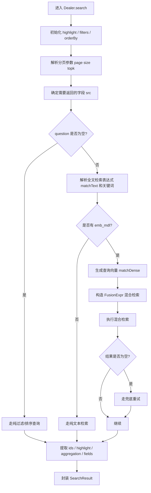
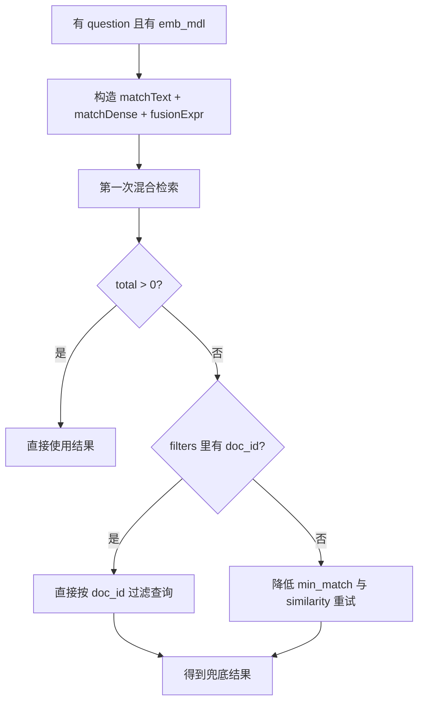
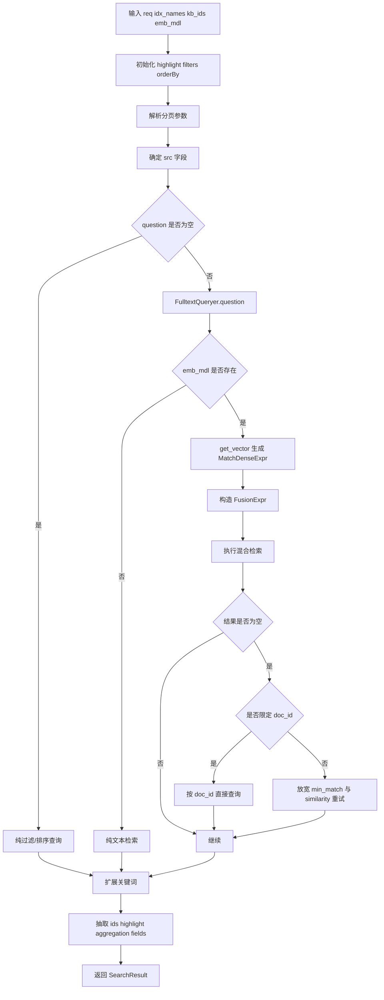

# `rag/nlp/search.py` 中 `Dealer.search()` 流程拆解

本文专门解释 [rag/nlp/search.py](/abs/path/C:/Users/able2207008/公司/opensource/ragflow/rag/nlp/search.py) 里 `Dealer.search()` 的执行流程。

目标不是泛泛讲“检索”，而是把这段代码拆开说明：

- 每一步在做什么
- 为什么要这么做
- 输入和输出是什么
- 有哪些分支
- 在什么条件下会走兜底逻辑

---

## 1. 这个函数在整个系统中的位置

`Dealer.search()` 是普通检索器 `settings.retriever` 的底层搜索入口之一。

在上层调用链里，常见路径是：

1. `async_chat()` 组装检索请求
2. `Dealer.retrieval()` 调用 `self.search(...)`
3. `Dealer.search()` 负责完成底层召回
4. `Dealer.retrieval()` 再做重排后分页和结果整形

所以：

- `Dealer.search()` 更像“底层召回器”
- `Dealer.retrieval()` 更像“业务层检索编排器”

可以简单理解为：

- `search()` 负责“把候选找出来”
- `retrieval()` 负责“把候选排好、裁好、包装好”

---

## 2. 函数签名

函数定义在 [rag/nlp/search.py](/abs/path/C:/Users/able2207008/公司/opensource/ragflow/rag/nlp/search.py)：

```python
async def search(self, req, idx_names, kb_ids, emb_mdl=None, highlight=None, rank_feature=None)
```

### 2.1 主要输入

- `req`
  - 检索请求主体
  - 常见字段包括：
    - `question`
    - `kb_ids`
    - `doc_ids`
    - `page`
    - `size`
    - `topk`
    - `similarity`
    - `fields`
    - `sort`
- `idx_names`
  - 要搜索的底层索引名列表
- `kb_ids`
  - 知识库 ID 列表
- `emb_mdl`
  - embedding 模型
  - 没有它时只能做纯文本检索
- `highlight`
  - 是否开启高亮，或者指定高亮字段
- `rank_feature`
  - 额外参与排序的特征，例如 PageRank

### 2.2 输出

返回一个 `SearchResult`：

```python
SearchResult(
    total=...,
    ids=...,
    query_vector=...,
    aggregation=...,
    highlight=...,
    field=...,
    keywords=...,
)
```

这个结果不是最终给前端的 answer，而是给上层 `retrieval()` 做进一步处理的中间结果。

---

## 3. 总体流程图



---

## 4. 第一步：初始化运行参数

函数开头会先做这些事情：

1. 处理 `highlight`
2. 从 `req` 中提取过滤条件
3. 创建排序表达式对象
4. 解析分页参数
5. 确定要取回的字段集合

### 4.1 `highlight` 默认关闭

如果调用方没有传 `highlight`，代码会把它设成 `False`。

这样做的原因是：

- 高亮不是所有场景都需要
- 高亮会增加底层检索和后处理开销
- 默认关闭能减少不必要的成本

### 4.2 `filters = self.get_filters(req)`

这里会把请求里的结构化过滤条件抽出来。

`get_filters()` 目前主要支持：

- `kb_ids -> kb_id`
- `doc_ids -> doc_id`
- 以及一些特殊过滤字段：
  - `knowledge_graph_kwd`
  - `available_int`
  - `entity_kwd`
  - `from_entity_kwd`
  - `to_entity_kwd`
  - `removed_kwd`

这样做的原因是：

- 上层用的是业务字段名
- 底层搜索存储用的是实际索引字段名
- 所以这里是一次“业务请求 -> 底层过滤条件”的映射

### 4.3 分页参数解析

这里会取：

- `page`
- `topk`
- `size`

然后得到：

- `offset`
- `limit`

它们的作用是直接传给底层 `dataStore.search(...)`。

### 4.4 `src` 字段列表

`src` 决定本次搜索要从底层带回哪些字段。

默认字段很多，不只是文本内容，还包括：

- 文档名
- 文本 token 字段
- 文档 ID
- chunk 顺序
- 页码
- 文档类型
- 内容展示字段
- 父块 ID
- PageRank
- 标签
- 行号

这样做的原因是：

- 后面不仅要显示文本
- 还要做重排、引用、分页定位、聚合、高亮、父子块扩展等处理
- 所以这里必须把后续流程可能用到的字段一次性带回来

---

## 5. 第二步：判断是不是“有问题文本的检索”

这一句是关键分叉点：

```python
qst = req.get("question", "")
if not qst:
    ...
else:
    ...
```

它把整个流程分成两类：

1. 没有 `question`
   - 走纯过滤查询
2. 有 `question`
   - 走真正的检索流程

---

## 6. 分支一：没有问题文本时

当 `question` 为空，`Dealer.search()` 不做全文检索，也不做向量检索。

它会：

1. 如果请求要求排序
   - 按 chunk 的自然顺序排序
2. 直接调用：
   - `self.dataStore.search(src, [], filters, [], orderBy, ...)`

### 6.1 为什么还需要这个分支

因为不是所有调用都在“问问题”。

有些场景本质是：

- 列文档
- 列 chunk
- 在某个文档范围内直接浏览内容
- 按已有过滤条件取数据

这时如果还强行做全文检索或向量检索，反而是多余的。

### 6.2 为什么默认按自然顺序排序

当 `req.get("sort")` 为真时，会按下面顺序排序：

- `chunk_order_int`
- `page_num_int`
- `top_int`
- `create_timestamp_flt desc`

目的很明确：

- 尽量按文档原始阅读顺序返回
- 让非问答场景下的内容浏览更自然

---

## 7. 分支二：有问题文本时

这才是最核心的检索路径。

一开始会先处理高亮字段，然后调用：

```python
matchText, keywords = self.qryr.question(qst, min_match=0.3)
```

### 7.1 这一步在做什么

它把用户自然语言问题转成：

- 一个底层可执行的全文检索表达式 `matchText`
- 一组关键词 `keywords`

### 7.2 为什么要先做全文检索表达式

因为底层并不是直接吃原始自然语言字符串，而是需要：

- 可执行的文本匹配表达式
- 明确的关键词集合

这一步相当于：

- query parsing
- term extraction
- full-text query planning

---

## 8. 分支二-a：没有 embedding 模型时

如果 `emb_mdl is None`，代码只能走纯文本检索：

```python
matchExprs = [matchText]
```

然后执行：

```python
self.dataStore.search(...)
```

### 8.1 这一步为什么存在

系统并不假设所有环境都一定有 embedding 能力。

所以需要支持：

- 只有全文检索
- 没有向量召回
- 仍然能返回结果

### 8.2 这种模式的特点

- 优势：成本低、简单、可解释
- 劣势：语义召回能力弱
- 更适合：
  - 关键词明确
  - 字段命名稳定
  - 文本匹配即可命中的问题

---

## 9. 分支二-b：有 embedding 模型时

如果 `emb_mdl` 存在，就进入混合检索模式。

这条路径包括三步：

1. 生成查询向量
2. 构造向量表达式
3. 构造文本 + 向量融合表达式

### 9.1 `matchDense = await self.get_vector(...)`

这一步会：

- 调 embedding 模型编码问题
- 把结果转成浮点向量
- 根据维度拼出向量字段名，比如 `q_768_vec`
- 构造 `MatchDenseExpr`

### 9.2 为什么还要把向量字段名动态算出来

因为不同 embedding 模型的维度可能不同。

所以系统不能写死：

- `q_768_vec`
- 或 `q_1024_vec`

必须根据当前查询向量长度动态推断。

### 9.3 非 Infinity 为什么要补 `src.append(f"q_{len(q_vec)}_vec")`

因为后续重排阶段可能还要读取 chunk 自身的向量字段。

Infinity 和其他引擎不同：

- Infinity 底层对分数处理更完整
- 其他引擎需要应用层自己做更多融合计算

所以非 Infinity 需要把向量字段显式取回。

### 9.4 `FusionExpr("weighted_sum", topk, {"weights": "0.05,0.95"})`

这一步定义的是混合检索融合策略。

当前权重是：

- 文本检索：0.05
- 向量检索：0.95

也就是说：

- 底层召回阶段明显更偏向向量语义召回
- 文本匹配更多是辅助

### 9.5 为什么这里偏向向量召回

因为召回阶段的目标是：

- 尽量不要漏掉潜在相关 chunk

而不是：

- 立刻做最终排序

更准确地说：

- 这里先“多找”
- 后面 `retrieval()` 再“细排”

---

## 10. 底层混合检索执行

混合检索最终会执行：

```python
self.dataStore.search(
    src,
    highlightFields,
    filters,
    [matchText, matchDense, fusionExpr],
    orderBy,
    offset,
    limit,
    idx_names,
    kb_ids,
    rank_feature=rank_feature,
)
```

### 10.1 这一步输入包含什么

- `src`
  - 要取回的字段
- `highlightFields`
  - 哪些字段做高亮
- `filters`
  - 结构化过滤条件
- `matchExprs`
  - 文本表达式、向量表达式、融合表达式
- `orderBy`
  - 排序表达式
- `offset/limit`
  - 底层分页
- `idx_names`
  - 搜索的索引列表
- `rank_feature`
  - 额外排序信号

### 10.2 为什么 `rank_feature` 放在这里

因为某些底层存储或搜索实现会把额外特征直接纳入排序。

最典型的是：

- 文档重要性
- PageRank
- 先验权重

---

## 11. 第一次没结果时的兜底重试

这段逻辑非常关键：

```python
if total == 0:
    ...
```

说明系统默认认为：

- 一次混合检索失败，不代表真的没内容
- 可能只是条件太严格

### 11.1 如果显式限定了 `doc_id`

这时它直接改成：

- 不做文本/向量匹配
- 只按 `doc_id` 过滤查询

原因是：

- 调用方已经说“只看这些文档”
- 那就不能再因为相似度不高把它们全过滤掉

### 11.2 如果没有限定 `doc_id`

就做一轮更宽松的检索：

- `min_match` 从 `0.3` 降到 `0.1`
- 向量相似度从默认阈值放宽到 `0.17`

### 11.3 为什么要这样做

因为第一次失败常见原因是：

- 关键词抽得太严
- 原问题太短
- 文本和向量阈值共同作用导致全空

放宽这两个条件，能显著降低“误判成无结果”的概率。



---

## 12. 关键词扩展

检索完成后，代码会把 `keywords` 继续做一次细粒度扩展：

```python
for k in keywords:
    kwds.add(k)
    for kk in rag_tokenizer.fine_grained_tokenize(k).split():
        ...
```

### 12.1 这一步在做什么

把：

- 主关键词
- 细粒度切分后的子词

都放进 `kwds`

### 12.2 为什么要这么做

因为后面的高亮如果只依赖原始关键词，可能覆盖不全。

细粒度 token 的作用是：

- 提升高亮命中率
- 让高亮更细
- 对中英文混合、缩写、复合词更友好

---

## 13. 最终结果抽取

无论走哪条分支，最后都会统一做这些提取：

1. `ids = self.dataStore.get_doc_ids(res)`
2. `keywords = list(kwds)`
3. `highlight = self.dataStore.get_highlight(res, keywords, "content_with_weight")`
4. `aggs = self.dataStore.get_aggregation(res, "docnm_kwd")`
5. `field = self.dataStore.get_fields(res, src + ["_score"])`

### 13.1 `ids`

这是当前命中的 chunk/document ID 列表，后面上层重排时要靠它取字段。

### 13.2 `highlight`

这是基于关键词生成的高亮结果。

注意这里高亮不是直接来自问题原文，而是来自：

- `FulltextQueryer` 提取出的关键词
- 加上细粒度切词扩展

### 13.3 `aggregation`

这是底层按 `docnm_kwd` 聚合的结果。

它不是最终的 `doc_aggs`，但给上层聚合提供了原始材料。

### 13.4 `field`

这里会把所有需要的字段统一取回，并额外加上 `_score`。

原因是：

- 上层 `retrieval()` 还要做重排
- 如果没有这些字段，就没法继续做 chunk 级结果组装

---

## 14. 最终返回的 `SearchResult`

返回结构大致是：

```python
SearchResult(
    total=total,
    ids=ids,
    query_vector=q_vec,
    aggregation=aggs,
    highlight=highlight,
    field=self.dataStore.get_fields(res, src + ["_score"]),
    keywords=keywords,
)
```

### 14.1 为什么要返回这么多中间信息

因为 `Dealer.search()` 不是终点。

上层 `Dealer.retrieval()` 还要继续依赖这些信息做：

- rerank
- threshold 过滤
- chunk 包装
- doc_aggs 统计
- highlight 注入

所以这里返回的是“可继续处理的检索中间结果”，不是最终用户答案。

---

## 15. 整个流程再压缩成一张图



---

## 16. 一句话总结

`Dealer.search()` 的本质不是“给出最终答案”，而是把用户请求拆成过滤、全文检索、向量检索、混合融合、兜底重试、高亮和聚合几个阶段，生成一个足够完整的底层召回结果对象，供上层 `retrieval()` 再继续做重排和业务包装。
