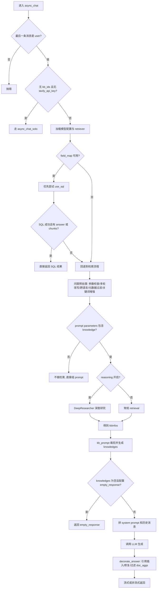
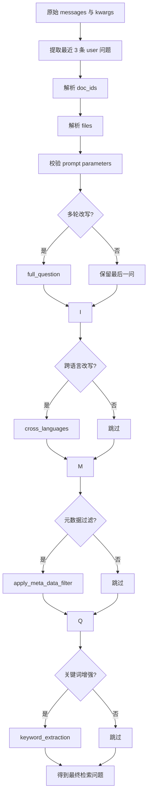
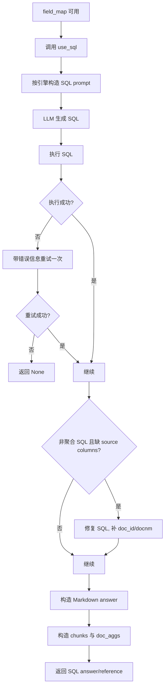
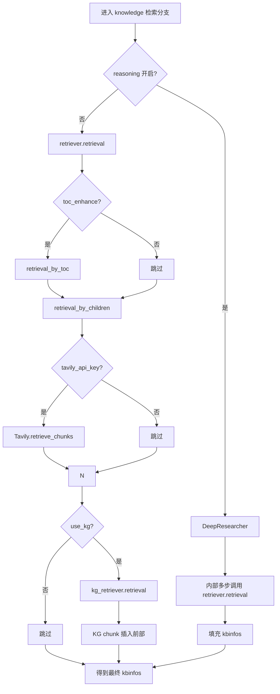
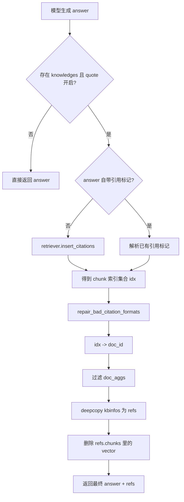

# `dialog_service.py` 中的 Retriever 流程总结

本文总结 [api/db/services/dialog_service.py](/abs/path/C:/Users/able2207008/公司/opensource/ragflow/api/db/services/dialog_service.py) 里与检索增强相关的主流程，重点覆盖 `async_chat()` 中的检索路径选择、预处理、召回增强、引用修复和最终输出组织。

目标不是介绍通用 RAG 概念，而是解释这份代码当前实际上是怎么跑的。

## 1. 总览

`async_chat()` 是 `dialog_service.py` 里的核心入口。它会先判断是否需要检索增强，然后在以下几条路径之间选择：

1. 无知识库、无 Tavily：直接走 `async_chat_solo()`
2. 字段映射可用：优先尝试 `use_sql()`
3. SQL 失败或不适用：回退到常规检索流
4. 配置了 reasoning：走 `DeepResearcher`
5. 常规检索完成后：拼 `knowledge` 到 prompt，再交给模型生成
6. 生成后：插入或修复引用，裁剪返回引用结构



## 2. 主流程分解

### 2.1 入口分流

`async_chat()` 一开始先做两个关键判断：

- 最后一条消息必须是 `user`
- 如果没有知识库且没有 Tavily，则直接走 `async_chat_solo()`

这意味着：

- `async_chat()` 既是 RAG 入口，也是“是否退化成纯聊天”的路由层
- 只有明确需要知识增强时，才进入较重的检索链路

### 2.2 模型与观测初始化

进入 RAG 路径后，会先做这些准备：

- 根据 `dialog.llm_id` 判断模型类型：`chat` 或 `image2text`
- 读取模型配置，拿到 `max_tokens`、`llm_factory`
- 初始化 Langfuse tracing
- 通过 `get_models(dialog)` 绑定：
  - `kbs`
  - `embd_mdl`
  - `rerank_mdl`
  - `chat_mdl`
  - `tts_mdl`

这里的意义是把“租户配置”转换成“本轮调用可直接使用的模型对象”。

### 2.3 请求预处理

正式检索前，代码会做一层请求规整：

- 提取最近 3 条用户问题作为 `questions`
- 解析 `doc_ids`
- 解析 `files`
  - 文本附件会拼进 prompt
  - 图片附件会走多模态消息构造
- 校验 `prompt_config["parameters"]`
- 可选地执行：
  - `full_question()` 多轮改写
  - `cross_languages()` 跨语言改写
  - `apply_meta_data_filter()` 元数据过滤
  - `keyword_extraction()` 关键词增强

可以把这一段理解成“把用户原始输入转成适合检索的问题”。



## 3. SQL 优先分支

如果 `KnowledgebaseService.get_field_map(dialog.kb_ids)` 能拿到字段映射，代码会优先调用 `use_sql()`。

这么做的目的很直接：

- 聚合问题
- 统计问题
- 精确筛选问题

这类问题用 SQL 往往比向量检索更准确。

### 3.1 `use_sql()` 的主要步骤

`use_sql()` 内部做了下面几件事：

1. 判断当前文档引擎
   - `infinity`
   - `oceanbase`
   - `es`
2. 构造面向当前引擎的 SQL prompt
3. 调用聊天模型生成 SQL
4. 执行 SQL
5. 如果第一次失败，用错误信息再次提示模型重写 SQL
6. 如果非聚合 SQL 缺少 `doc_id` / `docnm_kwd`，再修一次 SQL
7. 把结果表格化为 Markdown
8. 构造 `reference.chunks` 和 `reference.doc_aggs`

### 3.2 SQL 分支返回条件

`async_chat()` 对 SQL 分支的成功判断是：

- `ans.get("reference", {}).get("chunks")` 有值，或者
- `ans.get("answer")` 有值

特别注意：

- 聚合查询可能没有 chunks
- 但只要 answer 有效，仍然会被视为成功



## 4. 常规检索分支

如果 SQL 不适用，或者执行失败，就进入常规检索流程。

这里先检查一个条件：

- 只有 `prompt_config["parameters"]` 里声明了 `knowledge`
- 才会真正做 retrieval

这意味着代码把“是否需要知识检索”交给 prompt 模板控制，而不是硬编码。

### 4.1 reasoning 分支

如果打开了：

- `prompt_config.get("reasoning", False)`，或者
- `kwargs.get("reasoning")`

就不直接走一次性召回，而是走 `DeepResearcher`。

`DeepResearcher` 的特点：

- 用 `retriever.retrieval(...)` 作为底层能力
- 支持多步研究
- 通过异步队列流式输出研究过程
- 用 `<START_DEEP_RESEARCH>` / `<END_DEEP_RESEARCH>` 触发 think 开始/结束信号

这条路径的核心不是“召回更多”，而是“允许研究过程显式流式暴露出来”。

### 4.2 非 reasoning 常规路径

如果不走 reasoning，则会执行这些增强步骤：

1. `retriever.retrieval(...)`
2. 如果开了 `toc_enhance`
   - `retriever.retrieval_by_toc(...)`
3. `retriever.retrieval_by_children(...)`
4. 如果开了 Tavily
   - 联网搜索结果并入 `kbinfos`
5. 如果开了 `use_kg`
   - `settings.kg_retriever.retrieval(...)`
   - KG 结果插到 chunks 前面



## 5. `kbinfos` 到 `knowledge` 的转换

无论 SQL 失败后回退，还是直接走常规 RAG，检索结果最终都会落到 `kbinfos`：

- `kbinfos["chunks"]`
- `kbinfos["doc_aggs"]`
- `kbinfos["total"]`

随后调用：

```python
knowledges = kb_prompt(kbinfos, max_tokens)
```

这个步骤的作用是：

- 从召回结果里裁剪适合喂给 LLM 的知识片段
- 受 `max_tokens` 限制
- 生成最终写入 `{knowledge}` 的文本片段列表

如果 `knowledges` 为空，且配置了 `empty_response`，代码会直接返回固定文案，不再继续生成。

## 6. Prompt 组装

进入生成前，`async_chat()` 会做一次比较关键的 prompt 组装：

1. `kwargs["knowledge"] = ...`
2. 构造 system prompt
3. 追加文本附件 `attachments_`
4. 如果引用开启，追加 `citation_prompt()`
5. 追加历史消息
6. 调用 `message_fit_in()` 做窗口裁剪
7. 如果有图片附件，调用 `convert_last_user_msg_to_multimodal()`

最终发给模型的不是原始消息，而是“带知识、带引用规则、带附件、经过 token 裁剪”的消息。

## 7. 生成后的引用修复

生成完成后，`decorate_answer()` 会做最后一层后处理。

### 7.1 什么时候做引用处理

满足下面两个条件才做：

- `knowledges` 非空
- `quote` 开启

### 7.2 处理步骤

1. 如果模型自己没打引用标记
   - 调用 `retriever.insert_citations(...)`
2. 如果模型打了引用标记
   - 用 `CITATION_MARKER_PATTERN` 解析
3. 调用 `repair_bad_citation_formats(...)` 修坏格式
4. 把命中的 chunk 索引映射到 `doc_id`
5. 用命中的 `doc_id` 过滤 `doc_aggs`
6. 删除 chunk 里的 `vector` 字段

这一段说明检索流程并没有在“召回结束”时结束，而是一直延伸到“生成后引用修复”。



## 8. 流式与非流式对检索流程的影响

检索本身在流式和非流式下没有本质差别，差别主要出现在“答案如何返回”：

- 流式：
  - 通过 `chat_mdl.async_chat_streamly_delta(...)`
  - 再交给 `_stream_with_think_delta(...)`
  - 普通文本和 think 标记分开上抛
  - 最后用完整文本跑一次 `decorate_answer()` 产出 final 包
- 非流式：
  - 直接 `await chat_mdl.async_chat(...)`
  - 再执行 `decorate_answer()`

因此：

- retrieval 发生在生成之前
- citation repair 发生在生成之后
- streaming 只改变“输出方式”，不改变“retriever 的核心决策路径”

## 9. 关键数据结构

### 9.1 `kbinfos`

检索阶段核心结构：

```python
{
    "total": 0,
    "chunks": [...],
    "doc_aggs": [...]
}
```

### 9.2 `knowledges`

`kb_prompt(kbinfos, max_tokens)` 的输出，是最终拼进 `{knowledge}` 的知识片段列表。

### 9.3 最终 answer 包

`async_chat()` 最终往上层返回的核心字段通常包括：

```python
{
    "answer": ...,
    "reference": ...,
    "prompt": ...,
    "audio_binary": ...,
    "final": ...
}
```

## 10. 代码层面的几个关键设计点

### 10.1 SQL 是“优先分支”，不是“独立模式”

`use_sql()` 并不是单独入口，而是 `async_chat()` 内部的一层优化分支。失败后会自然回退到常规检索。

### 10.2 是否检索由 prompt 参数决定

只有 prompt 参数里包含 `knowledge` 才执行 retrieval。这是一个很强的模板驱动设计。

### 10.3 检索不等于向量召回

当前实现里的“retriever 流程”实际包括：

- SQL retrieval
- 向量 retrieval
- TOC enhancement
- children expansion
- Tavily web retrieval
- KG retrieval
- citation insertion / repair

### 10.4 引用修复是检索闭环的一部分

`retriever.insert_citations()` 和 `repair_bad_citation_formats()` 说明这套链路不是“先召回、后生成”就结束，而是生成后的引用回填仍然算检索闭环的一部分。

## 11. 一句话总结

`dialog_service.py` 里的 retriever 流程，本质上是一条“SQL 优先、检索增强回退、prompt 驱动知识注入、生成后再修引用”的混合式 RAG 链路，而不是单纯的一次向量召回。
