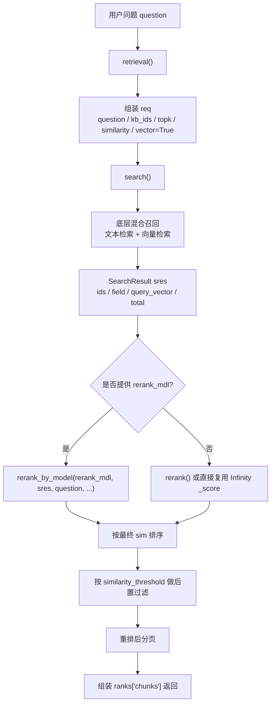
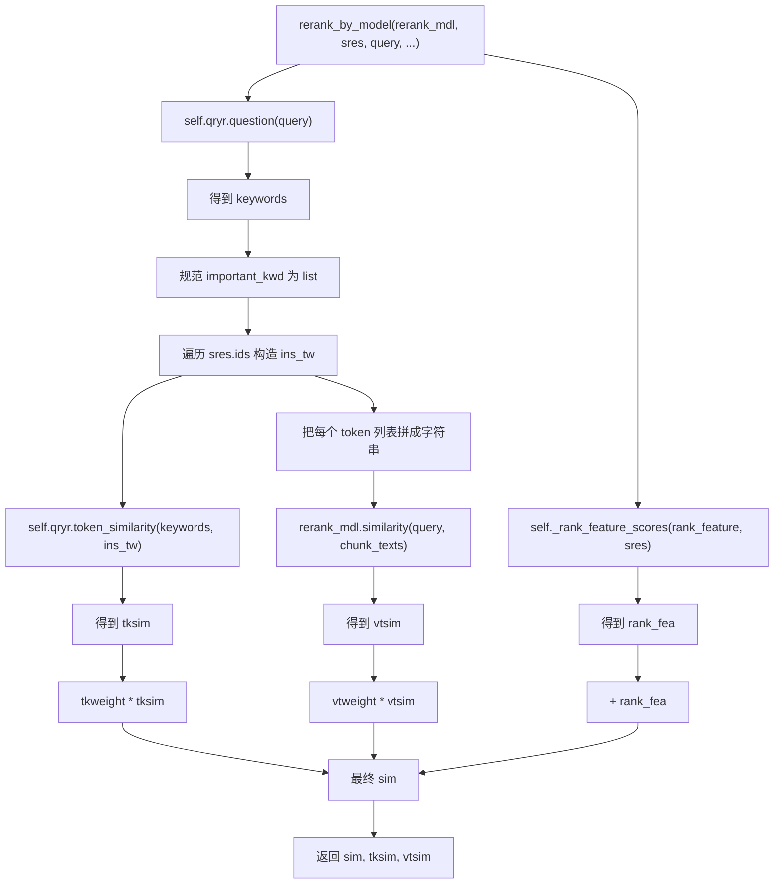
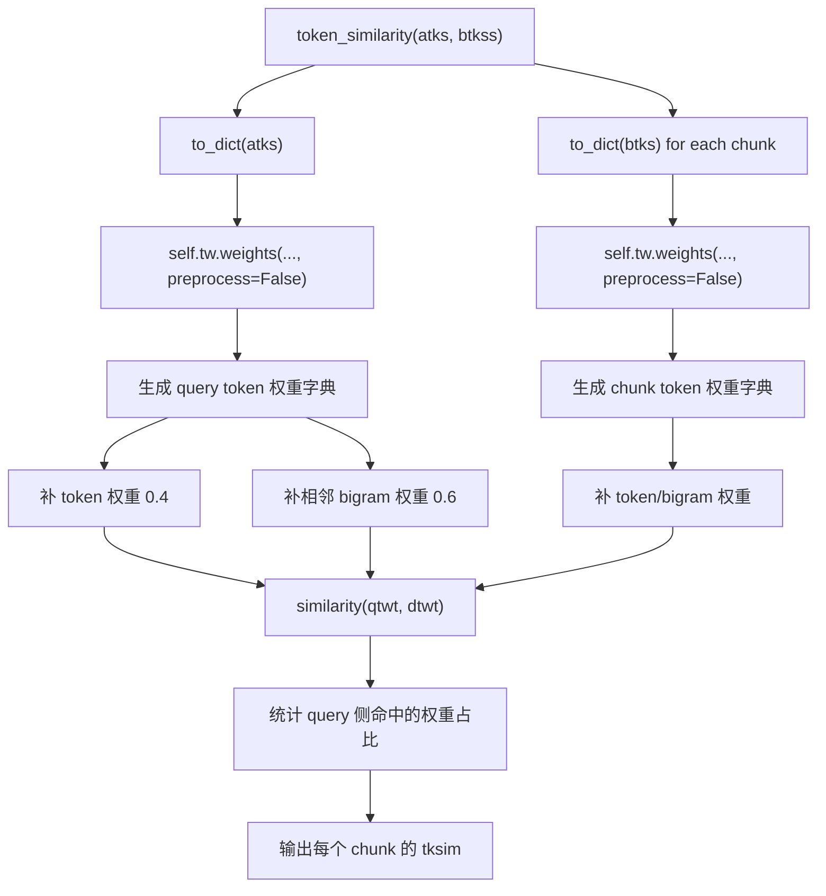
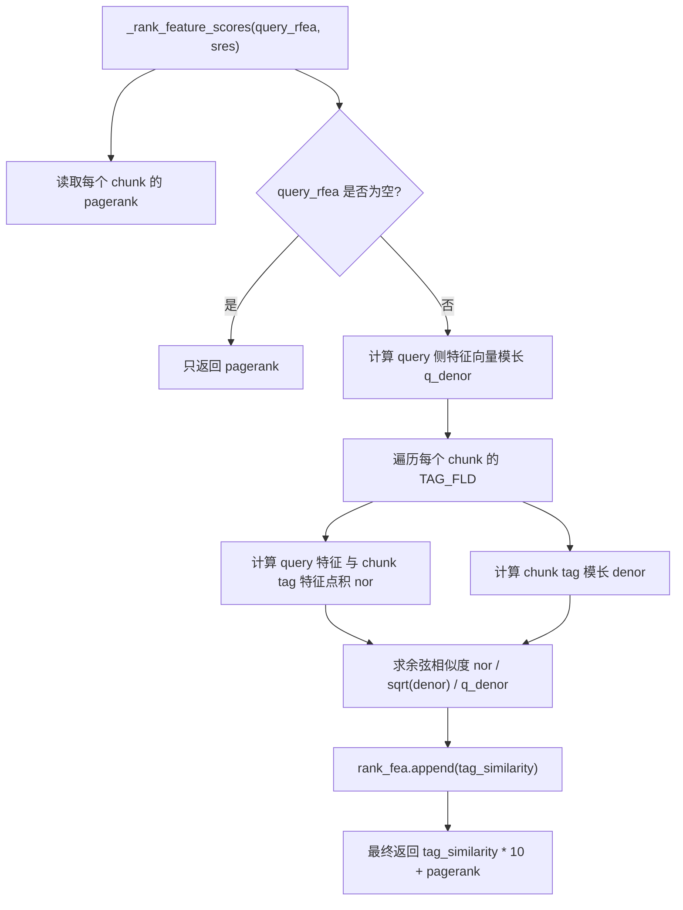
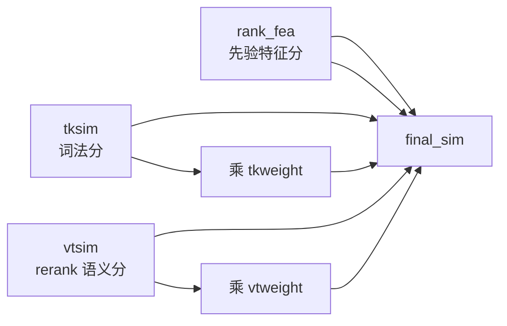
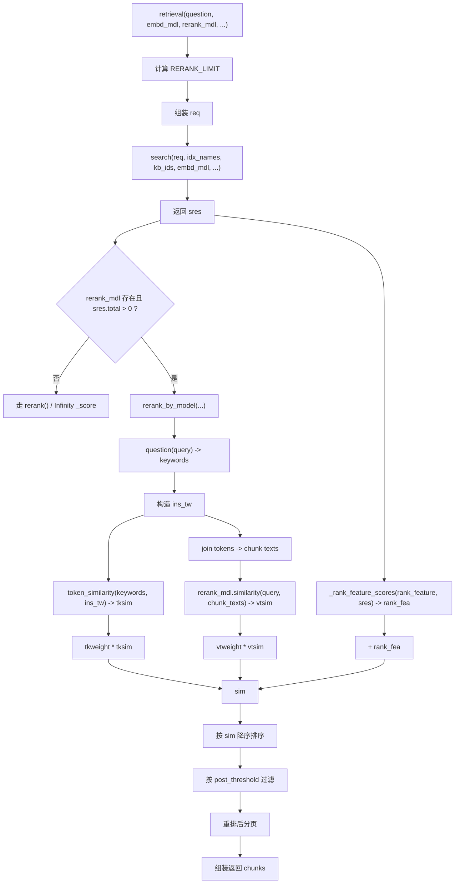

# `rerank_by_model()` 流程详解

本文专门讲解 [search.py](/E:/py/ragflow/rag/nlp/search.py) 里的 `rerank_by_model()`，重点不是只看函数体几行代码，而是把它放回整条检索链路里，说明：

- 它在整个 `retrieval()` 流程里处于什么位置
- 它依赖了哪些关键子函数
- 每个子函数分别提供了什么信号
- 最终总分是怎么拼出来的
- 为什么这条路径和普通 `rerank()` 不一样

---

## 1. 先说结论：`rerank_by_model()` 是什么

`rerank_by_model()` 可以理解成：

**“在底层召回之后，使用外部 rerank 模型做语义精排，并辅以轻量词法分和先验特征分，得到最终排序分数。”**

它和普通 `rerank()` 的区别在于：

- `rerank()` 更依赖应用层自己算的“词法相似度 + 向量相似度”
- `rerank_by_model()` 则把“强语义判断”交给独立 rerank 模型

所以它的设计哲学是：

**底层先召回候选，应用层不再自己硬算主语义分，而是让专门的 rerank 模型来判断“query 和 chunk 到底像不像”。**

---

## 2. 它在整体调用链里的位置

`rerank_by_model()` 不是直接暴露给外部调用的主入口，它是被 [search.py](/E:/py/ragflow/rag/nlp/search.py) 的 `retrieval()` 调起来的。

整体路径可以先记成：

```text
用户问题
-> retrieval()
-> search() 做底层召回
-> 如果传入 rerank_mdl:
   -> rerank_by_model()
-> 得到最终分数
-> 排序、阈值过滤、分页
-> 返回 chunks
```

下面这张 Mermaid 图先给一个全貌。



---

## 3. `retrieval()` 为什么要先召回、后重排

在 [search.py](/E:/py/ragflow/rag/nlp/search.py) 里，`retrieval()` 先做的是：

1. 组装一个底层搜索请求 `req`
2. 调 `self.search(...)` 去底层索引查候选
3. 拿到 `sres`
4. 再决定是否调用 `rerank_by_model()`

这背后的原因是：

- rerank 模型通常比普通检索贵得多
- 不可能对整个索引里的所有 chunk 都做 rerank
- 所以工业上通常先召回一个候选集，再对候选集精排

这也是为什么 `retrieval()` 里专门有一个 `RERANK_LIMIT`：

- 不是只召回当前页大小
- 而是先召回一批候选
- 重排之后再分页

这样排序质量会比“先分页再重排”稳定得多。

---

## 4. `rerank_by_model()` 自己做了哪几件事

函数定义在 [search.py](/E:/py/ragflow/rag/nlp/search.py)：

```python
def rerank_by_model(self, rerank_mdl, sres, query, tkweight=0.3,
                    vtweight=0.7, cfield="content_ltks",
                    rank_feature: dict | None = None):
```

它内部大体分 5 步：

1. 从 query 提取关键词
2. 规范 chunk 字段，构造每个 chunk 的 token 序列
3. 计算轻量词法相似度 `tksim`
4. 调外部 rerank 模型计算语义分 `vtsim`
5. 计算额外排序特征 `rank_fea`
6. 融合成最终分 `sim`

下面这张图只看函数体内部。



---

## 5. 重要子函数一：`self.qryr.question(query)`

`rerank_by_model()` 的第一步是：

```python
_, keywords = self.qryr.question(query)
```

这里虽然丢掉了 `MatchTextExpr`，但保留了 `keywords`。

它的作用是：

- 对 query 做规范化
- 分词
- 适度扩展
- 提取后续词法比较要用的关键词

也就是说，这一步不是为了直接发 ES 查询，而是为了给下面的 `token_similarity()` 提供一个“查询侧关键词集合”。

你可以把它理解成：

**先把用户问题转换成一组适合做词法对比的 query tokens。**

---

## 6. 重要子函数二：构造 `ins_tw`

函数里这段很关键：

```python
ins_tw = []
for i in sres.ids:
    content_ltks = sres.field[i][cfield].split()
    title_tks = [t for t in sres.field[i].get("title_tks", "").split() if t]
    important_kwd = sres.field[i].get("important_kwd", [])
    tks = content_ltks + title_tks + important_kwd
    ins_tw.append(tks)
```

这里在做的事是：

**把每个候选 chunk，整理成一串用于 rerank 前轻量比较的 token 列表。**

组成部分有三类：

- `content_ltks`
  - chunk 的正文 token
- `title_tks`
  - 标题 token
- `important_kwd`
  - 业务上预先提取的重要关键词

最终每个 chunk 都会变成一个 token list，例如：

```text
["ragflow", "知识库", "检索", "优化", "文档", "召回"]
```

### 为什么这里没有像 `rerank()` 那样重复放大 title / important_kwd

这是 `rerank_by_model()` 和 `rerank()` 的一个关键差别。

在普通 `rerank()` 里，代码会做：

- `title * 2`
- `important_kwd * 5`
- `question_tks * 6`

因为那条路径里，应用层自己要承担更多语义排序责任，所以会用重复 token 的方式做人为加权。

但 `rerank_by_model()` 不这么做，原因是：

- 这里主语义分交给了外部 rerank 模型
- 应用层词法分只做“轻量辅助”
- 如果这里还强行放大 token，会让词法信号过强，压过 rerank 模型的判断

所以这条路径里，`ins_tw` 的构造是明显更克制的。

---

## 7. 重要子函数三：`token_similarity()`

接下来：

```python
tksim = self.qryr.token_similarity(keywords, ins_tw)
```

它定义在 [query.py](/E:/py/ragflow/rag/nlp/query.py)。

它本质上是：

**把 query tokens 和每个 chunk tokens 都转成“带权 token/bigram 字典”，再计算覆盖度相似度。**

内部逻辑可以压缩成：

```text
tokens
-> weights()
-> 生成 token 权重
-> 额外补相邻 bigram 权重
-> 得到字典
-> 比较 query 字典和 chunk 字典的重合程度
```

Mermaid 图如下：



### `token_similarity()` 为什么有价值

虽然 rerank 模型已经能做强语义判断，但这一步仍然保留，是因为它能提供一个：

- 更可解释
- 更轻量
- 对术语/关键词更敏感

的辅助信号。

例如：

- query 里明确出现的专业词
- chunk 里有没有命中这些词
- 相邻短语有没有对上

这些信号很多时候比纯 embedding 更稳，尤其是技术文档、错误码、专有名词场景。

所以这一步的角色不是“主裁判”，而是“辅助裁判”。

---

## 8. 重要子函数四：`rerank_mdl.similarity()`

这一步是整条链最核心的部分：

```python
vtsim, _ = rerank_mdl.similarity(
    query,
    [remove_redundant_spaces(" ".join(tks)) for tks in ins_tw]
)
```

这里做了两件关键事：

### 8.1 先把 token list 拼回文本

为什么要：

```python
" ".join(tks)
```

因为大多数 rerank 模型的输入形式不是 token list，而是：

- 一个 query 文本
- 多个候选文本

也就是典型的：

```text
query -> doc
```

配对打分模式。

所以 `ins_tw` 虽然内部是 token list，但真正喂给 rerank 模型之前还是要还原成字符串。

### 8.2 `remove_redundant_spaces()` 的作用

因为 token 是手工拼接回去的，中间可能带来多余空格。  
这一步是为了：

- 减少无意义空白
- 让 rerank 模型看到更干净的文本

### 8.3 这一步输出的 `vtsim` 是什么

`vtsim` 是 rerank 模型对：

- `query`
- 每个候选 chunk 文本

做语义匹配后输出的一组分数。

你可以把它理解成：

**“真正意义上更强的 query-document 语义相关性分数”。**

这一步和前面的 `tksim` 不同：

- `tksim` 更像词面重合度
- `vtsim` 更像语义相关度

---

## 9. 重要子函数五：`_rank_feature_scores()`

除了词法分和 rerank 语义分，这里还会算一组“先验特征分”：

```python
rank_fea = self._rank_feature_scores(rank_feature, sres)
```

这个函数定义在 [search.py](/E:/py/ragflow/rag/nlp/search.py)。

它主要融合两类先验：

- `pagerank`
- query 侧 `rank_feature` 和 chunk 侧 `tag` 特征的相似度

可以理解成：

**“即使两个 chunk 文本都和 query 很像，也还可以根据文档质量、标签先验等业务信号再拉开差距。”**

内部逻辑如下图：



### 为什么这里还要加先验特征分

因为纯文本相关并不总是最终排序唯一依据。

比如：

- 某些 chunk 来自更权威的文档
- 某些 chunk 带有更契合 query 的标签
- 某些 chunk 在图谱或文档结构中更重要

这类信息不是 rerank 模型直接看文本就能稳定学出来的，所以会作为额外分直接加上去。

---

## 10. 最终融合公式

`rerank_by_model()` 最后这句就是全函数核心：

```python
return tkweight * np.array(tksim) + vtweight * vtsim + rank_fea, tksim, vtsim
```

也就是：

```text
final_sim = tkweight * tksim + vtweight * vtsim + rank_fea
```

含义分别是：

- `tksim`
  - 轻量词法相似度
- `vtsim`
  - rerank 模型语义分
- `rank_fea`
  - 额外先验特征分

### 这三个量各自扮演什么角色

- `tksim`
  - 负责保留术语命中、词法可解释性
- `vtsim`
  - 负责主语义判断
- `rank_fea`
  - 负责补充业务先验

所以这不是“两个分数简单相加”，而是一个三路融合：



---

## 11. 为什么 `rerank_by_model()` 不直接只用 `vtsim`

很多人看到 rerank 模型会自然想：

“既然都上 rerank 了，为什么不直接按 rerank 分排？”

这个函数没有这么做，是因为工业检索里通常不愿意只押注单一路信号。

原因有三个：

### 11.1 rerank 模型再强，也不一定比术语精确命中更可靠

特别是在：

- 产品名
- 模块名
- 错误码
- 版本号
- API 名

这类场景，词法命中往往仍然很重要。

### 11.2 业务先验不一定能被 rerank 模型自然吸收

比如：

- pagerank
- 标签特征
- 文档权威性

这些通常更适合显式加入，而不是完全交给模型隐式学习。

### 11.3 多路融合更稳

当某一路波动时，其他信号还能起到纠偏作用。

所以这里不是“让 rerank 模型一票否决”，而是：

**让 rerank 模型做主语义判断，但仍然保留词法和业务先验的发言权。**

---

## 12. `rerank_by_model()` 和 `rerank()` 的关系

这两个函数很像，但定位不同。

可以并排理解：

| 维度 | `rerank()` | `rerank_by_model()` |
|---|---|---|
| 主语义分来源 | 查询向量 vs chunk 向量 | 独立 rerank 模型 |
| 词法特征强度 | 更强，手工重复放大 | 更轻，只做辅助 |
| 适用场景 | 没有外部 rerank 模型 | 有专门 rerank 模型 |
| 语义判断能力 | 受 embedding 质量限制 | 通常更强 |
| 计算成本 | 相对低 | 相对高 |

一句话说：

- `rerank()` 是“应用层自己做混合精排”
- `rerank_by_model()` 是“让专门 rerank 模型做主语义精排”

---

## 13. 结合 `retrieval()` 看完整执行顺序

如果把 `retrieval()` 中与 `rerank_by_model()` 相关的关键逻辑串起来，可以得到下面这张更完整的流程图。



---

## 14. 一个具体例子

假设用户问题是：

```text
RAGFlow 知识库检索为什么召回低
```

底层 `search()` 先召回出 3 个候选 chunk：

1. chunk A
   - 内容里大量提到“知识库”“检索”“召回”
2. chunk B
   - 词面不完全重合，但在讲“召回率下降原因”
3. chunk C
   - 词很像，但其实在讲“索引构建”

那么：

### query 侧

`question(query)` 可能抽出：

```text
["ragflow", "知识库", "检索", "召回", "低"]
```

### chunk 侧

每个 chunk 都会被整理出 `ins_tw`：

```text
A -> ["ragflow", "知识库", "检索", "召回", "优化"]
B -> ["召回率", "下降", "原因", "检索", "相关性"]
C -> ["索引", "构建", "检索", "配置", "知识库"]
```

### `tksim`

词法上：

- A 命中最多，`tksim` 最高
- C 也有不少字面重合
- B 因为说法不同，词法分可能偏低

### `vtsim`

rerank 模型看语义时：

- A 很相关
- B 也很相关，因为在讲“召回率下降原因”
- C 相关性反而没那么强

### `rank_fea`

如果 B 来自更高质量文档，或者标签更契合 query，它的 `rank_fea` 还可能更高。

### 最终结果

融合后很可能变成：

```text
A > B > C
```

而不是仅按词法命中排成：

```text
A > C > B
```

这正是 `rerank_by_model()` 的意义：

**既不丢掉可解释的词法信号，也让更强的语义模型把“说法不同但意思更对”的 chunk 拉上来。**

---

## 15. 一句话总结

`rerank_by_model()` 的本质是：

**在底层召回之后，用“轻量词法分 + rerank 模型语义分 + 先验特征分”三路融合，对候选 chunk 做最终精排。**

如果你只记一件事，可以记成：

```text
retrieval()
  先召回
  再 rerank_by_model()
  最后按综合分排序并分页
```

而 `rerank_by_model()` 内部最重要的一条公式就是：

```text
final_sim = tkweight * tksim + vtweight * vtsim + rank_fea
```

其中：

- `tksim` 负责术语和词面
- `vtsim` 负责强语义判断
- `rank_fea` 负责业务先验补充

