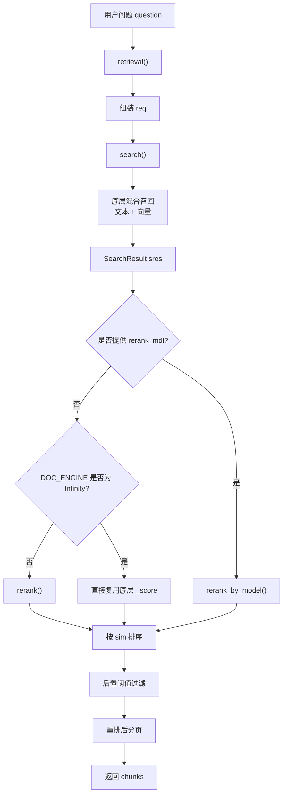
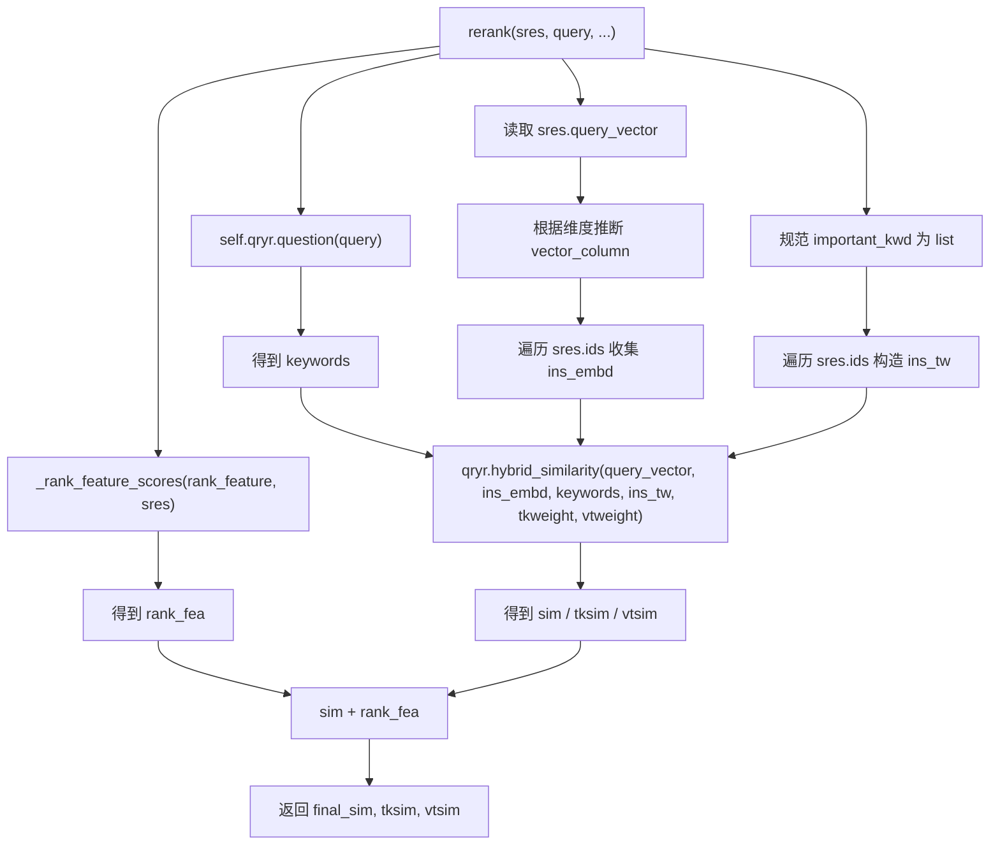
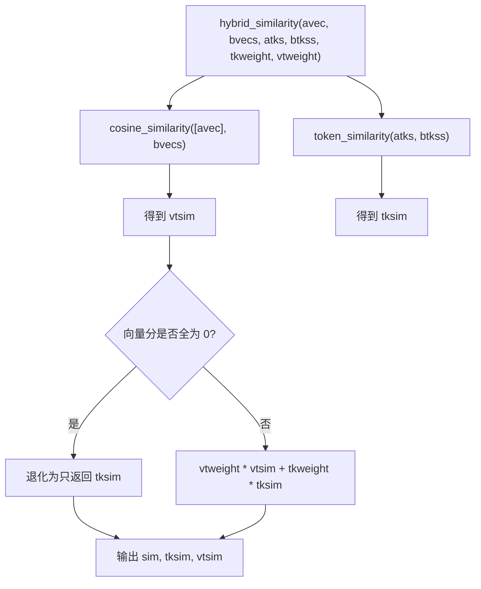
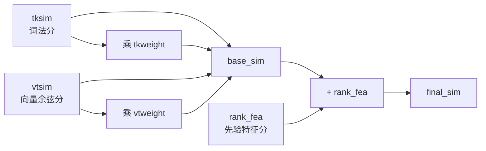
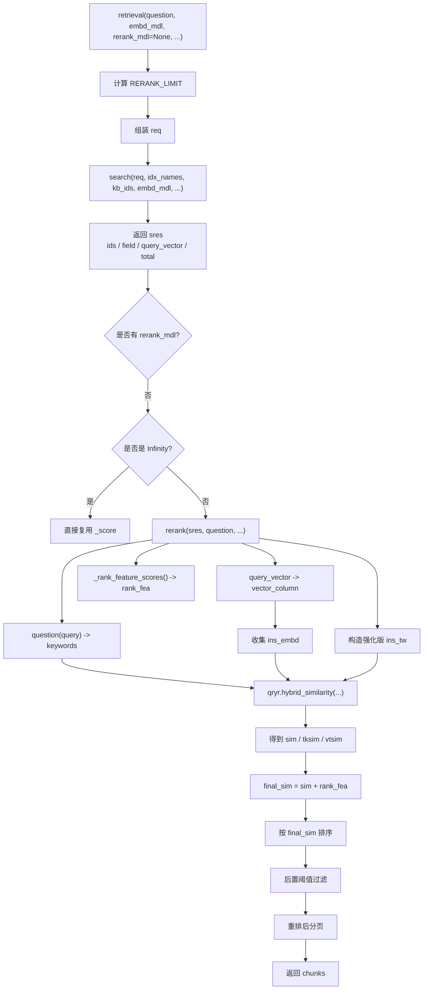

# `rerank()` 流程详解

本文专门讲解 [search.py](/E:/py/ragflow/rag/nlp/search.py) 里的 `rerank()`。

目标不是只解释函数表面代码，而是把它放回整个检索链路里，讲清楚：

- `rerank()` 在 `retrieval()` 里扮演什么角色
- 它依赖哪些关键子函数
- 查询向量、chunk 向量、关键词 token 是怎么一起参与打分的
- 最终综合分是怎么算出来的
- 它和 `rerank_by_model()` 的核心差异是什么

---

## 1. 先说结论：`rerank()` 是什么

`rerank()` 可以理解成：

**“在没有外部 rerank 模型时，应用层自己把词法相似度、向量相似度和额外排序特征融合成最终精排分数。”**

和 [rerank_by_model_flow.md](/E:/py/ragflow/docs/develop/rerank_by_model_flow.md) 里的 `rerank_by_model()` 相比，`rerank()` 的最大特点是：

- 不调用独立 rerank 模型
- 主语义分直接来自 query vector 和 chunk vector 的余弦相似度
- 为了弥补“没有外部 reranker”的不足，会更积极地做人为 token 加权

一句话说：

**`rerank()` 是系统内置的混合精排器。**

---

## 2. 它在整体调用链里的位置

`rerank()` 不是总会执行，它是在 [search.py](/E:/py/ragflow/rag/nlp/search.py) 的 `retrieval()` 里作为“没有外部 rerank 模型时的默认精排路径”被调用。

整体链路可以先记成：

```text
用户问题
-> retrieval()
-> search() 做底层召回
-> 如果没有 rerank_mdl:
   -> rerank()
-> 得到最终分数
-> 排序、阈值过滤、分页
-> 返回 chunks
```

Mermaid 全貌如下：



---

## 3. 为什么需要 `rerank()`

在很多系统里，底层搜索引擎已经能返回：

- 文本检索分
- 向量检索分

但这里仍然需要 `rerank()`，原因有三点：

### 3.1 底层引擎返回的分数不一定能直接比较

例如在 Elastic/OpenSearch 路径中：

- BM25 分
- KNN 相似度

并不是天然同一个量纲。

所以应用层经常还要再做一次统一融合。

### 3.2 应用层掌握更多业务特征

比如：

- `important_kwd`
- `question_tks`
- `title_tks`
- PageRank
- 标签特征

这些信号更适合在应用层显式处理。

### 3.3 没有外部 rerank 模型时，仍然需要一个“够用的精排器”

外部 rerank 模型更强，但也更贵、更慢。  
如果系统没有配置 reranker，`rerank()` 就承担起：

- 语义分
- 词法分
- 特征分

的融合责任。

---

## 4. `rerank()` 到底做了哪几件事

函数定义在 [search.py](/E:/py/ragflow/rag/nlp/search.py)：

```python
def rerank(self, sres, query, tkweight=0.3,
           vtweight=0.7, cfield="content_ltks",
           rank_feature: dict | None = None):
```

它内部可以拆成 6 步：

1. 从 query 提取关键词
2. 根据 query vector 维度找到 chunk 对应向量列
3. 收集每个 chunk 的向量
4. 构造每个 chunk 的加权 token 序列
5. 计算额外排序特征分
6. 调 `qryr.hybrid_similarity()` 算混合分
7. 再叠加额外特征分，得到最终分数

只看函数体内部的 Mermaid 图如下：



---

## 5. 重要子函数一：`self.qryr.question(query)`

第一步：

```python
_, keywords = self.qryr.question(query)
```

这一步的作用和 `rerank_by_model()` 里类似：

- 对 query 做规范化
- 提取关键词
- 为词法相似度比较提供 query 侧 token

这里没有直接使用 `MatchTextExpr`，因为 `rerank()` 并不是拿它继续发搜索请求，而是只取其中的 `keywords` 去做应用层排序。

所以它在这里的角色是：

**把用户问题变成一组适合后续词法比较的 query tokens。**

---

## 6. 重要子函数二：根据 query vector 维度找到 chunk 向量列

函数里有这段：

```python
vector_size = len(sres.query_vector)
vector_column = f"q_{vector_size}_vec"
```

这一步很关键，因为它决定了：

- 当前 query 用的 embedding 维度是多少
- chunk 侧应该取哪一列向量来比较

例如：

- query vector 是 768 维
- 就取 chunk 里的 `q_768_vec`

这一步的意义是：

**保证 query 向量和 chunk 向量来自同一维度空间。**

如果向量维度都对不上，就没法做余弦相似度。

---

## 7. 重要子函数三：收集 `ins_embd`

接下来：

```python
ins_embd = []
for chunk_id in sres.ids:
    vector = sres.field[chunk_id].get(vector_column, zero_vector)
    if isinstance(vector, str):
        vector = [get_float(v) for v in vector.split("\t")]
    ins_embd.append(vector)
```

这里做的是：

**把当前候选集合里每个 chunk 的向量都拿出来，组成一个候选向量矩阵。**

几点要注意：

### 7.1 缺向量时给零向量

```python
zero_vector = [0.0] * vector_size
```

如果某个 chunk 没有这个维度的向量列，就用全零向量兜底。

这意味着：

- 它还能参与流程
- 但向量相似度通常会很低

### 7.2 兼容字符串存储形式

如果向量在某些后端返回时是字符串，就拆成 float 列表。

这说明 `rerank()` 对底层 doc store 的返回格式做了一层兼容。

### 7.3 为什么这一块很重要

因为 `rerank()` 里主语义分不靠外部 rerank 模型，而是靠：

- query vector
- chunk vectors

直接计算余弦相似度。

所以 `ins_embd` 是这条路径的“语义主信号输入”。

---

## 8. 重要子函数四：构造 `ins_tw`

函数里这段是 `rerank()` 的一大特点：

```python
for i in sres.ids:
    content_ltks = list(OrderedDict.fromkeys(sres.field[i][cfield].split()))
    title_tks = [t for t in sres.field[i].get("title_tks", "").split() if t]
    question_tks = [t for t in sres.field[i].get("question_tks", "").split() if t]
    important_kwd = sres.field[i].get("important_kwd", [])
    tks = content_ltks + title_tks * 2 + important_kwd * 5 + question_tks * 6
    ins_tw.append(tks)
```

这里不是简单地把所有 token 拼起来，而是做了明显的人为加权：

- `content_ltks`
  - 正文 token，基础信号
- `title_tks * 2`
  - 标题词加倍
- `important_kwd * 5`
  - 重要关键词加重
- `question_tks * 6`
  - 问答型 chunk 的问题词更强放大

这一步的目的非常明确：

**在没有外部 rerank 模型时，用重复 token 的方式，把更重要的词法信号显式抬高。**

### 为什么 `rerank()` 要比 `rerank_by_model()` 激进

因为：

- `rerank_by_model()` 有外部 rerank 模型兜底
- `rerank()` 没有

所以 `rerank()` 只能更依赖应用层自己的信号工程。

这也是为什么它会用这种很“工程化”的重复放大方式去调节词法影响力。

### `OrderedDict.fromkeys(...)` 在这里的意义

正文 token：

```python
content_ltks = list(OrderedDict.fromkeys(...))
```

先去重，再保序。

原因是：

- 正文里同一个词可能反复出现
- 如果不去重，正文噪音词会把词法分拉得太偏
- 但标题、重要关键词、问题词的重复，是有意为之

这是一种很典型的“先抑制自然重复，再显式注入人工加权”的设计。

---

## 9. 重要子函数五：`_rank_feature_scores()`

这一步和 `rerank_by_model()` 一样：

```python
rank_fea = self._rank_feature_scores(rank_feature, sres)
```

它会把：

- PageRank
- query 侧 rank_feature 与 chunk tag 特征的相似度

融合成一组额外分数。

作用是：

**在文本和向量信号之外，再补充一层业务先验。**

内部结构可以参考之前那篇 [rerank_by_model_flow.md](/E:/py/ragflow/docs/develop/rerank_by_model_flow.md)，这里不重复展开全部细节，但它仍然是 `rerank()` 最终分的重要组成部分。

---

## 10. 重要子函数六：`qryr.hybrid_similarity()`

这是 `rerank()` 的核心计算步骤：

```python
sim, tksim, vtsim = self.qryr.hybrid_similarity(
    sres.query_vector,
    ins_embd,
    keywords,
    ins_tw,
    tkweight,
    vtweight
)
```

这里的输入分别是：

- `sres.query_vector`
  - 查询向量
- `ins_embd`
  - 每个 chunk 的向量
- `keywords`
  - query 侧关键词
- `ins_tw`
  - 每个 chunk 的加权 token 列表

这一步实际上是在同时算三组量：

- `tksim`
  - 词法相似度
- `vtsim`
  - 向量相似度
- `sim`
  - 按 `tkweight/vtweight` 融合后的混合相似度

---

## 11. `qryr.hybrid_similarity()` 内部是怎么工作的

`hybrid_similarity()` 定义在 [query.py](/E:/py/ragflow/rag/nlp/query.py)：

```python
def hybrid_similarity(self, avec, bvecs, atks, btkss, tkweight=0.3, vtweight=0.7):
    sims = cosine_similarity([avec], bvecs)
    tksim = self.token_similarity(atks, btkss)
    if np.sum(sims[0]) == 0:
        return np.array(tksim), tksim, sims[0]
    return np.array(sims[0]) * vtweight + np.array(tksim) * tkweight, tksim, sims[0]
```

它的流程很直接：



### 为什么它会有“向量分全 0 的退化逻辑”

```python
if np.sum(sims[0]) == 0:
    return np.array(tksim), tksim, sims[0]
```

这表示：

- 如果向量信号完全失效
- 系统至少还能靠词法分继续排序

这是一种兜底策略，避免因为向量侧异常导致整批候选分数全没意义。

---

## 12. `token_similarity()` 在这条链里的角色

`token_similarity()` 定义在 [query.py](/E:/py/ragflow/rag/nlp/query.py)，它会把 query tokens 和 chunk tokens 都转成带权字典，再比较重合度。

这里和 `rerank_by_model()` 一样，它的职责是：

**提供一个对术语、关键词、局部短语更敏感、更可解释的词法分。**

但在 `rerank()` 里，它的重要性比 `rerank_by_model()` 更高，因为：

- 没有外部 rerank 模型
- 所以词法分不仅是辅助，还是主排序的重要组成部分

---

## 13. `rerank()` 的最终公式

结合 `qryr.hybrid_similarity()` 和函数末尾：

```python
return sim + rank_fea, tksim, vtsim
```

可以得到 `rerank()` 的整体公式：

```text
base_sim = tkweight * tksim + vtweight * vtsim
final_sim = base_sim + rank_fea
```

也就是：

```text
final_sim = tkweight * tksim + vtweight * vtsim + rank_fea
```

这和 `rerank_by_model()` 形式上很像，但语义分来源不同：

- `rerank()` 的 `vtsim` 来自 query vector vs chunk vector
- `rerank_by_model()` 的 `vtsim` 来自独立 rerank 模型

融合关系图如下：



---

## 14. 为什么 `rerank()` 要强化 title / important_kwd / question_tks

这是 `rerank()` 最有工程味的一点。

因为没有外部 rerank 模型时，系统担心两件事：

### 14.1 纯向量相似度不够稳

向量相似度擅长语义，但对下面这些往往不如词法稳：

- 产品名
- 专有术语
- 缩写
- 版本号
- 问答里的关键问法

### 14.2 普通正文 token 太平

如果不额外放大：

- 标题里的词
- `important_kwd`
- `question_tks`

这些本来更重要的信号，可能会被大量正文词稀释掉。

所以代码用最直接的方法：

- 标题词重复 2 次
- 重要关键词重复 5 次
- 问题词重复 6 次

把它们更强地推入 `token_similarity()` 的打分结果中。

这其实是在用“工程手工特征”弥补“没有 reranker 模型”的不足。

---

## 15. `rerank()` 和 `rerank_by_model()` 的核心区别

可以直接并排看：

| 维度 | `rerank()` | `rerank_by_model()` |
|---|---|---|
| 主语义分来源 | query vector vs chunk vector | 独立 rerank 模型 |
| 词法特征强度 | 更强，显式重复放大 | 更轻，只做辅助 |
| 是否需要 rerank 模型 | 不需要 | 需要 |
| 计算成本 | 相对低 | 相对高 |
| 适用场景 | 默认内置精排 | 配置了外部 reranker 时 |

一句话总结：

- `rerank()`：没有 reranker 时的内置混合精排
- `rerank_by_model()`：有 reranker 时的模型精排

---

## 16. 放回 `retrieval()` 里看完整路径

下面这张图把 `rerank()` 放回 `retrieval()` 整条链里。



---

## 17. 一个完整例子

假设 query 是：

```text
RAGFlow 知识库检索为什么召回低
```

底层 `search()` 先召回 3 个 chunk：

1. chunk A
   - 标题：`知识库检索优化`
   - 正文里频繁出现 `召回`
   - `important_kwd = ["检索", "召回"]`
2. chunk B
   - 标题：`RAGFlow 召回率问题`
   - 正文讨论“召回率下降原因”
3. chunk C
   - 标题：`索引构建流程`
   - 有“知识库”“检索”字样，但主题偏离

### 第一步：query 侧关键词

`question(query)` 可能抽出：

```text
["ragflow", "知识库", "检索", "召回", "低"]
```

### 第二步：chunk 向量

每个 chunk 已经有存好的：

- `q_768_vec`
  或
- `q_1024_vec`

`rerank()` 会根据 query 向量维度取出对应那一列。

### 第三步：强化版 `ins_tw`

例如 chunk A：

```text
content_ltks = ["知识库", "检索", "召回", "优化"]
title_tks = ["知识库", "检索", "优化"]
important_kwd = ["检索", "召回"]
question_tks = []
```

最终可能会变成：

```text
[
  "知识库", "检索", "召回", "优化",
  "知识库", "检索", "优化",
  "知识库", "检索", "优化",
  "检索", "检索", "检索", "检索", "检索",
  "召回", "召回", "召回", "召回", "召回"
]
```

这使得：

- `检索`
- `召回`

在词法相似度里权重显著提高。

### 第四步：混合相似度

假设结果趋势是：

- A：词法分高，向量分也高
- B：词法分中等，向量分高
- C：词法分还行，向量分较低

那么：

```text
A > B > C
```

就能比较自然地排出来。

---

## 18. 一句话总结

`rerank()` 的本质是：

**在没有外部 rerank 模型时，用“强化过的词法信号 + query/chunk 向量相似度 + 额外业务特征”做应用层混合精排。**

如果只记一条公式，可以记：

```text
final_sim = tkweight * tksim + vtweight * vtsim + rank_fea
```

其中：

- `tksim` 是强化过词法特征后的相似度
- `vtsim` 是 query vector 和 chunk vector 的余弦相似度
- `rank_fea` 是 PageRank / tag 特征等先验分

所以 `rerank()` 可以看成：

**一个没有外部 reranker 时的“内置混合精排器”。**

